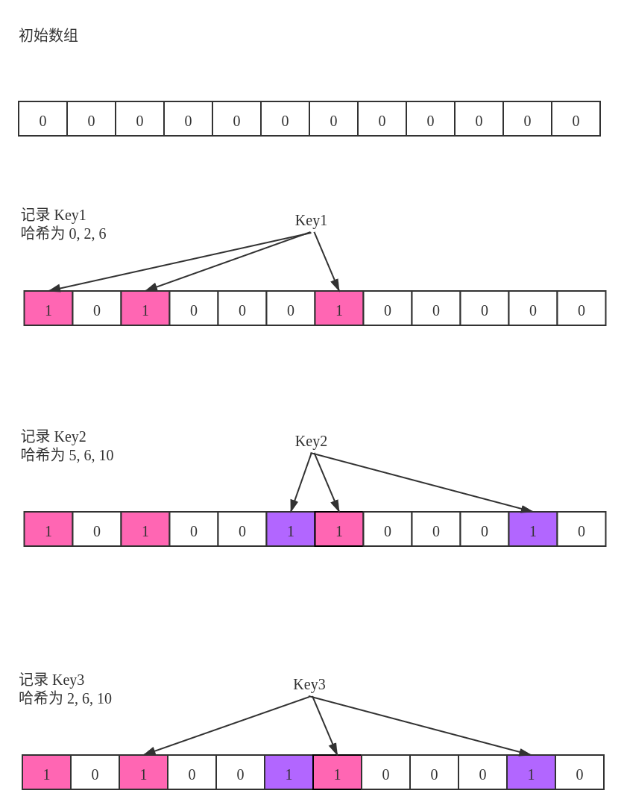

# 布隆过滤器

## 问题

维护一个海量数据的集合，给定一个新元素，快速判断该元素是否已经在集合中。

## 原理

对于可放入内存量级的数据，经典的集合结构可以是 **平衡树** 和 **哈希表** 。但无论哪一种方法都离不开一点 —— 存储所有原始数值

比如在爬虫场景当中，我们需要记录之前爬过的网站。每次遇到一个新的网站都要判断是否已经爬过。在这个问题当中，我们并关心之前爬过的网站有哪些，而只是关心 **现在的网站有没有在之前出现过** 。也就是之前出现过什么不重要，当前的是否出现过才重要。

无论利用平衡树、Trie、或是AC自动机等数据结构和算法可以实现高效的查找，但是都离不开存储下所有的字符串。

作如下估算：一个网址大概 $100$ 个字符，占 $0.1$ KB，如果是一亿个网址，就需要 $10$ GB了，如果是一百亿或一千亿呢？显然在这种情况下存储全部原始数值是不可行的。这时布隆过滤器派上了用场，它的做法巧妙，不需要存储下原值，原理如下：

布隆过滤器本身的结构非常简单，只需维护一个长度为 $m$ 的一维`bool`型数组，每一位只有一个二值项 $0$ 或 $1$ ，只占一位。对于每个新增的项，我们使用 $K$ 种不同的哈希函数将其映射到 $[0, m-1]$ ，并将`bool`数组对应的位置标记为 $1$ 。

### 图解布隆过滤器

下图展示了一个长度为 $m = 12$，具有 $k = 3$ 组哈希函数的布隆过滤器：



* 初始时标记数组全部为 $0$

* $Key1$ 的哈希元祖为 $(0, 2, 6)$ ，判断未出现过，打标记

* $Key2$ 的哈希元祖为 $(5, 6, 10)$ ，判断未出现过，在未出现的位上打标记

* $Key3$ 的哈希元祖为 $(2, 6, 10)$ ，对应的位置都已被标记，故判断 **可能出现过** 

由以上分析可知布隆过滤器对于“未出现”的判断是准确的，但无法对出现过做出绝对正确的判断。

## 代码实现

传入一组哈希函数，布隆过滤器的代码很简单：
```cpp
template <typename T>
class BloomFilter {
   public:
    BloomFilter(vector<function<int(T)>> hash_functions) : hash_functions_(hash_functions) {
        flags_.assign(hash_functions_.size(), false);
    }

    void Add(T key) {
        for (auto hash_function : hash_functions_) {
            flags_[hash_function(key)] = true;
        }
    }

    bool MaybeOccurred(T key) {
        for (auto hash_function : hash_functions_) {
            if (!flags_[hash_function(key)]) return false;
        }
        return true;
    }
   private:
    vector<function<int(T)>> hash_functions_;
    vector<bool> flags_;
};
```

## 错误率分析

令 $m$ 表示标记数组的长度， $k$ 表示哈希函数的个数， $n$ 表示一个已经记录的元素数量。

当 $m$ 很大时，对于一个新的key，其被误判出现过的概率为：

$$
p = \left[ 1 - e^{- \frac{nk}{m}} \right] ^ k
$$

经推演可得：

$$
m = - \frac{n \ln p}{(\ln 2)^2}
$$

$$
k = \frac{m}{n} \ln 2
$$

根据上述结论，可以根据预设的错误率 $p$ 和数据量估计 $n$ 来确定布隆过滤器的参数 $m, k$。

## 布隆过滤器的局限性

### 灵魂拷问

布隆过滤器可以 **删除元素** 吗？

答案是 **不支持** 。因为标志数组中的每一位都不是被某个key独占的，删除某一位会使对同样映射到该位的其他key的 **不存在性** 做出错误判断。

有一种改进的方法是将标记数组从标记是否出现过改为标记出现的次数，这样删除某个key的操作就不会影响其他key了。

乍一看这种做法似乎可行，但其实也有缺陷：当某个被判断为可能出现过的key需要被删除时，我们无法准确判断其是否出现过， **在这种情况下强行删除同样会影响到其他key产生的标记** 。

## 结论

布隆过滤器是一个优缺点都非常明显的数据结构，优点是： **速度快、内存消耗小、代码实现简单** ；缺点是： **不能严格判断存在、不支持删除元素**。