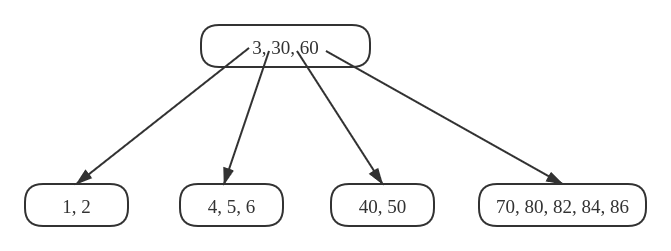
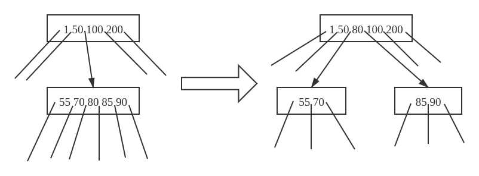
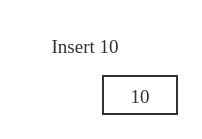
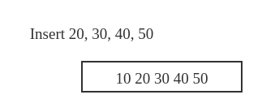
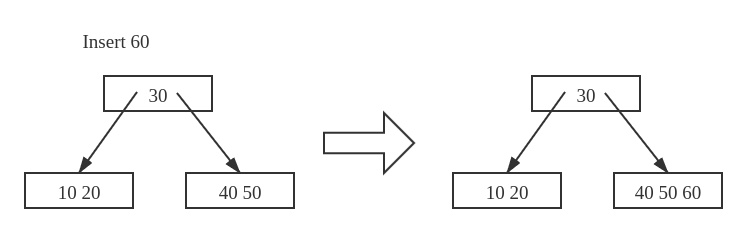
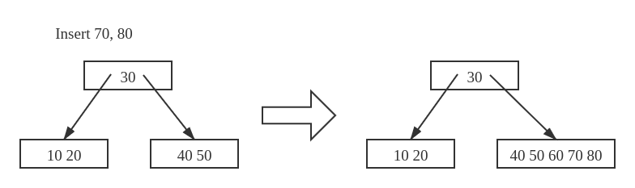
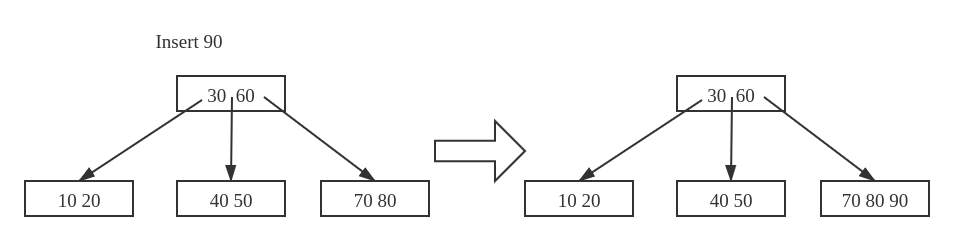
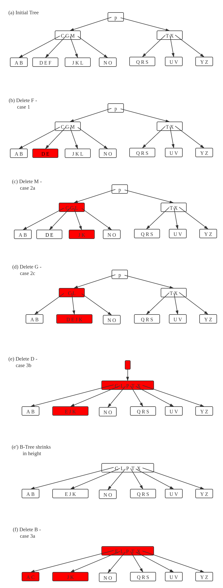

# B树

B树是一个自平衡搜索树。

本页内容参考自GeeksForGeeks

## 问题
设计一种非内存数据结构用于组织硬盘中的大量数据。

## 思想
大多数其他的自平衡搜索树（如AVL，红黑树）都假设将所有内容放在 **主存** 中。B树的作用是组织规模大 **无法全部放入主存** 的数据。当key的数量很多时，数据从硬盘中是以 **block** 的形式被读取。B树的思想是尽量 **减少硬盘读取的次数** 。大多数树的操作（搜索、插入、删除、最大、最小等）的时间复杂度是 $O(h)$ ，其中 $h$ 是树的高度。B树是一个很 **胖** 的树的，通过尽可能增大节点的度数来最小化B树的高度。一般地，B树 **节点的度数保持与磁盘block大小相同的数值** 。由于B树的高度很小，读取磁盘的次数相比其他平衡二叉搜索树（如AVL、红黑树）有了大幅缩小。

## 性质
1. 所有叶节点在同一层级  
2. 一个B树的结构由最小度数 $t$ 确定， $t$ 的值由磁盘block大小决定  
3. 除根节点外的所有节点最少包含 $t$ 个key，根节点可能最少仅包含 $1$ 个key  
4. 所有节点（包括根节点）最大包含 $2t-1$ 个key  
5. 每个节点的度数等于其中包含的key的数量 $+1$  
6. 节点中的key按升序排列，`k1`和`k2`之间的子节点包含所有位于区间 $(k1, k2)$ 之内的key  
7. 与BST不同的是：B树向上生长，BST向下生长
8. 与BST相同的是：增、删、改的复杂度都是 $O(\log n)$

下面是一个 $t=3$ 的B树示意图：



## 操作

对于B树，只读操作搜索和遍历的操作方法是显然的（与BST类似）：

### 搜索

从根节点递归地向下搜索。对于非叶子节点，如果该节点包含目标key，则搜索成功，否则递归搜索包含目标的区间子树。当搜索到月子节点且仍不包含目标`key`，则搜索失败。

### 遍历

从左到右递归扫描孩子节点。每两次对孩子节点递归扫描之间扫描二者位于当前节点的区间边界`key`。

### 插入

插入操作由于需要添加元素并保持B树本身的结构，做法不那么显然。

设待插入的key为`k`。类似BST，从根节点向下遍历直到找到一个叶节点，将`k`插入该节点，但需要保证该节点有足够的容量。

为了保证叶节点的容量总是够用的，增加对节点的 **分裂** 操作`SplitChild`，用于分裂某节点的孩子节点。下图展示了分裂的过程，注意到分割点上移的过程导致B树向上生长，而不像BST单纯向下生长。



如上讨论，当增加一个新key，我们从根节点走到叶节点，每当下沉到下一层的节点，先检查目标节点是否已满，如果已满则执行 **分裂**　操作。

**插入算法**：  

1. 初始化`x`为根

2. 只要`x`不是叶节点，做下述操作：

    a) 找到`x`下一层的目标下沉节点`y`

    b) 如果`y`未满，则将`x`指向`y`

    c) 如果`y`已满，则将其分裂并将`x`指向`y`的分裂结果之一。此时作为分界点的key被移到`x`

3. 第2步的循环当`x`为叶节点的时候结束。此时由于我们已经对所有满员节点进行分裂，`x`必然有至少 $1$ 个key的额外空间，故将`k`插入`x`即可。

下图表示一棵B树的构造过程，其中最小节点度数 $t=3$ ，序列 $[10, 20, 30, 40, 50, 60, 70, 80, 90]$ 顺次插入一棵初始为空的B树。

#### 图解B树的构造

开始时root为空，我们先插入 $10$：



现在插入 $20, 30, 40, 50$ ，直到根节点成员数量到达上限 $2 \times 3 - 1 = 5$ 之前，新元素都被插入根节点：



现在插入 $60$ ，有根节点已满，我们首先将其分裂成两个，然后将 $60$ 插入适当的节点：



现在插入 $70, 80$ ，期间不会发生分裂：



现在插入 $90$ ，这次插入会导致一次分裂，位于分界点的key将被上升到父节点：



### 删除

相比插入操作，删除操作更复杂，原因在于待删除的key可能位于包含非叶节点的任意节点，而每当删除一个位于非叶节点的key时，我们都需要重新调整其孩子节点。

在插入操作中，为了保持B树的特性，当插入key导致节点 **过大** 时我们执行分裂操作。同样地，我们需要保证删除操作不会导致节点 **过小** （唯一例外：根节点允许包含少于 $t - 1$ 个key）。正如在插入操作中需要对包含`k`的节点中饱和的做特殊处理，删除操作中也需要对包含`k`的节点（根节点除外）中成员数量达到最低限制的做特殊处理。

删除过程从`x`包含`k`的子树中删除`k`。这个过程需要保证每次在节点`x`上递归调用该算法，`x`中key的数量都不少于最小度数 $t$ 。注意到这个限制需要维护比每个节点的最小度数多 $1$ 个key，所以有些情况下一个key需要在递归下沉之前移动到那个孩子节点、这个 **更强的条件** 允许我们在B树中删除key的过程中仅沿着树枝向下移动一趟而不用回溯（只有一个例外，我们之后会解释）。在下述删除算法中，当根节点`x`一旦为空（这种情况会发生在2c和3b中），我们就删除`x`，并让`x`唯一的子节点成为新的根节点。

**删除算法**：

1. 若键`k`在节点`x`中且`x`是叶节点，将`k`从`x`中删除即可

2. 若键`k`在节点`x`中且`x`是一个内部节点：

    a) 若区间覆盖`k`的子节点`y`所包含key的数量最少不少于 $t$ ，找到以`y`为根的子树中`k`的前驱`k0`。递归地删除`k0`，并将`x`中的`k`换成`k0`

    b) 若`y`所包含的key的数量小于 $t$ ，对称地，检查`x`中紧随`k`的后继节点`z`，若`z`至少具有`t`个键，则在以`z`为根的子树中找到`k`的后继`k0`。递归删除`k0`，然后将`x`中的`k`替换成`k0`（我们可以在一趟向下的过程中找到并删除`k0`）

    c) 否则，若`y`和`z`的键数都是 $t - 1$ ，将`k`和`z`中的所有键合并到`y`，如此`x`同时丢掉`k`和指向`z`的指针，`y`此时键数为 $2t - 1$ 。接着释放`z`并从`y`中递归地删除`k`。

3. 若键`k`不在内部节点`x`中，则确定一定包含`k`的适当子树的根`x.c(i)`。如果`x.c(i)`仅具有 $t - 1$ 个键，则根据需要执行步骤 3a 或 3b ，以确保下降到包含至少 $t$ 个键的节点。然后通过递归 `x` 的适当孩子来完成：

    a) 若`x.c(i)`仅具有 $t - 1$ 个键， 但有一个键数至少为`t`的直接同级，从`x`中下移某个键到`x.c(i)`，再从`x.c(i)`的直接左或右同级中上移一个键到`x`，然后将适当的子节点指针从`x.c(i)`的直接同级指向其本身。

    b) 若`x.c(i)`与其两个直接同级的键数都是 $t - 1$ ，将`x.c(i)`与其中一个合并，期间将`x`中的一个键下移到合并节点，作为其分界键。

由于B树中的大多数键都在叶子中，因此删除操作最常用于从叶子中删除键，此时“递归”删除只需一趟下行，而无需回溯处理。对于从内部节点删除一个键的情况，在算法下沉的过程中可能必须返回删除键的节点，才能用其前驱后者后继替换键（2a和2b的情况）

#### 图解B树的删除操作




## C++实现

```cpp
/* The deletion function has been compartmentalized into 8 functions for ease
of understanding and clarity

The following functions are exclusive for deletion
In class BTreeNode:
        1) Remove
        2) RemoveFromLeaf
        3) RemoveFromNonLeaf
        4) GetPred
        5) GetSucc
        6) BorrowFromPrev
        7) BorrowFromNext
        8) Merge
        9) FindKey

In class BTree:
        1) Remove

The removal of a key from a B-Tree is a fairly complicated process. The program
handles all the 6 different cases that might arise while removing a key.

Testing: The code has been tested using the B-Tree provided in the CLRS book(
included in the main function ) along with other cases.

Reference: CLRS3 - Chapter 18 - (499-502)
It is advised to read the material in CLRS before taking a look at the code. */

#include <iostream>
using namespace std;

// A BTree node
class BTreeNode {
   public:
    BTreeNode(int _t, bool _leaf);  // Constructor

    // A function to traverse all nodes in a subtree rooted with this node
    void Traverse();

    // A function to search a key in subtree rooted with this node.
    BTreeNode *Search(int k);  // returns NULL if k is not present.

    // A function that returns the index of the first key that is greater
    // or equal to k
    int FindKey(int k);

    // A utility function to insert a new key in the subtree rooted with
    // this node. The assumption is, the node must be non-full when this
    // function is called
    void InsertNonFull(int k);

    // A utility function to split the child y of this node. i is index
    // of y in child array C[]. The Child y must be full when this
    // function is called
    void SplitChild(int i, BTreeNode *y);

    // A wrapper function to remove the key k in subtree rooted with
    // this node.
    void Remove(int k);

    // A function to remove the key present in idx-th position in
    // this node which is a leaf
    void RemoveFromLeaf(int idx);

    // A function to remove the key present in idx-th position in
    // this node which is a non-leaf node
    void RemoveFromNonLeaf(int idx);

    // A function to get the predecessor of the key- where the key
    // is present in the idx-th position in the node
    int GetPred(int idx);

    // A function to get the successor of the key- where the key
    // is present in the idx-th position in the node
    int GetSucc(int idx);

    // A function to fill up the child node present in the idx-th
    // position in the C[] array if that child has less than t-1 keys
    void Fill(int idx);

    // A function to borrow a key from the C[idx-1]-th node and place
    // it in C[idx]th node
    void BorrowFromPrev(int idx);

    // A function to borrow a key from the C[idx+1]-th node and place it
    // in C[idx]th node
    void BorrowFromNext(int idx);

    // A function to merge idx-th child of the node with (idx+1)th child of
    // the node
    void Merge(int idx);

    // Make BTree friend of this so that we can access private members of
    // this class in BTree functions
    friend class BTree;

   private:
    int *keys;      // An array of keys
    int t;          // Minimum degree (defines the range for number of keys)
    BTreeNode **C;  // An array of child pointers
    int n;          // Current number of keys
    bool leaf;      // Is true when node is leaf. Otherwise false
};

class BTree {
   public:
    // Constructor (Initializes tree as empty)
    BTree(int _t) {
        root = NULL;
        t = _t;
    }

    void Traverse() {
        if (root != NULL) root->Traverse();
    }

    // function to search a key in this tree
    BTreeNode *Search(int k) { return (root == NULL) ? NULL : root->Search(k); }

    // The main function that inserts a new key in this B-Tree
    void Insert(int k);

    // The main function that removes a new key in thie B-Tree
    void Remove(int k);

   private:
    BTreeNode *root;  // Pointer to root node
    int t;            // Minimum degree
};

BTreeNode::BTreeNode(int t1, bool leaf1) {
    // Copy the given minimum degree and leaf property
    t = t1;
    leaf = leaf1;

    // Allocate memory for maximum number of possible keys
    // and child pointers
    keys = new int[2 * t - 1];
    C = new BTreeNode *[2 * t];

    // Initialize the number of keys as 0
    n = 0;
}

// A utility function that returns the index of the first key that is
// greater than or equal to k
int BTreeNode::FindKey(int k) {
    int idx = 0;
    while (idx < n && keys[idx] < k) ++idx;
    return idx;
}

// A function to remove the key k from the sub-tree rooted with this node
void BTreeNode::Remove(int k) {
    int idx = FindKey(k);

    // The key to be removed is present in this node
    if (idx < n && keys[idx] == k) {
        // If the node is a leaf node - RemoveFromLeaf is called
        // Otherwise, RemoveFromNonLeaf function is called
        if (leaf)
            RemoveFromLeaf(idx);
        else
            RemoveFromNonLeaf(idx);
    } else {
        // If this node is a leaf node, then the key is not present in tree
        if (leaf) {
            cout << "The key " << k << " is does not exist in the tree\n";
            return;
        }

        // The key to be removed is present in the sub-tree rooted with this
        // node The flag indicates whether the key is present in the sub-tree
        // rooted with the last child of this node
        bool flag = ((idx == n) ? true : false);

        // If the child where the key is supposed to exist has less that t keys,
        // we fill that child
        if (C[idx]->n < t) Fill(idx);

        // If the last child has been merged, it must have merged with the
        // previous child and so we recurse on the (idx-1)th child. Else, we
        // recurse on the (idx)th child which now has atleast t keys
        if (flag && idx > n)
            C[idx - 1]->Remove(k);
        else
            C[idx]->Remove(k);
    }
    return;
}

// A function to remove the idx-th key from this node - which is a leaf node
void BTreeNode::RemoveFromLeaf(int idx) {
    // Move all the keys after the idx-th pos one place backward
    for (int i = idx + 1; i < n; ++i) keys[i - 1] = keys[i];

    // Reduce the count of keys
    n--;

    return;
}

// A function to remove the idx-th key from this node - which is a non-leaf node
void BTreeNode::RemoveFromNonLeaf(int idx) {
    int k = keys[idx];

    // If the child that precedes k (C[idx]) has atleast t keys,
    // find the predecessor 'pred' of k in the subtree rooted at
    // C[idx]. Replace k by pred. Recursively delete pred
    // in C[idx]
    if (C[idx]->n >= t) {
        int pred = GetPred(idx);
        keys[idx] = pred;
        C[idx]->Remove(pred);
    }

    // If the child C[idx] has less that t keys, examine C[idx+1].
    // If C[idx+1] has atleast t keys, find the successor 'succ' of k in
    // the subtree rooted at C[idx+1]
    // Replace k by succ
    // Recursively delete succ in C[idx+1]
    else if (C[idx + 1]->n >= t) {
        int succ = GetSucc(idx);
        keys[idx] = succ;
        C[idx + 1]->Remove(succ);
    }

    // If both C[idx] and C[idx+1] has less that t keys,merge k and all of
    // C[idx+1] into C[idx] Now C[idx] contains 2t-1 keys Free C[idx+1] and
    // recursively delete k from C[idx]
    else {
        Merge(idx);
        C[idx]->Remove(k);
    }
    return;
}

// A function to get predecessor of keys[idx]
int BTreeNode::GetPred(int idx) {
    // Keep moving to the right most node until we reach a leaf
    BTreeNode *cur = C[idx];
    while (!cur->leaf) cur = cur->C[cur->n];

    // Return the last key of the leaf
    return cur->keys[cur->n - 1];
}

int BTreeNode::GetSucc(int idx) {
    // Keep moving the left most node starting from C[idx+1] until we reach a
    // leaf
    BTreeNode *cur = C[idx + 1];
    while (!cur->leaf) cur = cur->C[0];

    // Return the first key of the leaf
    return cur->keys[0];
}

// A function to fill child C[idx] which has less than t-1 keys
void BTreeNode::Fill(int idx) {
    // If the previous child(C[idx-1]) has more than t-1 keys, borrow a key
    // from that child
    if (idx != 0 && C[idx - 1]->n >= t) BorrowFromPrev(idx);

    // If the next child(C[idx+1]) has more than t-1 keys, borrow a key
    // from that child
    else if (idx != n && C[idx + 1]->n >= t)
        BorrowFromNext(idx);

    // Merge C[idx] with its sibling
    // If C[idx] is the last child, merge it with with its previous sibling
    // Otherwise merge it with its next sibling
    else {
        if (idx != n)
            Merge(idx);
        else
            Merge(idx - 1);
    }
    return;
}

// A function to borrow a key from C[idx-1] and insert it
// into C[idx]
void BTreeNode::BorrowFromPrev(int idx) {
    BTreeNode *child = C[idx];
    BTreeNode *sibling = C[idx - 1];

    // The last key from C[idx-1] goes up to the parent and key[idx-1]
    // from parent is inserted as the first key in C[idx]. Thus, the loses
    // sibling one key and child gains one key

    // Moving all key in C[idx] one step ahead
    for (int i = child->n - 1; i >= 0; --i) child->keys[i + 1] = child->keys[i];

    // If C[idx] is not a leaf, move all its child pointers one step ahead
    if (!child->leaf) {
        for (int i = child->n; i >= 0; --i) child->C[i + 1] = child->C[i];
    }

    // Setting child's first key equal to keys[idx-1] from the current node
    child->keys[0] = keys[idx - 1];

    // Moving sibling's last child as C[idx]'s first child
    if (!child->leaf) child->C[0] = sibling->C[sibling->n];

    // Moving the key from the sibling to the parent
    // This reduces the number of keys in the sibling
    keys[idx - 1] = sibling->keys[sibling->n - 1];

    child->n += 1;
    sibling->n -= 1;

    return;
}

// A function to borrow a key from the C[idx+1] and place
// it in C[idx]
void BTreeNode::BorrowFromNext(int idx) {
    BTreeNode *child = C[idx];
    BTreeNode *sibling = C[idx + 1];

    // keys[idx] is inserted as the last key in C[idx]
    child->keys[(child->n)] = keys[idx];

    // Sibling's first child is inserted as the last child
    // into C[idx]
    if (!(child->leaf)) child->C[(child->n) + 1] = sibling->C[0];

    // The first key from sibling is inserted into keys[idx]
    keys[idx] = sibling->keys[0];

    // Moving all keys in sibling one step behind
    for (int i = 1; i < sibling->n; ++i)
        sibling->keys[i - 1] = sibling->keys[i];

    // Moving the child pointers one step behind
    if (!sibling->leaf) {
        for (int i = 1; i <= sibling->n; ++i) sibling->C[i - 1] = sibling->C[i];
    }

    // Increasing and decreasing the key count of C[idx] and C[idx+1]
    // respectively
    child->n += 1;
    sibling->n -= 1;

    return;
}

// A function to merge C[idx] with C[idx+1]
// C[idx+1] is freed after merging
void BTreeNode::Merge(int idx) {
    BTreeNode *child = C[idx];
    BTreeNode *sibling = C[idx + 1];

    // Pulling a key from the current node and inserting it into (t-1)th
    // position of C[idx]
    child->keys[t - 1] = keys[idx];

    // Copying the keys from C[idx+1] to C[idx] at the end
    for (int i = 0; i < sibling->n; ++i) child->keys[i + t] = sibling->keys[i];

    // Copying the child pointers from C[idx+1] to C[idx]
    if (!child->leaf) {
        for (int i = 0; i <= sibling->n; ++i) child->C[i + t] = sibling->C[i];
    }

    // Moving all keys after idx in the current node one step before -
    // to fill the gap created by moving keys[idx] to C[idx]
    for (int i = idx + 1; i < n; ++i) keys[i - 1] = keys[i];

    // Moving the child pointers after (idx+1) in the current node one
    // step before
    for (int i = idx + 2; i <= n; ++i) C[i - 1] = C[i];

    // Updating the key count of child and the current node
    child->n += sibling->n + 1;
    n--;

    // Freeing the memory occupied by sibling
    delete (sibling);
    return;
}

// The main function that inserts a new key in this B-Tree
void BTree::Insert(int k) {
    // If tree is empty
    if (root == NULL) {
        // Allocate memory for root
        root = new BTreeNode(t, true);
        root->keys[0] = k;  // Insert key
        root->n = 1;        // Update number of keys in root
    } else                  // If tree is not empty
    {
        // If root is full, then tree grows in height
        if (root->n == 2 * t - 1) {
            // Allocate memory for new root
            BTreeNode *s = new BTreeNode(t, false);

            // Make old root as child of new root
            s->C[0] = root;

            // Split the old root and move 1 key to the new root
            s->SplitChild(0, root);

            // New root has two children now. Decide which of the
            // two children is going to have new key
            int i = 0;
            if (s->keys[0] < k) i++;
            s->C[i]->InsertNonFull(k);

            // Change root
            root = s;
        } else  // If root is not full, call InsertNonFull for root
            root->InsertNonFull(k);
    }
}

// A utility function to insert a new key in this node
// The assumption is, the node must be non-full when this
// function is called
void BTreeNode::InsertNonFull(int k) {
    // Initialize index as index of rightmost element
    int i = n - 1;

    // If this is a leaf node
    if (leaf == true) {
        // The following loop does two things
        // a) Finds the location of new key to be inserted
        // b) Moves all greater keys to one place ahead
        while (i >= 0 && keys[i] > k) {
            keys[i + 1] = keys[i];
            i--;
        }

        // Insert the new key at found location
        keys[i + 1] = k;
        n = n + 1;
    } else  // If this node is not leaf
    {
        // Find the child which is going to have the new key
        while (i >= 0 && keys[i] > k) i--;

        // See if the found child is full
        if (C[i + 1]->n == 2 * t - 1) {
            // If the child is full, then split it
            SplitChild(i + 1, C[i + 1]);

            // After split, the middle key of C[i] goes up and
            // C[i] is splitted into two. See which of the two
            // is going to have the new key
            if (keys[i + 1] < k) i++;
        }
        C[i + 1]->InsertNonFull(k);
    }
}

// A utility function to split the child y of this node
// Note that y must be full when this function is called
void BTreeNode::SplitChild(int i, BTreeNode *y) {
    // Create a new node which is going to store (t-1) keys
    // of y
    BTreeNode *z = new BTreeNode(y->t, y->leaf);
    z->n = t - 1;

    // Copy the last (t-1) keys of y to z
    for (int j = 0; j < t - 1; j++) z->keys[j] = y->keys[j + t];

    // Copy the last t children of y to z
    if (y->leaf == false) {
        for (int j = 0; j < t; j++) z->C[j] = y->C[j + t];
    }

    // Reduce the number of keys in y
    y->n = t - 1;

    // Since this node is going to have a new child,
    // create space of new child
    for (int j = n; j >= i + 1; j--) C[j + 1] = C[j];

    // Link the new child to this node
    C[i + 1] = z;

    // A key of y will move to this node. Find location of
    // new key and move all greater keys one space ahead
    for (int j = n - 1; j >= i; j--) keys[j + 1] = keys[j];

    // Copy the middle key of y to this node
    keys[i] = y->keys[t - 1];

    // Increment count of keys in this node
    n = n + 1;
}

// Function to traverse all nodes in a subtree rooted with this node
void BTreeNode::Traverse() {
    // There are n keys and n+1 children, travers through n keys
    // and first n children
    int i;
    for (i = 0; i < n; i++) {
        // If this is not leaf, then before printing key[i],
        // traverse the subtree rooted with child C[i].
        if (leaf == false) C[i]->Traverse();
        cout << " " << keys[i];
    }

    // Print the subtree rooted with last child
    if (leaf == false) C[i]->Traverse();
}

// Function to search key k in subtree rooted with this node
BTreeNode *BTreeNode::Search(int k) {
    // Find the first key greater than or equal to k
    int i = 0;
    while (i < n && k > keys[i]) i++;

    // If the found key is equal to k, return this node
    if (keys[i] == k) return this;

    // If key is not found here and this is a leaf node
    if (leaf == true) return NULL;

    // Go to the appropriate child
    return C[i]->Search(k);
}

void BTree::Remove(int k) {
    if (!root) {
        cout << "The tree is empty\n";
        return;
    }

    // Call the remove function for root
    root->Remove(k);

    // If the root node has 0 keys, make its first child as the new root
    // if it has a child, otherwise set root as NULL
    if (root->n == 0) {
        BTreeNode *tmp = root;
        if (root->leaf)
            root = NULL;
        else
            root = root->C[0];

        // Free the old root
        delete tmp;
    }
    return;
}
```

测试代码：
```cpp
// Driver program to test above functions
int main() {
    BTree t(3);  // A B-Tree with minium degree 3

    t.Insert(1);
    t.Insert(3);
    t.Insert(7);
    t.Insert(10);
    t.Insert(11);
    t.Insert(13);
    t.Insert(14);
    t.Insert(15);
    t.Insert(18);
    t.Insert(16);
    t.Insert(19);
    t.Insert(24);
    t.Insert(25);
    t.Insert(26);
    t.Insert(21);
    t.Insert(4);
    t.Insert(5);
    t.Insert(20);
    t.Insert(22);
    t.Insert(2);
    t.Insert(17);
    t.Insert(12);
    t.Insert(6);

    cout << "Traversal of tree constructed is\n";
    t.Traverse();
    cout << endl;

    t.Remove(6);
    cout << "Traversal of tree after removing 6\n";
    t.Traverse();
    cout << endl;

    t.Remove(13);
    cout << "Traversal of tree after removing 13\n";
    t.Traverse();
    cout << endl;

    t.Remove(7);
    cout << "Traversal of tree after removing 7\n";
    t.Traverse();
    cout << endl;

    t.Remove(4);
    cout << "Traversal of tree after removing 4\n";
    t.Traverse();
    cout << endl;

    t.Remove(2);
    cout << "Traversal of tree after removing 2\n";
    t.Traverse();
    cout << endl;

    t.Remove(16);
    cout << "Traversal of tree after removing 16\n";
    t.Traverse();
    cout << endl;

    return 0;
}
```

输出：
```
Traversal of tree constructed is
 1 2 3 4 5 6 7 10 11 12 13 14 15 16 17 18 19 20 21 22 24 25 26
Traversal of tree after removing 6
 1 2 3 4 5 7 10 11 12 13 14 15 16 17 18 19 20 21 22 24 25 26
Traversal of tree after removing 13
 1 2 3 4 5 7 10 11 12 14 15 16 17 18 19 20 21 22 24 25 26
Traversal of tree after removing 7
 1 2 3 4 5 10 11 12 14 15 16 17 18 19 20 21 22 24 25 26
Traversal of tree after removing 4
 1 2 3 5 10 11 12 14 15 16 17 18 19 20 21 22 24 25 26
Traversal of tree after removing 2
 1 3 5 10 11 12 14 15 16 17 18 19 20 21 22 24 25 26
Traversal of tree after removing 16
 1 3 5 10 11 12 14 15 17 18 19 20 21 22 24 25 26
```

