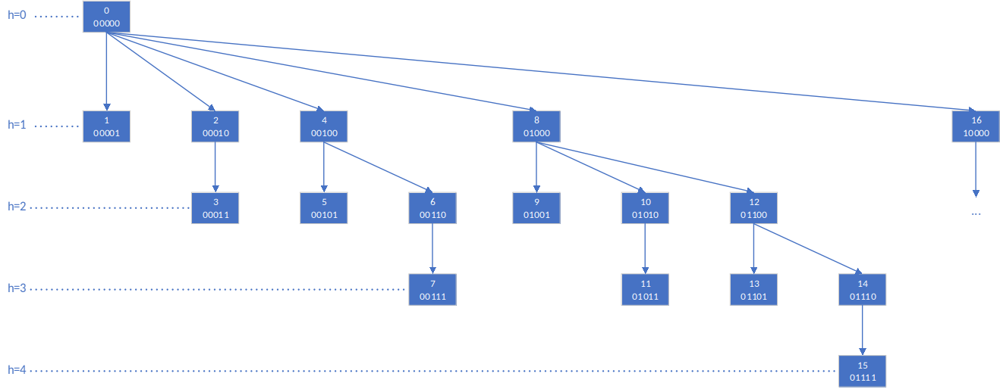

# Fenwick/树状数组

Fenwick树，也叫binary index tree，或树状数组，支持在 $O(\log n)$ 时间内更新元素值和计算前缀和操作


## 问题
给定长度为 $n$ 的序列 $a$ ，要求在 $O(\log n)$ 的时间内完成如下操作：

* $Add(i, delta)$ - 在指定项 $a[i]$ 上增加 $delta$

* $Query(l, r)$ - 查询位于区间 $[l, r)$ 的元素和

* $Query(x)$ - 查询长度为 $x$ 的前缀和，即 $[0, x)$ 的和


## 代码

```cpp
template <typename T>
class BIT {
 public:
  BIT() {}

  BIT(int _size, T _invalid_value)
      : size(_size), invalid_value(_invalid_value) {
    bit = vector<T>(size + 1, 0);
  }

  BIT(vector<T> arr, T _invalid_value)
      : size((int)arr.size()), invalid_value(_invalid_value) {
    bit = vector<T>(size + 1, 0);
    for (int i = 0; i < size; i++) {
      this->Add(i, arr[i]);
    }
  }

  void Add(int x, T val) {
    for (x++; x <= size; x += x & -x) {
      bit[x] += val;
    }
  }

  T Query(int x) {  // Sum [0, x)
    if (x < 0 || x > this->size) {
      return this->invalid_value;
    }
    T ans = 0;
    while (x) {
      ans += bit[x];
      x -= x & -x;
    }

    return ans;
  }

  T Query(int l, int r) {  // Sum [l, r)
    if (l < 0 || l >= this->size) {
      return this->invalid_value;
    }
    if (r < 0 || r > this->size) {
      return this->invalid_value;
    }
    return Query(r) - Query(l);
  }

 private:
  int size;
  T invalid_value;
  vector<T> bit;
};
```

## 算法

$a$ 的树状数组 $b$ 具有如下递归结构：



注意到，编号 $i$ 的节点其回溯链路上节点值的和即为原始序列前缀和$a[0, ..., i）$。具体地，假设 $b[i]$ 在上述树结构的父节点为 $b[j]$ ，则 $b[i]$ 的值为 $a[j, i)$ 的元素和。

那么如何获取 $b[i]$ 的父节点 $b[j]$ 的下标 $j$ 呢？

我们知道，若 $x$ 为正，则 $x \& -x$ 为 $x$ 二进制表示的最低位的 $1$ 。

故得到回溯方法：编号为 $i$ 的节点，其父节点编号为 $i - (i \& -i)$ 。

另一方面，编号为 $x + (x \& -x)$ 则为节点 $x$ 右侧的第一个所表征区间包含 $x$ 的节点（下称“包含节点”）。

基于上述分析，可以得出结论，更新原始序列中 $a[i]$ 的值，除更新 $b[i+1]$ 进行更新外，需要同步更新树状数组中对应节点及其右侧所有“包含节点”的值。即对于一个节点：前缀和向上扫描，跟新值向右扫描。

## 讨论

* 与线段树的区别

对于树状数组和线段树的区别，从树状数组索引更新的方式可见端倪：

BIT的索引更新方式为减去或加上最低位 $1$ ，线段树的索引更新方式为左移或右移 $1$ 位。这导致树状数组的父子节点所表征的区间没有交集，一枝中的所有节点一起构成一个索引所决定前缀的内容；而线段树的父子节点之间是有重合的，甚至父节点 $p$ 存储的值就是由两个儿子节点（$p << 1$ 和 $p << 1 | 1$ ）直接决定的。这也解释了为什么树状数组不支持维护区间最值，而线段树却支持，因为线段树为此额外付出了 $O(n)$ 的空间复杂度。
注：树状数组的空间复杂度为 $O(n)$ ，线段树的空间复杂度 $O(2n)$ 。


## 测试

测试代码：
```cpp
int main() {
  BIT<int> bit = BIT<int>({1, 2, 3, 4, 5, 6, 7, 8}, -1);
  cout << "BIT<int> bit = BIT<int>({1, 2, 3, 4, 5, 6, 7, 8}, -1);" << endl;

  for (int i = 0; i < 10; i++) {
    cout << "bit.Query(" << i << "): " << bit.Query(i) << endl;
  }

  for (int i = 0; i < 10; i++) {
    for (int j = i; j < 10; j++) {
      cout << "bit.Query(" << i << ", " << j << "): " << bit.Query(i, j)
           << endl;
    }
  }

  return 0;
}
```

输出：
```
BIT<int> bit = BIT<int>({1, 2, 3, 4, 5, 6, 7, 8}, -1);
bit.Query(0): 0
bit.Query(1): 1
bit.Query(2): 3
bit.Query(3): 6
bit.Query(4): 10
bit.Query(5): 15
bit.Query(6): 21
bit.Query(7): 28
bit.Query(8): 36
bit.Query(9): -1
bit.Query(0, 0): 0
bit.Query(0, 1): 1
bit.Query(0, 2): 3
bit.Query(0, 3): 6
bit.Query(0, 4): 10
bit.Query(0, 5): 15
bit.Query(0, 6): 21
bit.Query(0, 7): 28
bit.Query(0, 8): 36
bit.Query(0, 9): -1
bit.Query(1, 1): 0
bit.Query(1, 2): 2
bit.Query(1, 3): 5
bit.Query(1, 4): 9
bit.Query(1, 5): 14
bit.Query(1, 6): 20
bit.Query(1, 7): 27
bit.Query(1, 8): 35
bit.Query(1, 9): -1
bit.Query(2, 2): 0
bit.Query(2, 3): 3
bit.Query(2, 4): 7
bit.Query(2, 5): 12
bit.Query(2, 6): 18
bit.Query(2, 7): 25
bit.Query(2, 8): 33
bit.Query(2, 9): -1
bit.Query(3, 3): 0
bit.Query(3, 4): 4
bit.Query(3, 5): 9
bit.Query(3, 6): 15
bit.Query(3, 7): 22
bit.Query(3, 8): 30
bit.Query(3, 9): -1
bit.Query(4, 4): 0
bit.Query(4, 5): 5
bit.Query(4, 6): 11
bit.Query(4, 7): 18
bit.Query(4, 8): 26
bit.Query(4, 9): -1
bit.Query(5, 5): 0
bit.Query(5, 6): 6
bit.Query(5, 7): 13
bit.Query(5, 8): 21
bit.Query(5, 9): -1
bit.Query(6, 6): 0
bit.Query(6, 7): 7
bit.Query(6, 8): 15
bit.Query(6, 9): -1
bit.Query(7, 7): 0
bit.Query(7, 8): 8
bit.Query(7, 9): -1
bit.Query(8, 8): -1
bit.Query(8, 9): -1
bit.Query(9, 9): -1

```