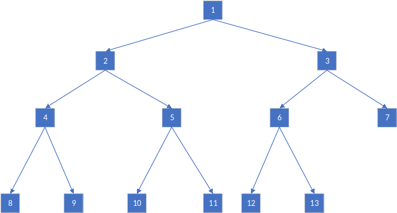

# 线段树
相较Fenwick/BIT，线段树除了支持在 $O(\log n)$ 时间内更新指定元素和计算区间和以外，还支持在 $O(\log n)$ 时间内计算区间最值，但为此多付出了 $O(n)$ 的空间开销。


## 问题
给定长度为 $n$ 的序列 $a$ ，要求在 $O(\log n)$ 的时间内完成如下操作：

* $Add(i, delta)$ - 在指定项 $a[i]$ 上增加 $delta$

* $QuerySum(l, r)$ - 查询位于区间 $[l, r)$ 的元素和

* $QueryMax(l, r)$ - 查询位于区间 $[l, r)$ 的元素最大值

* $QueryMin(l, r)$ - 查询位于区间 $[l, r)$ 的元素最小值


## 代码
```cpp
template <typename T>
class SGT {
 public:
  SGT() {}

  SGT(int _sz) : sz(_sz) {
    sgt_sum = vector<T>(sz << 1, 0);
    sgt_max = vector<T>(sz << 1, 0);
    sgt_min = vector<T>(sz << 1, 0);
  }

  SGT(vector<T> arr) : sz((int)arr.size()) {
    sgt_sum = vector<T>(sz << 1, 0);
    sgt_max = vector<T>(sz << 1, 0);
    sgt_min = vector<T>(sz << 1, 0);
    for (int i = 0; i < sz; i++) {
      this->Add(i, arr[i]);
    }
  }

  T QuerySum(int l, int r) {
    T ans = 0;
    for (l += sz, r += sz; l < r; l >>= 1, r >>= 1) {
      if (l & 1) ans += sgt_sum[l++];
      if (r & 1) ans += sgt_sum[--r];
    }
    return ans;
  }

  T QueryMax(int l, int r) {
    T ans = numeric_limits<T>::min();
    for (l += sz, r += sz; l < r; l >>= 1, r >>= 1) {
      if (l & 1) ans = max(ans, sgt_max[l++]);
      if (r & 1) ans = max(ans, sgt_max[--r]);
    }
    return ans;
  }

  T QueryMin(int l, int r) {
    T ans = numeric_limits<T>::max();
    for (l += sz, r += sz; l < r; l >>= 1, r >>= 1) {
      if (l & 1) ans = min(ans, sgt_min[l++]);
      if (r & 1) ans = min(ans, sgt_min[--r]);
    }
    return ans;
  }

  void Add(int x, T val) {
    x += sz;
    for (sgt_sum[x] += val, sgt_max[x] += val, sgt_min[x] += val; x > 1;
         x >>= 1) {
      sgt_sum[x >> 1] = sgt_sum[x] + sgt_sum[x ^ 1];
      sgt_max[x >> 1] = max(sgt_max[x], sgt_max[x ^ 1]);
      sgt_min[x >> 1] = min(sgt_min[x], sgt_min[x ^ 1]);
    }
  }

 private:
  int sz;
  vector<T> sgt_sum;
  vector<T> sgt_max;
  vector<T> sgt_min;
};
```

测试代码：

```cpp
int main() {
  SGT<int> bit = SGT<int>(10);

  for (int i = 0; i < 10; i++) {
    bit.Add(i, i * i);
  }

  cout << "Sum of a[2, 5) shoud be 29, result: " << bit.QuerySum(2, 5) << endl;
  cout << "Max of a[2, 5) shoud be 16, result: " << bit.QueryMax(2, 5) << endl;
  cout << "Min of a[2, 5) shoud be 4, result: " << bit.QueryMin(2, 5) << endl;

  bit.Add(7, -13);

  cout << "Sum of a[4, 9] shoud be 177, result: " << bit.QuerySum(4, 9) << endl;
  cout << "Max of a[4, 9] shoud be 64, result: " << bit.QueryMax(4, 9) << endl;
  cout << "Min of a[4, 9] shoud be 16, result: " << bit.QueryMin(4, 9) << endl;
}
```

输出：

```
Sum of a[2, 5) shoud be 29, result: 29
Max of a[2, 5) shoud be 16, result: 16
Min of a[2, 5) shoud be 4, result: 4
Sum of a[4, 9] shoud be 177, result: 177
Max of a[4, 9] shoud be 64, result: 64
Min of a[4, 9] shoud be 16, result: 16
```


## 算法
线段树是一颗有奇数个节点的的完全二叉树:



由于线段树的后半段（叶节点）存储了原数组的内容，故线段树的操作无论建立、求和或者更新值都是先定位到叶节点然后自底向上进行。

具体地，区间和操作是先将表征左右端点指针定位在叶节点相应位置，然后一步步上移紧缩，过程每当端点出现奇数则需要“接漏”——其中左端是闭区间所以先加再缩，右端是开区间所以先缩再加。


## 讨论
* 为什么数组表示的二叉树一般下标从 $1$ 开始，而不是 $0$

因为若从 $0$ 开始，则父节点的索引规则需要分类讨论，而从 $1$ 开始则不用。具体地，从上至下，从左至右对一棵满二叉树编号，如根节点编号为 $1$，则节点的左右儿子和父亲分别为 $p << 1$, $p << 1 | 1$, $p >> 1$，节点之间的转移可以只通过位运算完成。然而若根节点从开始编号，则节点p的左右儿子分别为 $2p + 1$, $2p + 2$，父亲的索引与 $p$ 的奇偶性有关，索引转移因而复杂得多。

