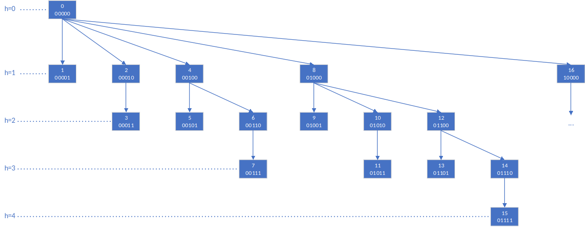

# Fenwick/树状数组

Fenwick树，也叫binary index tree，或树状数组，支持在 $O(\log n)$ 时间内更新元素值和计算前缀和操作


## 问题
给定长度为 $n$ 的序列 $v$ ，要求在 $O(\log n)$ 的时间内完成如下操作：

* 更新单个元素 $v[i]$ 的值

* 查询位于区间 $[l, r)$ 的元素和


## 代码

```cpp
template<typename T> class BIT {
public:
    BIT() {}
    BIT(int _sz) : sz(_sz) {
        bit = vector<T>(sz + 1, 0);
    }
    BIT(vector<T> arr) : sz((int)arr.size()) {
        bit = vector<T>(sz + 1, 0);
        for (int i = 0; i < sz; i++)
            this->Add(i, arr[i]);
    }
    void Add(int x, T val) {
        for (x++; x <= sz; x += x & -x)
            bit[x] += val;
    }
    T Query(int x) {    // Sum [0, x]
        T ans = 0;
        for (x++; x; x -= x & -x)
            ans += bit[x];
        return ans;
    }
    T Query(int l, int r) { // Sum [l, r)
        return Query(r - 1) - Query(l - 1);
    }
private:
    int sz;
    vector<T> bit;
};
```

## 算法



树中节点编号 $i$ 代表前i个元素。每个节点存储的是相比父节点多出来的那一部分元素和。顾对于任意节点，其回溯到根节点的路径上的元素之和就是原数组的前缀和。

注：若 $x$ 为正，则 $x \& -x$ 为 $x$ 低位 $1$ 所代表的数。

## 讨论

* 与线段树的区别

对于树状数组和线段树的区别，从树状数组索引更新的方式可见端倪：

BIT的索引更新方式为减去或加上最低位 $1$ ，线段树的索引更新方式为左移或右移 $1$ 位。这导致树状数组的父子节点所表征的区间没有交集，一枝中的所有节点一起构成一个索引所决定前缀的内容；而线段树的父子节点之间是有重合的，甚至父节点 $p$ 存储的值就是由两个儿子节点（$p << 1$ 和 $p << 1 | 1$ ）直接决定的。这也解释了为什么树状数组不支持维护区间最值，而线段树却支持，因为线段树为此额外付出了 $O(n)$ 的空间复杂度。
注：树状数组的空间复杂度为 $O(n)$ ，线段树的空间复杂度 $O(2n)$ 。