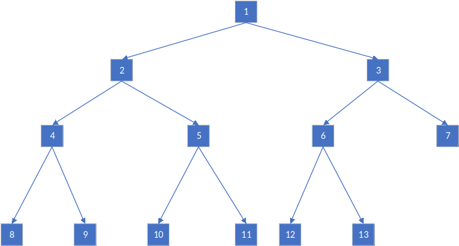

# 线段树
相较Fenwick树，线段树除了支持在 $O(logn)$ 时间内更新制定元素和计算区间和以外，还支持在 $O(logn)$ 时间内计算区间最值，但为此多付出了 $O(n)$ 的空间开销。


## 问题
给定长度为 $n$ 的序列 $v$ ，要求在 $O(logn)$ 的时间内完成如下操作：

* 更新单个元素 $v[i]$ 的值

* 查询位于区间 $[l, r)$ 的元素和


## 代码
用于维护区间求和的线段树：

```cpp
template <typename T>
class SGT {
   public:
    SGT() {}
    SGT(int _sz) : sz(_sz) { sgt = vector<T>(sz << 1, 0); }
    SGT(vector<T> arr) : sz((int)arr.size()) {
        sgt = vector<T>(sz << 1, 0);
        for (int i = 0; i < sz; i++) this->Add(i, arr[i]);
    }
    T Query(int l, int r) {
        T ans = 0;
        for (l += sz, r += sz; l < r; l >>= 1, r >>= 1) {
            if (l & 1) ans += sgt[l++];
            if (r & 1) ans += sgt[--r];
        }
        return ans;
    }
    void Add(int x, T val) {
        for (sgt[x += sz] += val; x > 1; x >>= 1)
            sgt[x >> 1] = sgt[x] + sgt[x ^ 1];
    }

   private:
    int sz;
    vector<T> sgt;
};
```

操作说明：

```cpp
using ll = long long;

// 建立一个长度为10的段树
SGT<ll> s(10);
for (int i = 0; i < 10; i++) {
    s.Add(i, i);
}

// 查询 [3, 7) 的和
int sum = s.Query(3, 7);
cout << sum << endl;
```

输出：

```
18
```


## 算法
线段树是一颗有奇数个节点的的完全二叉树:



由于线段树的后半段（叶节点）存储了原数组的内容，故线段树的操作无论建立、求和或者更新值都是先定位到叶节点然后自底向上进行。

具体地，区间和操作是先将表征左右端点指针定位在叶节点相应位置，然后一步步上移紧缩，过程每当端点出现奇数则需要“接漏”——其中左端是闭区间所以先加再缩，右端是开区间所以先缩再加。


## 讨论
* 关于为什么数组表示的二叉树一般不使用下标 $0$

从上至下，从左至右对一棵满二叉树编号，如根节点编号为 $1$，则节点的左右儿子和父亲分别为 $p << 1$, $p << 1 | 1$, $p >> 1$，节点之间的转移可以只通过位运算完成。然而若根节点从开始编号，则节点p的左右儿子分别为 $2p + 1$, $2p + 2$，父亲的索引与 $p$ 的奇偶性有关，索引转移因而复杂得多。


## 变体
用线段树维护、查询区间最值。

最大值
```cpp
template <typename T>
class SGT {
   public:
    SGT() {}
    SGT(int _sz) : sz(_sz) { sgt = vector<T>(sz << 1, 0); }
    SGT(vector<T> arr) : sz((int)arr.size()) {
        sgt = vector<T>(sz << 1, 0);
        for (int i = 0; i < sz; i++) this->Update(i, arr[i]);
    }
    T Query(int l, int r) {
        T ans = numeric_limits<T>::min();
        for (l += sz, r += sz; l < r; l >>= 1, r >>= 1) {
            if (l & 1) ans = max(ans, sgt[l++]);
            if (r & 1) ans = max(ans, sgt[--r]);
        }
        return ans;
    }
    void Update(int x, T val) {
        for (sgt[x += sz] = val; x > 1; x >>= 1)
            sgt[x >> 1] = max(sgt[x], sgt[x ^ 1]);
    }

   private:
    int sz;
    vector<T> sgt;
};
```

最小值
```cpp
template <typename T>
class SGT {
   public:
    SGT() {}
    SGT(int _sz) : sz(_sz) { sgt = vector<T>(sz << 1, 0); }
    SGT(vector<T> arr) : sz((int)arr.size()) {
        sgt = vector<T>(sz << 1, 0);
        for (int i = 0; i < sz; i++) this->Update(i, arr[i]);
    }
    T Query(int l, int r) {
        T ans = numeric_limits<T>::max();
        for (l += sz, r += sz; l < r; l >>= 1, r >>= 1) {
            if (l & 1) ans = min(ans, sgt[l++]);
            if (r & 1) ans = min(ans, sgt[--r]);
        }
        return ans;
    }
    void Update(int x, T val) {
        for (sgt[x += sz] = val; x > 1; x >>= 1)
            sgt[x >> 1] = min(sgt[x], sgt[x ^ 1]);
    }

   private:
    int sz;
    vector<T> sgt;
};
```
