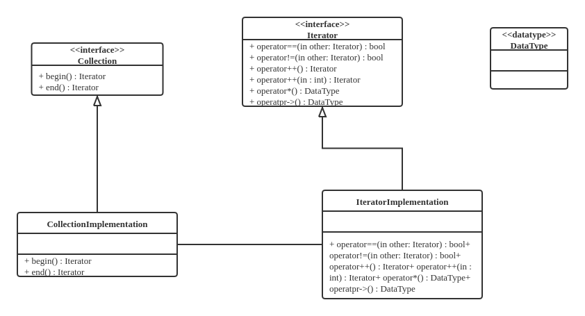
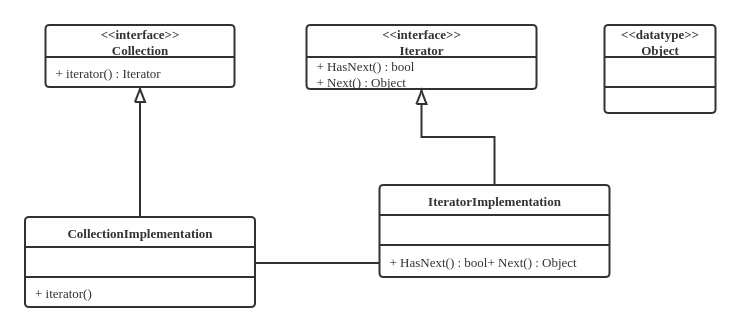

# 算法纵向拆分，分离表示

尝试将算法和数据分离。

逻辑、数据如何表示、算法细节业务流程的细节相关的部分

分离、解耦这三者

泛型编程：先实现算法、使用时再考虑数据类型

数据类型，对计算机底层是一种表示，对算法是一种束缚

## 迭代器

### 从问题开始

编程统计考试及格率
```cpp
int main(int argc, char* argv[]) {
    float scores[STUDENT_COUNT];
    int passed = 0;
    // initialize scores here.
    for (int i = 0; i != STUDENT_COUNT; i++) {
        if (scores[i] >= 60) passed++;
    }

    cout << "passing rate = " << (float)passed / STUDENT_COUNT << endl;

    return EXIT_SUCCESS;
}
```

注：这里用`!=`而不用`<`的原因是`!=`的执行更高效。

### 责任分解

把“分析”单独作为一个功能
```cpp
void Analyze(float *scores, int student_count) {
    int passed = 0;

    for (int i = 0; i != student_count; i++) {
        if (scores[i] >= 60) passed++;
    }

    cout << "passing rate = " << (float)passed / student_count << endl;
}
```

如果成绩使用单向链表存储
```cpp
struct Student {
    float score;
    Student* next;
};

//...

Student* head;
```

则先前的`Analyze`失效。

重新实现`Analyze`：
```cpp
void Analyze(Student* scores) {
    int passed = 0, count = 0;
    for (Student *p = scores; p != nullptr; p = p->next) {
        if (p->score >= 60) passed++;
        count++;
    }
    cout << "passing rate = " << (float)passed / count << endl;
}
```

### “遍历”的需求

* 不变的需求：遍历所有学生的成绩

* 变化的存储方式：操作不希望被某种存储方式绑定

分离“变”与“不变”

* 把“访问”设计成一个接口

* 针对不同的“存储”完成这个接口的不同实现

### 迭代器

把“访问”设计为一个接口
```cpp
class Iterator {
   public:
    virtual ~Iterator() {}
    virtual bool operator!=(const Iterator& other) const = 0;
    virtual const Iterator& operator++() = 0;
    virtual const Iterator* operator++(int) = 0;
    virtual float& operator*() const = 0;
    virtual float& operator->() const = 0;
    bool operator==(const Iterator& other) const { return !(*this != other); }
};
```

使用迭代器
```cpp
void Analyze(Iterator* begin, Iterator* end) {
    int passed = 0, count = 0;

    for (Iterator* p = begin; *p != *end; (*p)++) {
        if (**p >= 60) passed;
        count++;
    }

    cout << "passing rate = " << (float)passed / count << endl;
}
```

需要给“存储”对象一个约束

* 能够返回代表“头”和“尾”的迭代器

* 使用“左闭右开区间”，即 $[begin, end)$ - 以便于用`!=`判断结束

```cpp
class Collection {
   public:
    virtual ~Collection() {}
    virtual Iterator* begin() const = 0;
    virtual Iterator* end() const = 0;
    virtual int size() = 0;
};

int main(int argc, char* argv[]) {
    Collection* collection;
    // initialize collection here...
    Analyze(collection->begin(), collection->end());
}
```

## 迭代器的实现

实现基于数组的集合
```cpp
class ArrayCollection : public Collection {
   public:
    ArrayCollection() : size_(10) { data_ = new float[size_]; }
    ArrayCollection(int size, float* data) : size_(size) {
        data_ = new float[size_];
        for (int i = 0; i < size_; i++) *(data_ + i) = *(data + i);
    }
    ~ArrayCollection() { delete[] data_; }

    int size() { return size_; }
    Iterator* begin() const;
    Iterator* end() const;

   private:
    friend class ArrayIterator;
    float* data_;
    int size_；
};
```

其中获取首、尾`Iterator`的成员函数：
```cpp
Iterator* ArrayCollection::begin() const {
    return new ArrayIterator(data_, 0);
}

Iterator* ArrayCollection::end() const {
    return new ArrayIterator(data_, size_);
}
```

实现基于数组的迭代器
```cpp
class ArrayIterator : public Iterator {
   public:
    ArrayIterator(float* data, int index) : data_(data), index_(index) {}
    ArrayIterator(const ArrayIterator& other)
        : data_(other.data_), index_(other.index_) {}
    ~ArrayIterator() {}
    const Iterator& operator++();
    const Iterator& operator++(int);
    float& operator*() const;
    float* operator->() const;
    bool operator!=(const Iterator& other) const;

   private:
    float* data_;
    int index_;
};

const Iterator& ArrayIterator::operator++() {
    index_++;
    return *this;
}

const Iterator& ArrayIterator::operator++(int) {
    index_++;
    return ArrayIterator(data_, index_ - 1);
}

float& ArrayIterator::operator*() const { return *(data_ + index_); }

float* ArrayIterator::operator->() const { return (data_ + index_); }

bool ArrayIterator::operator!=(const Iterator& other) const {
    return data_ != ((ArrayIterator*)(&other))->data_ ||
           index_ != ((ArrayIterator*)(&other))->index_;
}
```

重写`Analyze`和`main`
```cpp
void Analyze(Iterator* begin, Iterator* end) {
    int passed = 0, count = 0;
    for (Iterator* p = begin; *p != *end; (*p)++) {
        if (**p >= 60) passed++;
        count++;
    }
    cout << "passing rate = " << (float)passed / count << endl;
}

int main() {
    float scores[] = {90, 20, 40, 40, 30, 60, 70, 30, 90, 100};
    Collection* collection = new ArrayCollection(10, scores);

    Analyze(collection->begin(), collection->end());
    system("PAUSE");
    return EXIT_SUCCESS;
}
```

### 迭代器模式

**设计模式**

* 提供一种方法顺序访问一个聚合对象中的各个元素

* 不暴露该对象的内部表示——与对象的内部表示无关（数组还是链表）



```cpp
//...
for (Iterator p = begin; p != end; p++) {
    // do something with object *p;
}
//...
```

### 另一种常见的迭代器模式



如Java等语言不提供`++`等运算符重载，上述迭代器模式提供了单向迭代：
```cpp
//...
Iterator it = Collection.iterator();
while (it.HasNext()) {
    Object object = it.next();
    // do something with object;
}
//...
```


## 迭代器与模板

固定的东西：

* 产生迭代器的方法

* 迭代器遍历集合的接口

变化的东西：

* 集合的存储方式

* 迭代器遍历集合的具体实现

迭代器实现了 **遍历操作** 与 **存储方法** 的隔离。使得实现算法逻辑时无需关心数据表示，而实现数据存储的时候又无需关心算法的逻辑。

###　算法的通用化

可以设计一些列通用算法：`max`, `min`, `sort`, `count`, `count_if`, `find`, ...

```cpp
int main() {
    float scores[] = {90, 20, 40, 40, 30, 60, 70, 30, 90, 100};
    Collection* c = new ArrayCollection(10, scores);
    cout << "passing rate = "
         << (float)count_if(c->begin(), c->end(), passed()) / c.size() << endl;

    system("PAUSE");
    return EXIT_SUCCESS;
}
```

### 改进目标

#### 问题 1

当前的使用方式
```cpp
void Analyze(Iterator* begin, Iterator* end) {
    for (Iterator *p = begin; *p != *end; (*p)++) {
        if (**p >= 60)   //...
    }
}
```

期待的使用方式
```cpp
void Analyze(const Iterator& begin, const Iterator& end) {
    for (Iterator p = begin; p != end; p++) {
        if (*p >= 60)   //...
    }
}
```

#### 问题 2

只支持`float`类型，见如下`*`和`->`的重载

```cpp
class Iterator {
   public:
    virtual ~Iterator() {}
    virtual bool operator!=(const Iterator& other) const = 0;
    virtual const Iterator& operator++() = 0;
    virtual const Iterator* operator++(int) = 0;
    virtual float& operator*() const = 0;
    virtual float& operator->() const = 0;
    bool operator==(const Iterator& other) const { return !(*this != other); }
};
```

### 引入模板

我们需要一种方法，在编写代码时将类型作为可变部分，这些部分在使用前必须做出指明。如此一来，可以先考虑通用的算法和抽象的数据结构，然后再在使用时予以实例化

使用 **模板** 技术实现 **泛型**。

#### 通用算法

```cpp
template <class iterator_>
void Analysis(iterator_ begin, iterator_ end) {
    int passed = 0, count = 0;
    for (iterator_ p = begin; p != end; p++) {
        if (*p >= 60) passed++;
        count++;
    }

    cout << "passing rate = " << (float)passed / count << endl;
}
```

这里`iterator_`类型的变量需要实现`=`, `!=`, `++`运算符。

```cpp
template <class T>
class ArrayCollection {
   public:
    ArrayCollection() : size_(10) { data_ = new T[size_]; }
    ArrayCollection(int size) : size(size_) { data_ = new T[size_]; }
    ArrayCollection(int size, T* data) : size_(size) {
        data_ = new T[size_];
        for (int i = 0; i < size_; i++) *(data_ + i) = *(data + i);
    }
    ~ArrayCollection() { delete[] data_; }
    T* begin(){ return data_; }
    T* end() { return data_ + size_; }

   private:
    T* data_;
    int size_;
};
```

#### 链表节点、链表迭代器、链表容器

```cpp
template <class T>
struct LinkiedListNode {
    T data_;
    LinkedListNode* next;
    LinkedListNode() : next(nullptr) {}
    LinkedListNode(T data) : data_(data), next(nullptr) {}
};

template <class T>
struct LinkedListIterator {
    LinkedListNode<T>* pointer;
    LinkedListIterator(LinkiedListNode<T>* p) : pointer(p) {}
    LinkedListIterator(const LinkedListIterator<T>& it) : pointer(it.pointer) {}

    LinkedListIterator<T>& operator++() {
        pointer = pointer->next;
        return *this;
    }
    const LinkedListIterator<T> operator++(int) {
        LinkedListIterator<T> temp = *this;
        pointer = pointer->next;
        return temp;
    }
    T& operator*() const { return pointer->data_; }
    T* operator->() const { return &(pointer->data_); }
    bool operator!=(const LinkedListIterator<T>& other) {
        return pointer != other.pointer;
    }
    bool operator==(const LinkedListIterator<T>& other) {
        return pointer == other.pointer;
    }
};

template <class T>
class LinkedListCollection {
   public:
    LinkedListCollection() : head_(nullptr) {}
    LinkedListCollection(int size, T* datq) {
        //...
    }
    ~LinkedListCollection() {
        //...
    }
    
    LinkedListIterator<T> begin() { return LinkedListIterator<T>(head_); }
    LinkedListIterator<T> end() { return LinkedListIterator<T>(nullptr); }

   private:
    LinkedListNode<T>* head;
};
```

使用如下：
```cpp
int main() {
    float scores[] = {90, 20, 40, 40, 30, 60, 70, 30, 90, 100};
    ArrayCollection<float> collection2(10, scores);
    LinkedListCollection<float> collection1(10, scores);

    Analyze(scores, scores + 10);
    Analyze(collection1.begin(), collection1.end());
    Analyze(collection2.begin(), collection2.end());

    system("PAUSE");
    return EXIT_SUCCESS;
}
```

这里指针由于支持`=`, `!=`, `++`操作，在这里也可以作为迭代器使用。

事实上，指针是一种迭代器，迭代器也是一种指针。


## 算法与数据解耦

## 抽象结构与类模板

## 函数对象与算法分解

## 基于模板的策略模式
