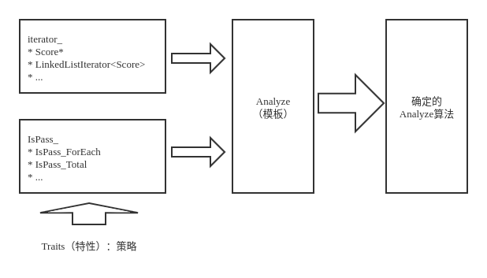

# 算法纵向拆分 - 分离表示

尝试将算法和数据分离。

逻辑、数据如何表示、算法细节业务流程的细节相关的部分

分离、解耦这三者

泛型编程：先实现算法、使用时再考虑数据类型

数据类型，对计算机底层是一种表示，对算法是一种束缚

## 迭代器

### 从问题开始

编程统计考试及格率
```cpp
int main(int argc, char* argv[]) {
    float scores[STUDENT_COUNT];
    int passed = 0;
    // initialize scores here.
    for (int i = 0; i != STUDENT_COUNT; i++) {
        if (scores[i] >= 60) passed++;
    }

    cout << "passing rate = " << (float)passed / STUDENT_COUNT << endl;

    return EXIT_SUCCESS;
}
```

注：这里用`!=`而不用`<`的原因是`!=`的执行更高效。

### 责任分解

把“分析”单独作为一个功能
```cpp
void Analyze(float *scores, int student_count) {
    int passed = 0;

    for (int i = 0; i != student_count; i++) {
        if (scores[i] >= 60) passed++;
    }

    cout << "passing rate = " << (float)passed / student_count << endl;
}
```

如果成绩使用单向链表存储
```cpp
struct Student {
    float score;
    Student* next;
};

//...

Student* head;
```

则先前的`Analyze`失效。

重新实现`Analyze`：
```cpp
void Analyze(Student* scores) {
    int passed = 0, count = 0;
    for (Student *p = scores; p != nullptr; p = p->next) {
        if (p->score >= 60) passed++;
        count++;
    }
    cout << "passing rate = " << (float)passed / count << endl;
}
```

### “遍历”的需求

* 不变的需求：遍历所有学生的成绩

* 变化的存储方式：操作不希望被某种存储方式绑定

分离“变”与“不变”

* 把“访问”设计成一个接口

* 针对不同的“存储”完成这个接口的不同实现

### 迭代器

把“访问”设计为一个接口
```cpp
class Iterator {
   public:
    virtual ~Iterator() {}
    virtual bool operator!=(const Iterator& other) const = 0;
    virtual const Iterator& operator++() = 0;
    virtual const Iterator* operator++(int) = 0;
    virtual float& operator*() const = 0;
    virtual float& operator->() const = 0;
    bool operator==(const Iterator& other) const { return !(*this != other); }
};
```

使用迭代器
```cpp
void Analyze(Iterator* begin, Iterator* end) {
    int passed = 0, count = 0;

    for (Iterator* p = begin; *p != *end; (*p)++) {
        if (**p >= 60) passed;
        count++;
    }

    cout << "passing rate = " << (float)passed / count << endl;
}
```

需要给“存储”对象一个约束

* 能够返回代表“头”和“尾”的迭代器

* 使用“左闭右开区间”，即 $[begin, end)$ - 以便于用`!=`判断结束

```cpp
class Collection {
   public:
    virtual ~Collection() {}
    virtual Iterator* begin() const = 0;
    virtual Iterator* end() const = 0;
    virtual int size() = 0;
};

int main(int argc, char* argv[]) {
    Collection* collection;
    // initialize collection here...
    Analyze(collection->begin(), collection->end());
}
```

## 迭代器的实现

实现基于数组的集合
```cpp
class ArrayCollection : public Collection {
   public:
    ArrayCollection() : size_(10) { data_ = new float[size_]; }
    ArrayCollection(int size, float* data) : size_(size) {
        data_ = new float[size_];
        for (int i = 0; i < size_; i++) *(data_ + i) = *(data + i);
    }
    ~ArrayCollection() { delete[] data_; }

    int size() { return size_; }
    Iterator* begin() const;
    Iterator* end() const;

   private:
    friend class ArrayIterator;
    float* data_;
    int size_；
};
```

其中获取首、尾`Iterator`的成员函数：
```cpp
Iterator* ArrayCollection::begin() const {
    return new ArrayIterator(data_, 0);
}

Iterator* ArrayCollection::end() const {
    return new ArrayIterator(data_, size_);
}
```

实现基于数组的迭代器
```cpp
class ArrayIterator : public Iterator {
   public:
    ArrayIterator(float* data, int index) : data_(data), index_(index) {}
    ArrayIterator(const ArrayIterator& other)
        : data_(other.data_), index_(other.index_) {}
    ~ArrayIterator() {}
    const Iterator& operator++();
    const Iterator& operator++(int);
    float& operator*() const;
    float* operator->() const;
    bool operator!=(const Iterator& other) const;

   private:
    float* data_;
    int index_;
};

const Iterator& ArrayIterator::operator++() {
    index_++;
    return *this;
}

const Iterator& ArrayIterator::operator++(int) {
    index_++;
    return ArrayIterator(data_, index_ - 1);
}

float& ArrayIterator::operator*() const { return *(data_ + index_); }

float* ArrayIterator::operator->() const { return (data_ + index_); }

bool ArrayIterator::operator!=(const Iterator& other) const {
    return data_ != ((ArrayIterator*)(&other))->data_ ||
           index_ != ((ArrayIterator*)(&other))->index_;
}
```

重写`Analyze`和`main`
```cpp
void Analyze(Iterator* begin, Iterator* end) {
    int passed = 0, count = 0;
    for (Iterator* p = begin; *p != *end; (*p)++) {
        if (**p >= 60) passed++;
        count++;
    }
    cout << "passing rate = " << (float)passed / count << endl;
}

int main() {
    float scores[] = {90, 20, 40, 40, 30, 60, 70, 30, 90, 100};
    Collection* collection = new ArrayCollection(10, scores);

    Analyze(collection->begin(), collection->end());
    system("PAUSE");
    return EXIT_SUCCESS;
}
```

### 迭代器模式

**设计模式**

* 提供一种方法顺序访问一个聚合对象中的各个元素

* 不暴露该对象的内部表示——与对象的内部表示无关（数组还是链表）


```cpp
//...
for (Iterator p = begin; p != end; p++) {
    // do something with object *p;
}
//...
```

### 另一种常见的迭代器模式


如Java等语言不提供`++`等运算符重载，上述迭代器模式提供了单向迭代：
```cpp
//...
Iterator it = Collection.iterator();
while (it.HasNext()) {
    Object object = it.next();
    // do something with object;
}
//...
```


## 迭代器与模板

固定的东西：

* 产生迭代器的方法

* 迭代器遍历集合的接口

变化的东西：

* 集合的存储方式

* 迭代器遍历集合的具体实现

迭代器实现了 **遍历操作** 与 **存储方法** 的隔离。使得实现算法逻辑时无需关心数据表示，而实现数据存储的时候又无需关心算法的逻辑。

###　算法的通用化

可以设计一些列通用算法：`max`, `min`, `sort`, `count`, `count_if`, `find`, ...

```cpp
int main() {
    float scores[] = {90, 20, 40, 40, 30, 60, 70, 30, 90, 100};
    Collection* c = new ArrayCollection(10, scores);
    cout << "passing rate = "
         << (float)count_if(c->begin(), c->end(), passed()) / c.size() << endl;

    system("PAUSE");
    return EXIT_SUCCESS;
}
```

### 改进目标

#### 问题 1

当前的使用方式
```cpp
void Analyze(Iterator* begin, Iterator* end) {
    for (Iterator *p = begin; *p != *end; (*p)++) {
        if (**p >= 60)   //...
    }
}
```

期待的使用方式
```cpp
void Analyze(const Iterator& begin, const Iterator& end) {
    for (Iterator p = begin; p != end; p++) {
        if (*p >= 60)   //...
    }
}
```

#### 问题 2

只支持`float`类型，见如下`*`和`->`的重载

```cpp
class Iterator {
   public:
    virtual ~Iterator() {}
    virtual bool operator!=(const Iterator& other) const = 0;
    virtual const Iterator& operator++() = 0;
    virtual const Iterator* operator++(int) = 0;
    virtual float& operator*() const = 0;
    virtual float& operator->() const = 0;
    bool operator==(const Iterator& other) const { return !(*this != other); }
};
```

### 引入模板

我们需要一种方法，在编写代码时将类型作为可变部分，这些部分在使用前必须做出指明。如此一来，可以先考虑通用的算法和抽象的数据结构，然后再在使用时予以实例化

使用 **模板** 技术实现 **泛型**。

#### 通用算法

```cpp
template <class iterator_>
void Analysis(iterator_ begin, iterator_ end) {
    int passed = 0, count = 0;
    for (iterator_ p = begin; p != end; p++) {
        if (*p >= 60) passed++;
        count++;
    }

    cout << "passing rate = " << (float)passed / count << endl;
}
```

这里`iterator_`类型的变量需要实现`=`, `!=`, `++`运算符。

```cpp
template <class T>
class ArrayCollection {
   public:
    ArrayCollection() : size_(10) { data_ = new T[size_]; }
    ArrayCollection(int size) : size(size_) { data_ = new T[size_]; }
    ArrayCollection(int size, T* data) : size_(size) {
        data_ = new T[size_];
        for (int i = 0; i < size_; i++) *(data_ + i) = *(data + i);
    }
    ~ArrayCollection() { delete[] data_; }
    T* begin(){ return data_; }
    T* end() { return data_ + size_; }

   private:
    T* data_;
    int size_;
};
```

#### 链表节点、链表迭代器、链表容器

```cpp
template <class T>
struct LinkiedListNode {
    T data_;
    LinkedListNode* next;
    LinkedListNode() : next(nullptr) {}
    LinkedListNode(T data) : data_(data), next(nullptr) {}
};

template <class T>
struct LinkedListIterator {
    LinkedListNode<T>* pointer;
    LinkedListIterator(LinkiedListNode<T>* p) : pointer(p) {}
    LinkedListIterator(const LinkedListIterator<T>& it) : pointer(it.pointer) {}

    LinkedListIterator<T>& operator++() {
        pointer = pointer->next;
        return *this;
    }
    const LinkedListIterator<T> operator++(int) {
        LinkedListIterator<T> temp = *this;
        pointer = pointer->next;
        return temp;
    }
    T& operator*() const { return pointer->data_; }
    T* operator->() const { return &(pointer->data_); }
    bool operator!=(const LinkedListIterator<T>& other) {
        return pointer != other.pointer;
    }
    bool operator==(const LinkedListIterator<T>& other) {
        return pointer == other.pointer;
    }
};

template <class T>
class LinkedListCollection {
   public:
    LinkedListCollection() : head_(nullptr) {}
    LinkedListCollection(int size, T* datq) {
        //...
    }
    ~LinkedListCollection() {
        //...
    }
    
    LinkedListIterator<T> begin() { return LinkedListIterator<T>(head_); }
    LinkedListIterator<T> end() { return LinkedListIterator<T>(nullptr); }

   private:
    LinkedListNode<T>* head;
};
```

使用如下：
```cpp
int main() {
    float scores[] = {90, 20, 40, 40, 30, 60, 70, 30, 90, 100};
    ArrayCollection<float> collection2(10, scores);
    LinkedListCollection<float> collection1(10, scores);

    Analyze(scores, scores + 10);
    Analyze(collection1.begin(), collection1.end());
    Analyze(collection2.begin(), collection2.end());

    system("PAUSE");
    return EXIT_SUCCESS;
}
```

这里指针由于支持`=`, `!=`, `++`操作，在这里也可以作为迭代器使用。

事实上，指针是一种迭代器，迭代器也是一种指针。


## 算法与数据解耦

容器：存储数据，数据的表示

算法：处理数据，抽象的算法实现

迭代器：标准的数据遍历接口，隔离算法与容器，是算法与数据的表示无关

实现通用的算法，将算法与数据表示解耦。

### 考试科目数变成3

如果上述问题考试科目变成3科，则`float`型变量不能表示分数，定义`Score`类型
```cpp
struct Score {
    float value[3];
    Score() {}
    Score(float f1, float f2, float f3) {
        value[0] = f1;
        value[1] = f2;
        value[2] = f3;
    }
    Score& operator=(const Score& s) {
        value[0] = s.value[0];
        value[1] = s.value[1];
        value[2] = s.value[2];
        return *this;
    }
    bool operator>=(float pass) {
        return value[0] >= pass && value[1] >= pass & value[2] >= pass;
    }
};

ostream& operator<<(ostream& out, const Score& s) {
    cout << "{" << s.value[0] << ", " << s.value[1] << ", " << s.value[2]
         << "}";
    return out;
}
```

相应地主函数变为
```cpp
int main(int argc, char* argv[]) {
    Score sarray[3];
    sarray[0] = Score(60, 60, 60);
    sarray[1] = Score(70, 70, 70);
    sarray[2] = Score(50, 80, 80);

    ArrayCollection<Score> collection3(3, sarray);
    LinkedListCollection<Score> collection4(3, sarray);
    
    Analyze(sarray, sarray + 3);
    Analyze(collection3.begin(), collection3.end());
    Analyze(collection4.begin(), collection4.end());

    system("PAUSE");
    return EXIT_SUCCESS;
}
```

### 如何实现解耦

对于一个数据类型，

|         | 值     | 操作        |
| ------- | ------ | ---------- |
| 抽象接口 | 值域    | 可用的操作   |
| 具体实现 | 如何存储 | 如何实现操作 |

对于 **可用的操作** 部分，对如`=`, `!=`, `++`, `*`的支持是算法所关心的。算法实际上只与 **可用的操作** 相关，与具体数据类型无关。

### 算法、运算符、运算符重载

算法仅与“可用的操作”相关，那么我们就可以抛开类型考虑算法，实现抽象运算，在算法和数据类型（存储）之间实现解耦。

在C++中，“可用的操作”时使用运算符来描述的（如`*`, `++`, `!=`, `>=`），他作用在指定数量的操作数上，返回一个结果。

如果我们需要某个数据类型可以使用在某个算法中，只要实现相关的操作就可以了。

这依赖于运算符重载，也可以认为是运算符重载的本来目的：**运算符重载就是在新的数据类型上还原运算符的本质**。

### 数据类型与操作

可用的操作是数据类型的抽象接口。

数据类型也可以用 **可用操作的集合** 来界定，具有相同“可用操作集合”就是相同的数据类型。

如果把“操作”更加泛华，将其定义到一个抽象实体上，那么就可以把“数据类型”进一步抽象化。


## 抽象结构与类模板

除了“抽象算法”之外，还有“抽象结构”
    `Stack`, `LinkedList`, `Vector`

这些抽象结构，与存储什么数据无关，至于数据的存储方式和访问方式相关，可以借助类模板实现。

### 实现一个链表模板

例如下方链表


```cpp
template <class T>
struct LinkedListNode {
    T data_;
    LinkedListNode* next_;
    LinkedListNode() : next_(nullptr) {}
    LinkedListNode(T data) : data_(data), next_(nullptr) {}
    LinkedListNode(T data, LinkedListNode* next) : data_(data), next_(next) {}
};

template <class T>
class LinkedListCollection {
   public:
    LinkedListCollection() : head_(nullptr) {}
    ~LinkedListCollection() { clear(); }

    bool empty() { return head_ == nullptr; }
    void AddFirst(const T& data) {
        head_ = new LinkedListNode<T>)(data, head_);
    }
    bool RemoveFirst() {
        if (head_ != nullptr) {
            LinkedListNode<T>* p = head_;
            head_ = head_->next_;
            delete p;
            return true;
        } else {
            return false;
        }
    }
    T* GetFirst() { return head_ != nullptr ? &(head_->data_) : nullptr; }
    bool RemoveLast() {
        if (head_ != nullptr) {
            if (head_->next_ != nullptr) {
                LinkedListNode<T>* p;
                for (p = head_; p->next_->next_ != nullptr; p = p->next_)
                    ;
                delete p->next_;
                p->next_ = nullptr;
                return true;
            } else {
                delete head_;
                head_ = nullptr;
                return true;
            }
        } else {
            return false;
        }
    }
    clear() {
        while (RemoveFirst())
            ;
    }
    LinkedListIterator<T> begin() { return LinkedListIterator<T>(head_); }
    LinkedListIterator<T> end() { return LinkedListIterator<T>(nullptr); }

   private:
    LinkedListNode<T>* head_;
};
```

关于 **内联函数** ：

C++中`inline`关键字修饰函数定义（告诉编译器这个函数可能被频繁使用，对性能要求敏感，调用时使用内联展开，避免入栈出栈的操作）

`inline int max(int a, int b) { return a > b ? a : b; }`

作用：函数内联展开，避免函数调用开销，用空间换时间。

在类定义体内定义（实现）的函数缺省为内联函数。

**到此为止** 我们为任意类型元素实现链表的方式。

### 用链表模板组织分数

通过模板实例化使用Linked List（抽象结构）
```cpp
int main(int argc, char* argv[]) {
    //...
    LinkedListCollection<Score> collection4;
    for (int i = 0; i < 3; i++)
        collection4.AddFirst(sarray[i]);

    Analyze(collection4.begin(), collection4.end());
    //...
    return EXIT_SUCCESS;
}
```

### 小结

固定的东西：

* 算法/抽象结构的接口与实现

* “数据”的访问接口（迭代器）

* “数据”的可用操作（运算符重载）

变化的东西：

* “数据”的组织形式

* “数据”的类型（值域、存储、操作实现）

由此实现“算法/抽象结构”与“数据表示”之间的分离

**泛型编程**：先实现算法，再充实数据表示（类型）


## 函数对象与算法分解

### 当“及格”判定规则发生变化

如果某些科目的及格线不是60分

现有的`Analyze`函数
```cpp
template <class iterator_>
void Analyze(iterator_ begin, iterator_ end) {
    int passsed = 0, count = 0;
    for (iterator_ p = begin; p != end; p++) {
        if (*p >= 60) passed++;
        count++;
    }
    cout << "passing rate = " << (float)passed / count << endl;
}
```

将判断及格函数`IsPass`的函数指针作为参数传给`Analyze`
```cpp
template <class iterator_>
void Analyze(iterator_ begin, iterator_ end, bool (*IsPass)(const iterator_&)) {
    int passsed = 0, count = 0;
    for (iterator_ p = begin; p != end; p++) {
        if (IsPass(p)) passed++;
        count++;
    }
    cout << "passing rate = " << (float)passed / count << endl;
}
```

使用“判断及格”函数指针
```cpp
template <class iterator_>
bool IsPass(const iterator_& p) {
    return p->value[0] >= 70 && p->value[1] >= 60 && p->value[2] >= 60;
}

注：这里的`IsPass`有缺陷：只适用于`Score`类型

int main(int argc, char* argv[]) {
    //...
    Analyze(sarray, sarray + 3, IsPass<Score*>);
    Analyze(collection3.begin(), collection3.end(), IsPass<Score*>);
    Analyze(collection4.begin(), collection4.end(), IsPass<LinkedListIterator<Score>>);
    //...
}
```

### 进一步解耦

这两个函数唯一的不同就是“科一”的及格分数
```cpp
template <class iterator_>
bool IsPass(const iterator_& p) {
    return p->value[0] >= 70 && p->value[1] >= 60 && p->value[2] >= 60;
}

template <class iterator_>
bool IsPass(const iterator_& p) {
    return p->value[0] >= 60 && p->value[1] >= 60 && p->value[2] >= 60;
}
```

如何抽离出相同的处理逻辑，将“及格线”记录下来

* 使用`Score`变量
```cpp
const Score pass(70, 60, 60);

template <class iterator_>
bool IsPass(const iterator_& p) {
    return p->value[0] >= pass.value[0] && p->value[1] >= pass.value[1] && p->value[2] >= pass.value[2];
}
```

* 使用文件
```cpp
template <class iterator_>
bool IsPass(const iterator_& p) {
    float pass1, pass2, pass3;
    ifstream is("pass-score.txt");
    is >> pass1 >> pass2 >> pass3;
    return p->value[0] >= pass1 && p->value[1] >= pass2 && p->value[2] >= pass3;
}
```

可以通过修改`pass-score.txt`的内容改变及格分数线组合。

这里 **单一实例** 的问题依然存在，问题在于函数是固定的。

### 函数对象

定义`IsPass`函数对象类模板
```cpp
template <class iterator_, class T>
class IsPass {
   public:
    IsPass(const T& pass) : pass_(pass) {}
    bool operator()(const iterator_& p) { return *p >= pass_; }

   private:
    T pass_;
};
```

相应改变算法定义
```cpp
template <class iterator_, class T>
void Analyze(iterator_ begin, iterator_ end, IsPass<iterator_, T> is_pass) {
    int passsed = 0, count = 0;
    for (iterator_ p = begin; p != end; p++) {
        if (is_pass(p)) passed++;
        count++;
    }
    cout << "passing rate = " << (float)passed / count << endl;
}
```

使用函数对象
```cpp
int main(int argc, char* argv[]) {
    //...
    sarray[0] = Score(60, 60, 60);
    sarray[1] = Score(70, 70, 70);
    sarray[2] = Score(50, 80, 80);
    ArrayCollection<Score> collection3(3, sarray);
    LinkedListCollection<Score> collection4;
    //...
    Analyze(sarray, sarray + 3, IsPass<Score*, Score>(Score(70, 60, 60)));
    Analyze(collection3.begin(), collection4.end(), IsPass<Score*, Score>(Score(50, 60, 60)));
    Analyze(collection4.begin(), collection4.end(), IsPass<LinkedListIterator<Score>, Score>(Score(60, 60, 60)));
}
```

### 判断及格的逻辑改变

新需求：`IsPass`如果也要多种实现，没课都及格和总分及格

此时可以把`IsPass`函数对象不作为`Analyze`的 **参数** 而将其类型作为`Analyze`的 **模板参数** 传入
```cpp
template <class iterator_, class IsPass_>
void Analyze(iterator_ begin, iterator_ end, IsPass_ is_pass) {
    int passsed = 0, count = 0;
    for (iterator_ p = begin; p != end; p++) {
        if (is_pass(p)) passed++;
        count++;
    }
    cout << "passing rate = " << (float)passed / count << endl;
}
```

这样就可以是吸纳不同的`IsPass_`
```cpp
template <class iterator_, class T>
class IsPass_ForEach {
   public:
    IsPass_ForEach(const T& pass) : pass_(pass) {}
    bool operator()(const iteartor_& p) { return *p >= pass_; }

   private:
    T pass_;
};

template <class iterator_, class T>
class IsPass_Total {
   public:
    IsPass_ForEach(const T& pass) : pass_(pass) {}
    bool operator()(const iteartor_& p) {
        return p->GetTotal() >= pass.GetTotal();
    }

   private:
    T pass_;
};
```

### 小结

对于`Analyze`这个算法

| 描述                | 操作 | 参数         |
| ------------------ | --- | ------------ |
| 针遍历集合中的所有元素 | 遍历 | iterator_    |
| 判断是否及格         | 判断 | IsPass_      |
| 累加“及格”数量       | 累加 | Analyze()本身 |

有三个无关（正交）的可变部分


## 基于模板的策略模式

### 策略模式的模板实现

用两个类参数组合形成一个确定的Analyze算法实例。

策略模型的模板实现：



这里再次体现了 **策略** 模式。

### 再看负载监视器

使用 模板策略 实现负载监视器
```cpp
template <class load_, class memory_, class latency_, class display_>
class Monitor : public load_, public memory_, public latency_, public display_ {
   public:
    Monitor() {}

    void GetLoad() { load = load_::GetCPULoad(); }
    void GetTotalMemory() { total_memory = memory_::GetTotal(); }
    void GetUsedMemory() { used_memory = memory_::GetUsed(); }
    void GetNetworkLatency() { latency = latency_::GetLatency(); }
    void Show() { display_::Show(load, total_memory, used_memory, latency); }

   private:
    float load, latency;
    long total_memory, used_memory;
};
```

这里也可以使用组合代替继承。

相应主程序
```cpp
int main(int argc, char* argv[]) {
    Monitor<Load, memory, Latency, Display> monitor;
    while (running()) {
        monitor.GetLoad();
        monitor.GetTotalMemory();
        monitor.GetUsedMemory();
        monitor.GetNetworkLatency();

        monitor.Show();
        sleep(1000);
    }
}
```

定义策略类
```cpp
class Load {
   public:
    float GetCPULoqd();
};

class Memory {
   public:
    long GetTotal();
    long GetUsed();
};

class Latency {
   public:
    float GetLatency();
};
```

显示策略类
```cpp
class Display {
   public:
    void Show(float load, long total_memory, long used_memory, float latency);
};
```

### STL

Standard Template Library - 标准模板库

* 一组最常用的Ｃ++功能的模板实现
    * 算法 - `min`, `max`, `for_each`, `find_if`, `copy`, `sort`, `stable_sort`等
    * 函数对象及其操作：算法的可变部分 - `greater`, `less`, `equal_to`, `logical_and`, `logical_or`, `no1`, `not2`, `bind1st`, `bind2nd`, `ptr_fun`等
    * 容器及其迭代器：算法所作用的一组数据及对其进行遍历的手段 - `vector`, `dqueue`, `list`, `set`, `map`, `stack`, `queue`及其迭代器, `istream_oterator`, `ostream_iterator`等
    * 其他：如`string`类
