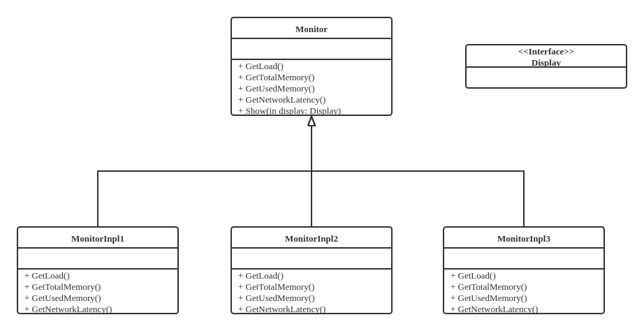
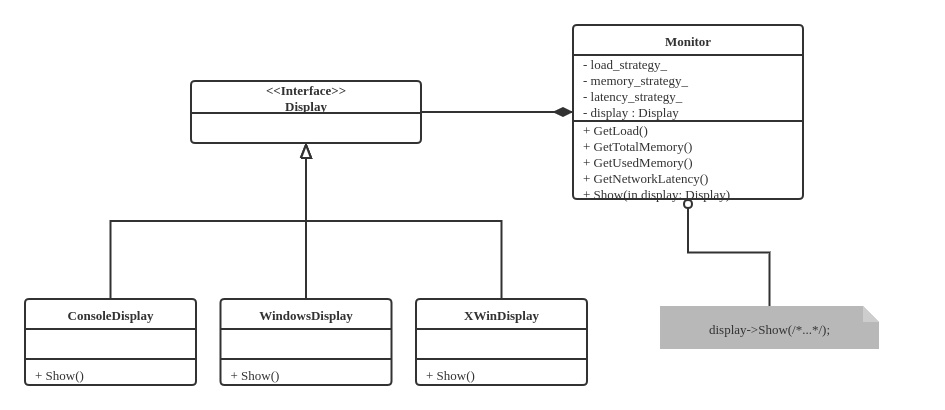
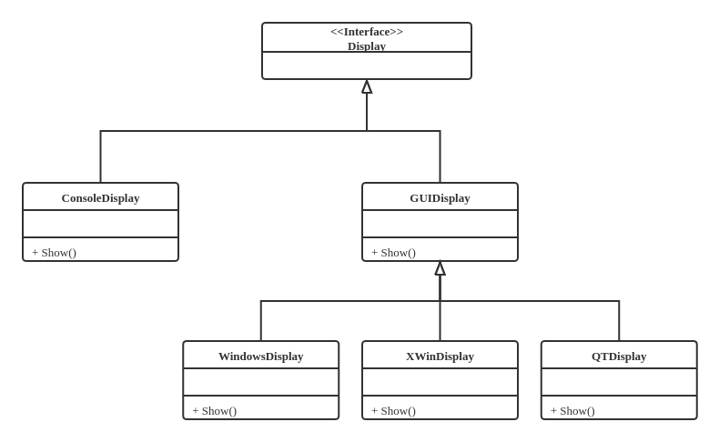
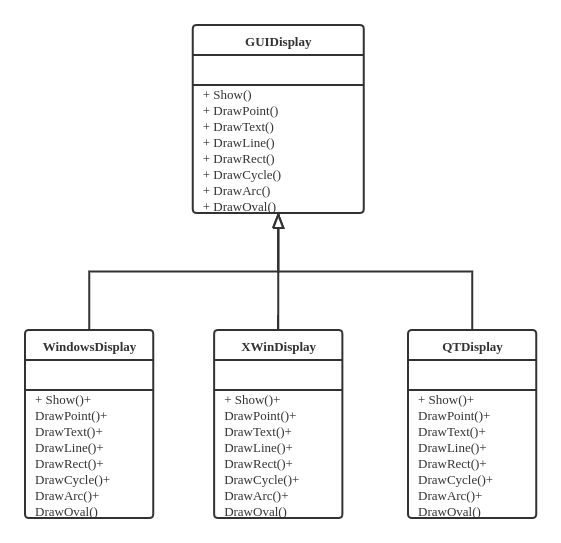
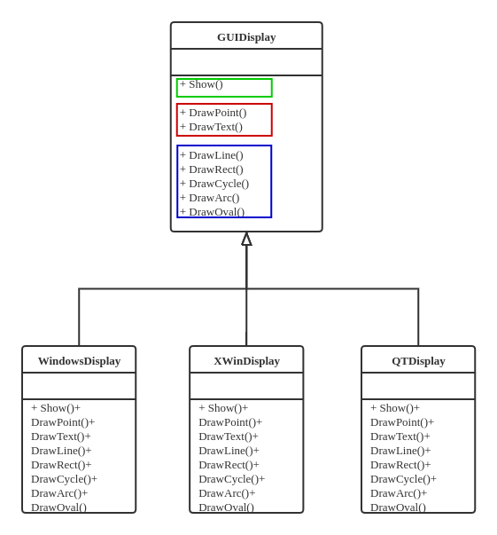

# 算法横向拆分，分离步骤

面向对象的接口设计要时刻遵循功能的 **单一性** 原则。

## 设计一个负载监视器

### 负载监视器

监视计算节点的敷在状态（如CPU占用率、存储器占用率、到某个特定节点的网络延迟）。

以CPU占用率的监视为例，不同条件下（例如不同种类不同版本的OS）获得CPU占用率的方法不同。

怎样在一个程序中实现对这些不同条件的适应呢？

### 自顶向下

主程序，Monitor的使用方法

```cpp
int main(int argc, char* argv[]) {
    WindowsDisplay display;
    Monitor monitor(&display);
    while (running()) {
        monitor.GetLoad();
        monitor.GetTotalMemory();
        monitor.GetUsedMemory();
        monitor.GetNetworkLantency();

        monitor.show();
        sleep(1000);
    }
}
```

`switch case` - 对于不同的条件下实现`Monitor::GetLoad`函数

```cpp
enum MonitorType { Win32, Win64, Ganglia };

MonitorType type = Ganglia;

float Monitor::GetLoad() {
    switch (type) {
        case Win32:
            // Get system load via Win32 APIs
            return load;
        case Win64:
            // Get system load via Win64 APIs
            return load;
        case Ganglia:
            // Get system load via Ganglia interface
            return load;
    }
}
```

弊端：每增加一种新的系统环境，需要对`Monitor::GetLoad`函数做修改。

模板方法



```cpp
class Monitor {
   public:
    virtual void GetLoad() = 0;
    virtual void GetTotalMemory() = 0;
    virtual void GetUsedMemory() = 0;
    virtual void GetNetworkLatency() = 0;

    Monitor(Display *display);
    virtual ~Monitor();
    void Show();
   protected:
    float load, latency;
    long total_memory, used_memory;
    Display* m_display;
};

void Monitor::Show() {
    m_display->Show(load, total_memory, used_memory, latency);
}
```

### 这种实现的问题

如果几个函数接口的实现相互独立，分别有 $N, M, K$ 种实现方法，那么，实现子类的个数将是 $N \times M \times K$种。

例如如果实现`GetLoad()`的方式有 $4$ 种，实现 `GetTotalMemory()` 的方式有 $3$ 种，那么子类的数量可以有 $12$ 种。当代码需要维护的时候需要对重复的代码进行修改，费时费力。


## 接口分离与单一责任原则

### 两种不同层次的变化

对于上述实现，存在两种不同层面的变化，应该有所区分

* 在实现层面上：对于每个功能，存在多种实现方法

    * 相对于基类是可变的，每种变化对应一个子类

    * 这种变化表现在编译期，是一种相对静态的可变

* 在组织层面上：大“类”的功能由一系列子功能构成

    * 子功能之间是相互独立的，应当将这些子功能拆分到不同的“小”类

    * 组合是自由的、动态的、可变的、通过实现子功能的“小”类对象的组合来完成

    * 这种变化表现在运行期，是一种相对动态的可变

* 隔离不同层面的“变”

    * 静态的可变用 **继承**

    * 动态的可变用 **组合**

### 单一责任

* 单一责任原则

    * 类功能应该是 **内聚** 的，一个类只承担一项功能

    * 表现为：修改/派生一个类只应该有一个理由，只能由单个变化因素引起

* 将多个不同功能交由同一个类实现，违反了单一责任原则

    * 当一个功能需要变化时，不得不修改或者派生新的实现类

### 分离两种层次

* 剥离出新的接口

    * 每个功能（算法）的实现定义为一个接口（称为 **策略** ）

    * 与接口不同的实现组成一个 **策略类的体系**

* 用组合替代继承

    * 用功能（算法）接口之间的组合来实现功能（算法）之间的组合

如此一来，对于实现相互独立的函数接口分别有 $N, M, K$ 种实现方法，需要实现的类的数量从 $N \times M \times K$ 变为 $N + M + K$ 个“小”类和 $1$ 个大类。

### 重新看负责监视其的设计

* 剥离新的接口

    * 由三个“策略”接口分别定义不同的功能

    * 每个策略接口有一系列不同的实现

* 用组合替代继承

    * `Monitor`类中堡村一组“策略”接口类的实例

    * 这些实例可以自由组合和动态替换

实现`LoadStrategy`“小类”
```cpp
class LoadStrategy {
   public:
    virtual float GetLoad() = 0;
};

class LoadStrategyImpl1 : public LoadStrategy {
   public:
    float GetLoad() {
        // Get load here...
        return load;
    }
};

class LoadStrategyImpl2 : public LoadStrategy {
   public:
    float GetLoad() {
        // Get load here...
        return load;
    }
};
```

实现`Monitor`类
```cpp
class Monitor {
   public:
    Monitor(LoadStrategy *load_strategy, MemoryStrategy *memory_strategy,
            LatencyStrategy *latency_strategy, Display *display);
    void GetLoad();
    void GetTotalMemory();
    void GetUsedMemory();
    void GetNetworkLatency();
    void Show();

   private:
    LoadStraegy *load_strategy_;
    MemoryStrategy *memory_strategy_;
    LatencyStrategy *latency_strategy_;
    float load, latency;
    long total_memory, used_memory;
    Display *display_;
};

Monitor::Monitor(LoadStrategy *load_strategy, MemoryStrategy *memory_strategy,
                 LatencyStrategy *latency_strategy, Display *display)
    : load_strategy_(load_strategy),
      memory_strategy_(memory_strategy),
      latency_strategy_(latency_strategy),
      display_(display),
      load(0.0),
      latency(0.0),
      total_memory(0),
      used_memory(0) {}

void Monitor::Show() {
    display->Show(load, total_memory, used_memory, latency);
}
```

主函数实现
```cpp
int main(int argc, char *argv[]) {
    GangliaLoadStrategy load_strategy;
    WinMemoryStrategy memory_strategy;
    PingLatencyStrategy latency_strategy;
    WindowDisplay display;
    Monitor monitor(&load_strategy, &memory_strategy, &latency_strategy, &display);

    while (running()) {
        monitor.GetLoad();
        monitor.GetTotalMemory();
        monitor.GetUsedMemory();
        monitor.GetNetworkLatency();

        monitor.Show();
        sleep(1000);
    }
}
```

这样的实现还具备运行期的 **灵活性** ，可以使用新的策略类替换原始的策略类。
```cpp
class Monitor {
   public:
    // ,,,
    void SetLoadStrategy(LoadStrategy *load_strategy);
    void SetMemoryStrategy(MemoryStrategy *memory_strategy);
    void SetLatencyStrategy(LoadStrategy *latency_strategy);
};

int main(int argc, char *argv[]) {
    //...
    LoadStrategyImpl2 new_load_strategy;
    monitor.SetLoadStrategy(&new_load_strategy);
    monitor.GetLoad();
    //...
}
```


## 委托与接口的进一步分解

接着负载监视器的设计，接下来实现结果显示部分

回顾之前设计中留下的`Monitor::Show()`接口
```cpp
class Monitor {
    public:
    //...
    void Show();
    protected:
    float load, latency;
    long total_memory, used_memory;
    Display* display_;
};

void Monitor::Show() {
    display_->Show(load, total_memory, used_memory, latency);
}
```



这里`Monitor::Show`调用的是`Display display_`这个成员的`Show`方法，而`Display::Show`又根据环境调用相应子类的`Show`方法。

`Monitor`有一个“显示”的任务，但它本身没有实现而是交给`Display display_`这个成员实现。这是一种 **委托** 模式

* Delegation, Wrapper, Helper 一般都指的是 **委托** 模式

### 深入`Display`

“显示”分成两类：Console和GUI，GUI更加美观、常用。

GUI有多种不同的实现（Windows, X-Win, QT, ...），来实现多个不同的`GUIDisplay`



同时，我们又希望显示是多样化的，如不同的颜色、形状；柱状图、折线图、饼图



### 问题

对于`GUIDisplay`的各个子类，大量重复代码（代码冗余，维护难度加大）

分析：变与不变

|    不变                    |                         变 |
| :-----------------------: | :------------------------: |
| 任何绘图基础都是画点，画法一样 | 不同GUI，实现画点的API接口不同 |

把变与不变分离，抽象出新的接口

### 分离新的接口

将`GUIDisplay`中的函数分成三类



其中

* 第一类是其对外暴露的接口

* 第二类是需要调用特定平台API的函数

* 第三类函数基于第二类函数实现

于是可以讲三类函数分离开来，在不同层面体现其可变性。


## 分离不同层面的可变性

“显示”部分包含两个层面的变化：

* 调用不同平台API实现相同的基础功能

* 结果采用命令行显示还是GUI显示


