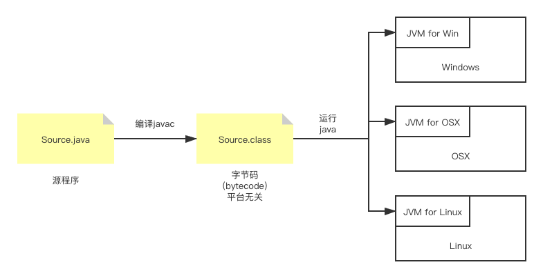

# Java基础

## 引言

### Java的历史与发展

1990 年 SUN 公司开始用 C++ 开发家用电器软件，1994 年基于 C++ 开发出了 Oka 语言，1995 年 正式将 Oka 命名为 Java，官网 java.sun.com，后 SUN 被 Oracle 收购。

Java 分为三大平台：

* Java SE 标准版：用于桌面应用
* Java EE 企业版：用于 web 应用
* Java ME 微型版：用于移动端应用

JDK 是 Java 开发工具包，其发展历程如下：

* 1995 - JDK 1.0：初创
* 1998 - JDK 1.2：Java2
* 2000 - JDK 1.3：改进
* 2002 - JDK 1.4：稳定
* 2004 - JDK 1.5：语法增加，从此叫 Java 5,6,7...
* 2006 - JDK 1.6：广泛使用
* 2010 - Oracle 并购 SUN
* 2011 - JDK 1.7：改进
* 2014 - JDK 1.8：前进大步

Java 的发展是由 JCP（Java Community Process） 和 JSR（Java Specification Requests）主要推动的。例如，Lambda 表达式是 JSR-335 引入的，这也是 Java8 重要的新特性。

### Java 语言的特点

Java 是一种编程语言，它面向对象，语法与 C++ 极为相似，但比 C++ 更简单。

Java 的特点可以规纳入下：

* 语法简单
* 面向对象（与 C++ 保留了一部分 C 的特性不同，Java 的一切冻灾对象内，是更为纯粹的面向对象）
* 平台无关
* 安全稳定
* 支持多线程

另外，Java 具备丰富的类库，提供了大量的类以满足网络化、多线程、面向对象系统的需要。

所以，Java 能够胜任 *面向对象的应用开发、各类网络应用程序的开发、计算过程的可视化、动态画面和交互操作、Internet系统管理、数据库操作* 等任务。

Java 相比 C++ 的砍掉了什么：

* 无直接指针操作
* 自动内存管理（系统自动释放内存）
* 数据类型长度固定（平台无关）
* 不用头文件
* 不包含结构和联合
* 不支持宏
* 不用多重继承（而是用结构，从而避免了拷贝构造等 C++ 中的复杂操作）
* 无类外全局变量
* 无 GOTO

### Java 运行机制 - 跨平台的原因

Java 有三个核心机制：

* Java 虚拟机（JVM）
* 代码安全性检查（Code Security）
* 垃圾收集机制（Garbage Collection）

<center></center>
<center>Java 程序的编译和运行</center>

其中 JVM 是在一台计算机上由软件或硬件模拟的计算机，读取并处理经过并以过的字节码 class 文件。

JVM 规范定义了：指令集、寄存器集、类文件结构、堆栈、垃圾收集堆、内存区域。

具体运行时需要运行环境 JRE（Java Runtime Environment）

JRE = JVM + API(Lib)

JRE 运行时有三项主要功能：

* 加载代码：由 class loader 完成
* 校验代码：由 bytecode verifier 完成 —— 该特点保证 Java 的安全性
* 执行代码：由 run time interpreter 完成

另一方面，Java 有自动垃圾回收机制（在 C++ 中程序员需要利用 new/delete 操作管理内存）。

* JVM 中有系统及线程跟踪存储空间的分配情况
* 在 JVM 空闲时，检查并释放那些可被释放的存储空间
* 程序员无须也无法精确控制或干预该回收过程

最后 JDK 是由 JRE+工具包 构成的，其中工具包主要包括：Java Compiler, Java Debugger, JavaDoc, JPDA。

JDK 提供的工具有：

* java 编译器：javac
* java 执行器：java
* 文档生成器：javadoc
* java 打包器：jar
* java 调试器：jdb

### 面向对象程序设计

对象的含义：

* 现实世界中：一个客观实体
* 计算机世界中：一个可标识的存储区域

类：具有共同属性（变量，field）和行为（方法，method）的对象集合

类是对象的抽象（模板），对象是类的实例。

注：类和对象有时都称为“对象”，为了明确起见，后者称为对象实例。

面向对象的程序设计有 **封装性、继承性、多态性** 三大特征。

#### 封装

* 模块化：将属性和行为封装在类中，程序定义很多类。
* 信息隐蔽：将类的细节部分隐藏起来，用户只通过某个后保护的接口访问某个类。

#### 继承（inheritance）

继承的本质是基一种 **类和子类之间共享数据的方法**。从而大大提高了编程效率。

继承的好处可以总结为：

* 更好地进行 **抽象与分离**
* 增强代码的 **重用率**
* 提高 **可维护性**

#### 多态（polymorphism）

让不同的对象，在接收同一个指令（方法）的时候进行不同的操作。

其中气节的实现则由接收对象自行决定。

#### 面向对象程序设计的要点

* 认为客观世界有各种对象组成
* 程序的分析和设计都围绕着

    * 有哪些类
    * 梅格雷有哪些属性、哪些方法
    * 类之间的关系（如继承、关联）
    * 对象之间发送消息（调用方法）


## 简单的 Java 程序

### Java 程序的类型与基本构成

Java 程序有很多种类型。而在 Java SE 中主要有两种类型： **Application** 和 **Applet**，二者的结构和运行环境有所不同：

* Application：前者是独立程序，需要执行器（JVM）来运行
* Applet：嵌在 HTML 网页中的非独立程序，可以由专门的 Applet View 来运行，也可以由 Web 浏览器（调用 JMV）来运行

#### Application

HelloWorld.java
```java
public class HelloWorldApp {
    public static void main(String args[]) {
        System.out.println("Hello World!");
    }
}
```

要点：

* class 是主体
* public 类名与文件同名
* main() 的写法是固定的

#### Applet

* 没有入口函数 main，故为非独立运行。
* 字节码文件 .class 需要借助支持Java的浏览器来运行。

### 程序的编写、编译和运行

* 编辑：纯文本文件 .java —— 注意文件名要和 public 的类名一致。
* 编译：JDK 中的 **javac** 工具将源文件（.java）转换为字节码文件（.class） —— 字节码文件中包含的是 JVM 指令。
* 运行：JDK 中的 **java** 工具 —— 注意 `java` 工具后跟的是 **类** 不是 **文件**。

#### 设定 classpath

在 `java` 及 `java` 命令行上使用 `-classpath/-cp` 选项可以指定使用的类库：
```
javac -cp libxx.jar Source.java

java -cp libxx.jar Source
```

#### 使用 package 时的编译

实际目录结构要与 package 后跟的文件路径一致。

编译及运行：
```
# Use -d option to make the dir for target classes. 
javac -d classes path/to/dir1/*.java path/to/dir2/*.java path/to/dir3/*.java

# Use -cp option to specify the dir in which to find target class.
java -cp classes path.to.target.Class
```

### Applet 程序的编译和运行

Java Applet 程序必须嵌入到 HTML 中，并由负责解释 HTML 文件的 WWW 浏览器充当解释器，解释执行程序。

Java Applet 在 WWW 中引入了动态交互的内容。

在编译得到 .class 文件后，使用 HTML 中的 <applet> 标签来嵌入 Applet。

可以使用　**appletViewer** 来执行内嵌　Applet 的 HTML 文件。
```
appletViewer xxx_including_applet.html
```

*从 Java8 开始，`Applet` 的运行受到了严格的限制，由此也诞生了很多替代方案，如 `Flash`、`SilverLight` 等。后来更直接的直接使用 JavaScript 或 HTML5 里的一些功能来实现网页里面的交互功能。*

### JDK中的其他几个工具

* javac：编译
* java：运行（终端 或 GUI）
* appletViewer：运行 Applet 程序
* jar：打包工具
* javadoc：生成文档
* javap：查看类信息及反汇编
* ...

#### 使用 jar 打包

打包
````
javac -cvfm A.jar A.man A.class
````
其中 `c`（create 创建），`v`（verbose 详情），`f` 为输出文件名，`m` 为清单文件名。

运行
```
java -jar A.jar
```

一般清单文件会写明 jar 包的 **版本**、**根路径** 和 **主类名**
```
Manifest-Version: 1.0
Class-Path: .
Main-Class: A
``` 

注：清单文件可以任意命名，常见用法是 MANIFEST.MF。

#### 使用 javadoc 生成文档

```
javadoc -d 目录名 xxx.java
```

`/**    */` 中的内容可以用一下标记：

* `@author`：类说明；标明开发该类模块的作者
* `@version`：类说明；标明该类模块的版本
* `@see`：类、属性、方法的说明；参考专项，即相关主题
* `@param`：方法说明；对方法中某参数的说明
* `@return`：方法说明；对方法返回值的说明
* `@exception`：方法说明，对方法可能跑出异常的说明

#### Java API 的文档

官方文档：https://docs.oracle.com/javase/8/docs/api/index.html

#### javap 产看类信息和反汇编

查看类信息
```
javap 类名
```

反汇编
```
javap -c 类名
```
输出的是 JVM 指令。
