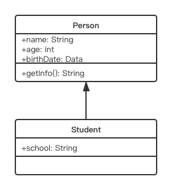

# 类、包和接口

## 类、字段、方法

**类** 是 Java 程序中最近本的要素，是一类对象的原型，它 **封装** 了一类对象的状态和方法。

从形式上讲，相当于讲 **变量和函数** 封装到一个 **类** 当中。

```java
class Person{
    String name;
    int age;
    void sayHello() {
        System.out.println("Hello! My name is " + name);
    }
}
```

**字段（field）** 是类的属性，是用 **变量** 来表示的。

字段也称为 **域、域变量、属性、成员变量** 等。

**方法（method）** 是类的功能和操作，用 **函数** 来表示。

**构造方法（constructor）** 是一种特殊的方法，用来初始化该类的一个对象。构造方法与类同名，而且不写返回类型：
```java
Person(String _name, int _age) {
    name = _name;
    age = _age;
}
```
一般情况下，一个类有一至多个构造方法。

如果没有定义任何构造方法，系统自动产生一个构造方法，称为默认构造方法（default constructor）。默认构造方法不带参数，而且方法体为空。

访问对象的方法，需要用 `.` 运算符：
```java
Person p = new Person();
System.out.println(p.name);
p.sayHello();
```
这种使用方式的好处是：**封装性** 和 **安全性**（通过引用访问保证不会访问非法地址）。

**方法重载（override）**：多个方法有相同的名字，**编译期** 能识别出来。

这些方法的 **签名（signature）** 不同，即具有不同的参数列表。

通过方法重载可以实现 **多态（polymorphism）**。

### **this** 的使用：

* 在方法中，使用 `this` 来访问字段及方法。此时 `this` 表示当前实例本身。
* `this` 经常用于解决局部变量与类变量同名的问题，例如：
```java
Person(int age, String name) {
    this.age = age;
    this.name = name;
}
``` 
* 在构造方法中，用 `this` 调用另一个构造方法，如：
```java
Person() {
    this(0, "");
    //...
}
```
注：在构造方法中调用另一个构造方法，则这条调用语句 **必须放在第一句**。


## 类的继承

**继承（inheritance）** 是面向对象程序设计中最为 **重要的特性之一**。

Java 中关于继承有：**子类（subclass）** 和 **父类/超类（superclass）** 的概念。

Java 只支持单继承，即 **一个类只能有一个直接的父类**。

子类在继承父类的状态和行为的同时，可以 **修改** 父类的状态或重载父类的行为，也可以 **增加** 新的状态和行为。

这样做的好处是：

* 可以提高程序的抽象程度
* 实现代码重用，提升开发效率好可维护性 

Java 中继承是通过 `extends` 关键字来实现的：
```java
class Student extends Person {
    //...
}
```
缺省 `extends` 表示从 `java.lang.Object` 类继承。

*所有的类都是通过直接或间接继承 `java.lang.Object` 得到的。*

用 UML 图表示继承关系：

<center></center>

```java
class Student extends Person {
    String school;
    int score;
    boolean isGood() { return score > 80; }
    //...
}
```

JDK1.5 之后可以用 `@override` 注记 来表示函数的 **覆盖（override）**，而不用也是可以的：
```java
void sayHello() {
    System.out.println("Hello! My name is " + name + " from " + school);
}
```

一个类中可以有多个同名的方法，这称为方法的 **重载（overload）** 。当重载父类方法的时候，本质上是增加新的方法：
```java
void sayHello(Student another) {
    System.out.println("Hi!");
    if (school.equals(another.school)) {
        System.out.println("Schoolmate!");
    }
}
```

可以使用 `super` 来访问父类的域和方法。

注意无论是 `this` 还是 `super` 都是当前对象实例的指针，并不会因为 `super` 的使用使得内存中多出一个父类的对象。

`super` 的存在使得子类在 **覆盖** 父类方法的同时，又 **可以使用** 原来定义在父类中的方法。

### 父类对象与子类对象的转换：

* 子类对象可以被视为其父类的一个对象
* 父类对象不能被当做其某一个子类的对象（如果用子类指针指向父类实例，编译能通过，但运行会抛异常）
* 父类作为函数形参时可以传一个子类实参
* 如果一个父类对象的引用指向的实际是一个子类的实例，那么这个父类的想的引用可以强制类型转换（casting）成子类对象的引用：
```java
Person p = new Student("Desmond", 12);
Student s = (Student)p;
```

## 包的使用

### package

包及子包的定义，实质上是一种命名空间，为了解决命名冲突。

`package pkg1.pkg2.pkg3`

它与类的继承没有关系。实际上，子类和父类可以位于不同的包中。

包有两个层面的含义：

* 一个是 **命名空间**、存储路径
* 一个是 **可访问性**，同一个包中的各个类，默认情况下可以相互访问

包层次的根目录是由环境变量 `CLASSPATH` 来确定的。

对于没有 `package` 语句的文件，称为默认包，默认在根目录下。

JDK 中提供了很多包，如：`java.applet`, `java.awt`, `java.awt.image`, `java.awt,peer`, `java.io`, `java.lang`, `java.net`, `java.util`, `java.swing` 等。

### import

为了能使用 Java 中已经提供的类，需要用 `import` 语句来导入所需要的类：`import pkg1.pkg2.pkg3.Class`

Java 编译器会自动导入 `java.lang.*`

