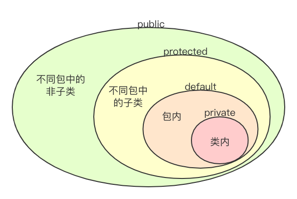
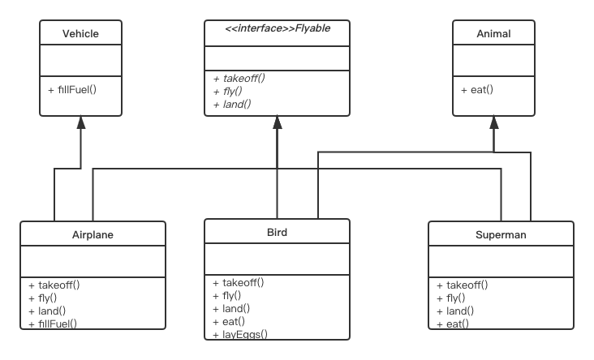

# 类、包和接口

## 类、字段、方法

**类** 是 Java 程序中最近本的要素，是一类对象的原型，它 **封装** 了一类对象的状态和方法。

从形式上讲，相当于讲 **变量和函数** 封装到一个 **类** 当中。

```java
class Person{
    String name;
    int age;
    void sayHello() {
        System.out.println("Hello! My name is " + name);
    }
}
```

**字段（field）** 是类的属性，是用 **变量** 来表示的。

字段也称为 **域、域变量、属性、成员变量** 等。

**方法（method）** 是类的功能和操作，用 **函数** 来表示。

**构造方法（constructor）** 是一种特殊的方法，用来初始化该类的一个对象。构造方法与类同名，而且不写返回类型：
```java
Person(String _name, int _age) {
    name = _name;
    age = _age;
}
```
一般情况下，一个类有一至多个构造方法。

如果没有定义任何构造方法，系统自动产生一个构造方法，称为默认构造方法（default constructor）。默认构造方法不带参数，而且方法体为空。

访问对象的方法，需要用 `.` 运算符：
```java
Person p = new Person();
System.out.println(p.name);
p.sayHello();
```
这种使用方式的好处是：**封装性** 和 **安全性**（通过引用访问保证不会访问非法地址）。

**方法重载（override）**：多个方法有相同的名字，**编译期** 能识别出来。

这些方法的 **签名（signature）** 不同，即具有不同的参数列表。

通过方法重载可以实现 **多态（polymorphism）**。

### **this** 的使用：

* 在方法中，使用 `this` 来访问字段及方法。此时 `this` 表示当前实例本身。
* `this` 经常用于解决局部变量与类变量同名的问题，例如：
```java
Person(int age, String name) {
    this.age = age;
    this.name = name;
}
``` 
* 在构造方法中，用 `this` 调用另一个构造方法，如：
```java
Person() {
    this(0, "");
    //...
}
```
注：在构造方法中调用另一个构造方法，则这条调用语句 **必须放在第一句**。


## 类的继承

**继承（inheritance）** 是面向对象程序设计中最为 **重要的特性之一**。

Java 中关于继承有：**子类（subclass）** 和 **父类/超类（superclass）** 的概念。

Java 只支持单继承，即 **一个类只能有一个直接的父类**。

子类在继承父类的状态和行为的同时，可以 **修改** 父类的状态或重载父类的行为，也可以 **增加** 新的状态和行为。

这样做的好处是：

* 可以提高程序的抽象程度
* 实现代码重用，提升开发效率好可维护性 

Java 中继承是通过 `extends` 关键字来实现的：
```java
class Student extends Person {
    //...
}
```
缺省 `extends` 表示从 `java.lang.Object` 类继承。

*所有的类都是通过直接或间接继承 `java.lang.Object` 得到的。*

用 UML 图表示继承关系：

<center></center>

```java
class Student extends Person {
    String school;
    int score;
    boolean isGood() { return score > 80; }
    //...
}
```

JDK1.5 之后可以用 `@override` 注记 来表示函数的 **覆盖（override）**，而不用也是可以的：
```java
void sayHello() {
    System.out.println("Hello! My name is " + name + " from " + school);
}
```

一个类中可以有多个同名的方法，这称为方法的 **重载（overload）** 。当重载父类方法的时候，本质上是增加新的方法：
```java
void sayHello(Student another) {
    System.out.println("Hi!");
    if (school.equals(another.school)) {
        System.out.println("Schoolmate!");
    }
}
```

可以使用 `super` 来访问父类的域和方法。

注意无论是 `this` 还是 `super` 都是当前对象实例的指针，并不会因为 `super` 的使用使得内存中多出一个父类的对象。

`super` 的存在使得子类在 **覆盖** 父类方法的同时，又 **可以使用** 原来定义在父类中的方法。

### 父类对象与子类对象的转换：

* 子类对象可以被视为其父类的一个对象
* 父类对象不能被当做其某一个子类的对象（如果用子类指针指向父类实例，编译能通过，但运行会抛异常）
* 父类作为函数形参时可以传一个子类实参
* 如果一个父类对象的引用指向的实际是一个子类的实例，那么这个父类的想的引用可以强制类型转换（casting）成子类对象的引用：
```java
Person p = new Student("Desmond", 12);
Student s = (Student)p;
```

## 包的使用

### package

包及子包的定义，实质上是一种命名空间，为了解决命名冲突。

`package pkg1.pkg2.pkg3`

它与类的继承没有关系。实际上，子类和父类可以位于不同的包中。

包有两个层面的含义：

* 一个是 **命名空间**、存储路径
* 一个是 **可访问性**，同一个包中的各个类，默认情况下可以相互访问

包层次的根目录是由环境变量 `CLASSPATH` 来确定的。

对于没有 `package` 语句的文件，称为默认包，默认在根目录下。

JDK 中提供了很多包，如：`java.applet`, `java.awt`, `java.awt.image`, `java.awt,peer`, `java.io`, `java.lang`, `java.net`, `java.util`, `java.swing` 等。

### import

为了能使用 Java 中已经提供的类，需要用 `import` 语句来导入所需要的类：`import pkg1.pkg2.pkg3.Class`

Java 编译器会自动导入 `java.lang.*`

## 访问控制符 - public, private, protected

Java 中有两种修饰符（modifier）：**访问修饰符（如 public/private）** 和 **其他修饰符（如 abstract）**。修饰符可以修饰类，也可以修饰类的成员。

### 类成员的访问控制符

<center></center>
<center>类成员的访问控制符</center>

### 类的访问控制符

被 `public` 修饰的类可以被 **其他类** 所访问，而默认的访问控制权限是 **同包** 访问。

### setter 和 getter

将字段用 `private` 修饰，从而更好地将信息进行 **封装和隐藏** 。

这种方法有以下优点：

* 属性用 `private` 更好地封装和隐藏，外部类不能随意存取和修改。
* 在方法定义中可以检验 **参数的合法性**
* 方法可以给出经过计算后的值
* 方法可以完成其他必要工作（如清理资源、设定状态 等）
* 只提供 `getXXX` 不提供 `setXXX` 保证属性是只读的

## 其他修饰符 - static, final, abstract

### static 字段

不保存在某个对象的实例中，而是保存在类的实例的公共存储单元。

可以通过 **类名** 来访问，也可以通过 **实例** 访问，两种方式的结果是相同的。

例如，`System` 类的 `in` 和 `out` 对象，就是属于类的域，直接用类名来访问，即 `System.in` 和 `System.out`。

可以用来作实例计数：
```java
class Person {
    static long totalNum;
    int age;
    String Name;
};
```

由于 Java 是完全面向对象的（不支持 “将变量定义在外面”），故 `static` 成员可以用以替换 C++ 中的 **全局变量**。

`static` 方法同理，它不能用来对具体实例的成员进行操作，只能调用 `static` 成员、操纵 `static` 变量。显然，`static` 的方法不能访问 `this` 或 `super` 这种实例引用。

`static` 方法的调用可以使用类名，也可以使用变量名，但效果是相同的。

有一种方便的写法是 `import static`，例如：
```java
import static java.lang.System.*;

out.println();  // 表示 System.out.println();
```
`import static` 的前提是类的所有成员都是`static`的。

### final

`final` 修饰的类不能被继承，即不能有子类。

`final` 修饰的方法不能被子类方法覆盖。

`final` 修饰的字段和局部变量（方法中的变量）能且只能被赋值一次，是只读的。

* 一个字段被 `static final` 修饰时，它可以表示常量，如 `Integer.MAX_VALUE`, `Math.PIE`。

* 在定义 `static final` 域时，如不给定初始值，则按默认值进行初始化（数值为 `0`，布尔型为 `false`，引用型为 `null`）。

* 在定义 `final` 字段时，若不是 `static` 的域，则 **必须且只能** 赋值一次，不能缺省。

    * 这种域的赋值方式有两种：**一是在定义变量时赋初始值，而是在每一个构造函数中进行赋值**。

* 在定义 `final` 局部变量时，也 **必须且仅能赋值一次**。这个值可以不是常量，但在该变量存在期间不会改变。

### abstract

`abstract` 类（**抽象类**）不能被实例化。

`abstract` 方法（**抽象方法**）的写法类似 C++ 中的函数声明：
```java
abstract retuanType abstractMethod(/* param list */);
```
其作用在于 **为所有的子类定义一个统一的接口**。

抽象类可以包含抽象方法，也可以不包含。但包含抽象方法的类必须声明为抽象类。

抽象方法在子类中必须被实现，否则子类仍然是 `abstract` 的。

## 接口（interface）

接口是 **某种特征的约定**。

* 接口定义中所有方法都是 `public abstract` 的。（在 UML 图中用斜体表示）
* 实现接口 `implements` 可以实现多继承，并且与类的继承关系无关

如下图所示：
<center></center>
<center>接口继承UML图</center>

**面向接口编程**，而不是面向实现：

* `Flyable f = new Bird();`
* Java 中有大量的接口

接口的作用：

* 通过接口可以实现 **不相关类的相同行为**，而不需要考虑这些类之间的层次关系。从而在一定程度上实现了多重继承。
* 通过接口可以指明多个类需要实现的方法。
* 通过接口可以了解对象的交互界面，而不需要了解对象所对应的类。

接口举例：
```java
interface Collection {
    void add(Object obj);
    void delete(Object obj);
    Object find(Object obj);
    int size();
}
```

通常 **接口名** 以 **...able 或 ...ible** 结尾，标明接口能完成一定的行为。

接口的声明中还可以包括对接口的访问权限以及对它的父接口列表。完整的接口声明如下：
```java
[public] interface interfaceName [extends listOfSuperInterface] {
    //  ...
}
```

* 其中 `public` 指明任意类均可以访问这个接口，缺省情况下，只有与该接口定义在同一个包中的类才可以访问这个接口。
* `extends` 子句与类声明中的 `extends` 子句不同的是一个接口可以有多个父接口，但一个子类只能有一个父类。子接口继承父接口中的所有常量和方法。

接口内方法声明的格式为：`returnType methodName(/* paramlist */);`

接口中只进行方法的声明，不提供方法的实现，故该定义没有方法体，用 `;` 结尾。

在接口中声明的方法具有 `public` 和 `abstract` 属性。所以定义的时候这两个关键词是 **可以省略的**。

另外，如果子接口中定义了和父接口同名的常量或相同的方法，则父接口中的常量被隐藏，方法被重载。

举例来说，下面定义的 `FIFOQueue` 中实现了上面所定义的接口 `Collection`：
```java
class FIFOQueue implements Collection {
    public void add(Object obj) {
        // ...
    }
    
    public void delete(Object obj) {
        // ...
    }

    public Object find(Object obj) {
        // ...
    }
    
    public int currentCount() {
        // ...
    }
}
```
在类中实现接口定义的方法时，方法的声明必须与接口中所定义的完全一致。

接口可以作为一个 **引用类型** 来使用。任何实现该接口的类的实例都可以 **存储在该接口类型的变量中**，通过这些变量 **可以访问类所实现的接口中的方法**。Java 运行时系统动态地决定该使用哪个类中的方法。

把接口作为一种数据类型可以不需要了解对象所对应的具体的类，举例如下：
```java
// ...
Collection c = new FIFOQueue();
c.add(obj);
//...
```

### 接口中的常量和枚举，Java8 对接口的扩充

#### 常量和枚举

接口体重可以包含常量定义。

常量定义的格式为：
```java
type NAME = value;
```
其中 `type` 可以是任意类型，`NAME` 是常量名，通常用大写，`value` 是常量值。

在接口中定义的常量可以被实现该接口的多个类共享，它与 **C 中 `define`** 以及 **C++ 中用 `cosnt` 定义常量的意义是相同的**。

在 **接口中定义的常量** 具有 `public`, `static`, `final` 属性。

从 JDK5 开始，可以使用枚举
```java
enum Light { Red, Yello, Green }
```

使用：
```java
Light light = Light.Red;
switch(light) { case Red: ... break; }
```
注意：`case` 后面不写为 `Light.Red`。

Java 中枚举是用 `class` 来实现的，可以复杂地使用。

#### Java8 中的接口

Java8 以上，接口成员还可以是：`static` 方法，具有实现体的方法（default 方法）

* 默认方法的好处是：提供了一个默认实现，子类在实现的时候可以不用重新写了。


## 小结

### 完整的类定义
```java
// 类声明
[public] [abstract|final] class className [extends superClassName] [implements InterfaceNameList] {
    // 成员变量声明（可为多个）
    [public|protected|private] [static] [final] [transient] [volatile] type variableName;

    // 方法定义及实现（可为多个）
    [public|protected|private] [static] [final|abstract] [native] [synchronized] returnType mathodName([paramList]) [throws exceptionList] {
        // ...
    }
}
```

### 完整的接口定义
```java
// 接口声明
[public] interface InterfaceName [extends SuperInterfaceList] {
    type constantName = Value;  // 常量声明（可为多个）
    returnType methodName([paramList]); // 方法声明（可为多个）
}
```

### 三种要求固定声明方式的方法
```java
// 构造方法
className([paramList]) {
    // ...
}

// main()方法
public static void main(String args[]) {
    // ...
}

// finalize()方法
protected void finalize() throw throwable {
    // ...
}
```
其中 `finalize` 方法一般不用，与编译器相关。

### 完整的 Java 源文件
```java
package packageName;    // 指定文件中类所在的包，0个或1个
import packageName.[className|*];   // 指定引入的类，0个或多个
public classDefinition  // 属性为 public 的类定义，0个或1个
interfaceDefinition and classDefinition // 接口和类的定义，0个或多个
```
其中：

* 源文件的名字必须与属性为 `public` 的类名完全相同
* 在一个 .java 文件中，`package` 语句和 `public` 类最多只能有一个
