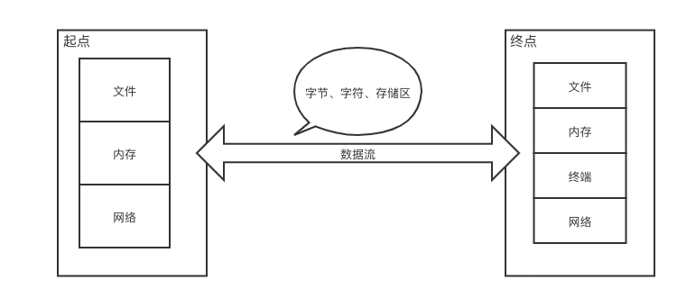

# 流、文件及基于文本的应用

## 输入输出流

把不同类型的输入输出都抽象为 **流（stream）**，按方向进一步分为 **输入流** 和 **输出流**。

最早期 Java 将输入输出功能封装在 `java.io` 包中，JDK1.4 引入了 `java.nio` 包，这里的 n 是 new 的意思，JDK1.7 改版为 `java.nio2`。

流的概念

### 字节流与字符流

流按照其内容分为 **字节流** 和 **字符流**，具体按照一个一个 *字节* 读取还是按照一个一个 *字符* 读取。

|     |     字节流    | 字符流  |
|     |--------------|--------|
| 输入 | InputStream  | Reader |
| 输出 | OutputStream | Writer |

字节

## 文件及目录

## 正则表达式

