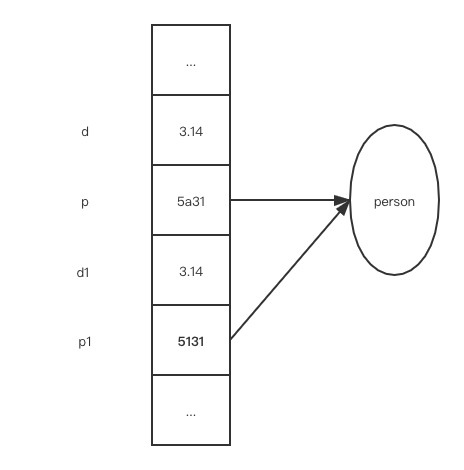

# 基本语法 —— 数据运算、流控制和数组

## 数据类型、变量、常量

数据类型决定了 Java 中数据的存储方式和运算方式。

Java 中的数据类型分为：**基本类型（primitive types）** 和 **引用类型（reference types）**：

* 数据类型
    * 基本类型
        * 数值型
            * 整数类型（byte, short, int, long）
            * 浮点类型（float, double）
        * 字符型（char）
        * 布尔型（boolean）
    * 引用类型
        * 类（class）
        * 接口（interface）
        * 数组

基本类型的变量在内存位于 **栈空间**，赋值语句复制 **值**
```java
double d = 3;
Person p = new Person();
```

应用类型的变量引用到 **堆空间**，赋值语句复制的是 **引用**
```java
double d1 = d;
Person p1 = p;
```

<center></center>

关于 Java 中的四类八种基本类型，要注意：

* ·boolean· 类型不能与整形混用，取值只能为 `true` 或 `false`，这一点与 C++ 不同。
* ·char· 类型用 Unicode 编码，占 2 字节。
* 四种整型有固定的表示范围和字段长度，**不受操作系统影响**，以此保证可移植性。
* Java 整型中没有”无符号数“

标识符（identifier）：任何一个变量、常量、方法、对象和类都要有名字。

标识符可以由数字、字母、下划线、$符号组成，但不能以数字开头。

一般按照 Java 的命名惯例，**类名首字母大写（Pascal）**，其余的（包、方法、变量名）**首字母小写（camel）**。一般很少使用下划线，常量在使用处定义，而不是都写在开篇。

## 运算符与表达式

### 运算符

* 算数运算符：`+`, `=`, `*`, `/`, `%`, `++`, `--`
* 关系运算符：`<`, `>`, `<=`, `>=`, `==`, `!=`
* 逻辑运算符：`!`, `&`, `|`, `^`, `$$`（短路与）, `||`（短路或）
* 位运算符：`&`, `|`, `^`, `~`, `<<`（左移，低位补零）, `>>`（右移，高位补原来的符号位）, `>>>`（无符号右移，即高位补零）
* 赋值运算符：`=`；扩展赋值运算符：`+=`, `-=`, `*=`, `/=`
* 字符串连接运算符：`+`

移位运算的性质：

* 适用于 **整型** 和 **字符型**
* 对长度少于 int 型的操作数先自动转化为 int 型再移位（整形提升，对所有的运算都是这样）
* 对于 int 型整数移位，移动位数先对 $32$ 取模
* 对于 long 型整数移位，移动为数先对 $64$ 取模

赋值运算符 `=` 两侧操作数类型不一致时，使用 **默认类型转换** 或 **强制类型转换（casting）** 原则进行处理。后者用于缩小类型的时候，如：
```java
long a = 1000;
int b = (int)a;
```

特例：可以将整形常量直接赋值给 `byte`, `short`, `char` 等变量类型，而不需要进行强制类型转换，只要不超过其表数范围，如·：
```java
byte b = 2; // valid
byte b = 4096; // invalid
```

### 表达式

**表达式** 是符合一定语法规则的运算符和操作数的序列。

表达式中操作数运算得到的结果称为表达式的 **值**，值的类型称为表达式的 **类型**。

当表达式中有不同类型操作数时，同意转化成更高的类型：`int` < `long` < `float` < `double`。

整形提升：所有 `byte`, `char`, `short` 参与算术运算时都转化为 `int`。

*如果你不是分确定运算符的优先级，可以多使用`()`提高程序可读性。另一方面，可以从 javap -c 类名 反汇编得到的 JVM 汇编指令中挖局有用信息。*

## 流程控制

与 C++ 不同，Java 中没有 ”表达式语句“，即下述写法不合法：
```java
x + y;
```
**这种设计避免了程序员写无意义的表达式**。

Java 中的注释除了与 C++ 相同的 `//` 和 `/*  */` 的写法之外。还有形如 `/**   */` 的 doc 注释，用于 JDK 的 `javadoc` 工具。这种设计的本质是为了提高程序的 **易读性**。

Java 中的 `if else` 和 `switch` 的语法与 C++ 相同。

Java 中的 `for`, `while`, `do while` 的语法与 C++ 相同。

### 关于 `goto` 语句：

在各种语言中，是否保留 `goto` 语句都是一个具有争议的话题，主要问题在于 `goto` 语句的随机跳转严重降低了程序的可读性。

对于这个问题，Java 的解决方案是引入相比于 C++ 增强版的 `break` 和 `continue` 关键字。在循环前面可以用标号来标明是哪一重循环，例如：
```java
label1: {...
label2:     {...
label3:         {...
                    break label2;
        }
    }
}
```
同样地，`continue` 也可以通过标号来制定调到外面的某一层循环。

## 关于数组

数组是多个相同类型数据的组合。

一维数组的声明方式：
```java
int[] a;
double[] b;
MyClass[] C;
```
注：数组方括号可以写在变量前面，也可以写在变量后面。

**数组定义** 与 **为数组分配空间** 分开进行，如：
```java
int []a = new int[3];
a[0] = 3;
a[1] = 6;
a[2] = 9;

MyClass []mcs = new MyClass[3];
mcs[0] = new MyClass(/* params */);
mcs[1] = new MyClass(/* params */);
mcs[2] = new MyClass(/* params */);
```
Java 中声明数组时不能指定其长度，例如 `int a[5];` 这种写法就是非法的。这个 **根本原因** 是数组时引用类型，我们在声明的时候并不会把数据存到栈空间内。

数组也可以使用 **静态初始化**，定义数组的同时就为数组元素分配空间并赋值。如：
```java
int[] a = {1, 2, 3};
int[] b = new int[] {1, 2, 3};

MyClass[] mcs = {
    new MyClass(/* params */),
    new MyClass(/* params */),
    new MyClass(/* params */),
};
```
初始化列表中最后可以多一个 `,`。

有数组是引用类型，故数组一经分配空间，其中每个元素就被 **隐式初始化**。数值类型是 `0`，引用类型是 `null`。**这样设计的初衷是避免分配空间后内容不确定带来的安全性隐患**。

Java 的数组有一个 `length` 属性用于记录数组的长度。

Java 中也有增强 `for` 循环：
```java
int[] ages = new int[10];
for (age : ages) {
    System.out.pringln(age);
}
```
注意这种遍历方式是 **只读** 的。

`Array.copy` 方法提供了数组元素的复制功能。

### 多维数组

在 Java 中，二维数组是 “数组的数组”，故数组每行的长度可以不同，这一点与 C++ 不同，举例如下：
```java
int[][] a = {{1, 2}, {3, 4, 0, 9}, {5, 6, 7}};

int[][] b = new int[3][];
b[0] = new int[2];
b[1] = new int[4];
b[2] = nwe int[3];
```
