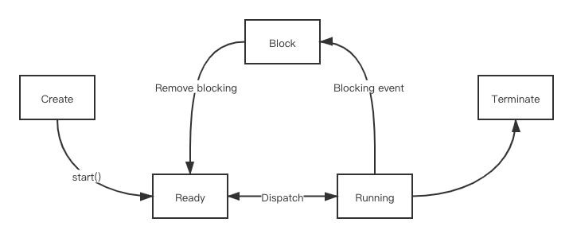

# 多线程

## 线程创建

**进程**：一个程序的执行

**线程**：程序中单个顺序的流控制

一个进程可以含有多个线程。一般的操作系统都提供查询线程数的 API。

一个进程中的多个线程 **共享 CPU**（并发或者分享时间片），也 **共享内存**（如多个线程访问同一个对象）。

Java 从语言级别支持多线程。如 `Object` 中 `wait()` 和 `notify()`，再比如 `java.lang` 中的 `Thread` 类。

**线程体** 一般用 `run` 方法来实现。线程启动后，系统就 **自动调用** `run` 方法。

通常，`run` 方法执行一个 **时间较长** 的操作：如 *执行一个循环*，*显示一系列图片*，*下载一个文件* 等。

创建线程的 **两种方法**：

* 通过继承 `Thread` 类创建线程
```java
class MyThread extends Tread {
    public void run() {
        for (int i = 0; i< 100; i++) {
            System.out.print(" " + i);
        }
    }
}
```

* 通过向 `Thread()` 构造方法传递 `Runnable` 对象来创建线程。
```java
class MyTask implements Runnable {
    public void run() {
        // ...
    }
}
MyTask myTask = new MyTask();
Thread thread = new Tread(myTask);
tread.start();
``` 

* 匿名类创建，在 `new` 一个 `Thread` 的同时覆盖其中的 `run` 方法
```java
new Thread() {
    public void run() {
        for (int i = 0; i < 100; i++) {
            System.out.println("" + i);
        }
    }
}.start();
```

* 用 Lambda 表达式
```java
new Thread(() -> { /* ... */ }).start();
```


## 线程控制

### 线程的状态与生命周期

<center></center>
<center>线程状态机</center>

### 基本线程控制操作

* 线程的 **启动**：`start()`
* 线程的 **结束**：设置一个 **标记变量**，以结束相应的循环及方法。
* **暂时阻止** 线程执行：
```java
try { Thread.sleep(1000); } catch ( InterruptedException e ) {}
```
注：`Tread.sleep()` 方法会抛出 `InterruptedException` 异常，一般要将其 `catch` 住。

设定线程优先级：`setPriority(int priority)` 方法

### 后台线程

线程有两种：

* 普通线程
    * 在 Java 程序中，若还有非Daemon线程，则整个程序就不会结束
* Daemon线程（守护线程、后台线程）
    * 如果普通线程结束了，则后台线程 **自动终止**
    * **垃圾回收线程** 就是后台线程

使用 `setDaemon(true)` 设置后台线程。

`main()` 函数称为 **主线程**。


## 线程同步

### 线程的不确定性

举个例子，对于一个内存中的 **整型变量** `int cnt = 0;`，我们 **起 $5000$ 个线程**，每个线程执行 `cnt++` ，然后休眠一秒结束。在 **足够长** 的时间后（如 $3$ 秒），`cnt` 的值 **不一定** 是 $5000$。

这是因为 `cnt++` 操作 **不是原子的**（通过 `java -p` 可以得到其汇编指令），如果发生大于一个线程的 `cnt++` 操作 **并发执行** 的情况，则会导致结果错误。

由此可见，当同时运行的 **多个线程需要共享数据** 时，就必须考虑到其他线程的 **状态和行为**，这时就需要实现 **同步**。

### 同步

Java 引入了 **对象互斥锁** 的概念，来保证 **共享数据** 操作的完整性。

* **每个对象** 都对应于一个 `monitor`（监视器），这个监视器有一种状态称为  “互斥锁（lock, mutex）”，这个标记用于保证在任意时刻，**只能有一个** 线程访问该对象。
* 关键字 `synchronized` 用来与对象的互斥锁联系。

`synchronized` 的用法：

* 对代码片段：
```java
synchronized(对象) {
    // ...
}
```

* 对某个方法，同步放在函数声明中
```java
public synchronized void push(char c) {
    // ...
}
```
相当于对 `synchronized(this)`，为同步方法。

### 线程的同步控制

使用 `wait()` 方法可以释放对象锁。

使用 `notify()` 或 `notifyAll()` 可以让 **处于等待状态** 的一个或者所有线程 **进入就绪状态**。

可以将 `wait` 和 `notify` 方法放在 `synchronized` 代码里面，因为 Java 是这样处理的：  
*在`synchronized` 代码被执行期间，线程调用对象的`wait()`方法，会释放对象的标志锁，然后进入等待状态，然后由 **其他线程** 调用 `notify` 或 `nitifyAll` 方法通知正在等待的线程*。

一个经典的问题是 **生产者-消费者** 模式。

在给多线程加锁的时候要注意可能导致 **死锁** 的逻辑。

### 并发 API 中的工具

上文提到的 `synchronized` 等关键字属于 **语言级别** 的锁，JDK1.5 中增加了更多的类，以便更灵活地使用锁机制。

`java.util.concurrent.locks` 包中有：

`Lock` 接口、`ReentrantLock` 类中：`lock`、`tryLock`、`unLock` 方法。

`ReadWriteLock` 接口、`ReentrantReadWriteLock` 类中：`.writeLock().lock()`, `.readLock().unLock()`


## 并发API

提供了大量 **原子变量** 及 **线程安全** 相关工具。

从 JDK1.5 开始，`java.util.concurrent` 包及其子包提供了一系列工具，帮助开发者使用线程。

这里介绍几个的实用类：**单变量**、**集合**、**Timer**、**线程池**

### 原子变量

`java.util.concurrent.atomic` 包：`AtomicInteger` 类，`getAndIncrement()` 方法

### 集合与线程

在 JDK1.5 之前：

* `ArrayList`、`HashMap` **不是** 线程安全的，`Vector`、`Hashtable` 是线程安全的。
* 产生一个线程安全的集合对象：
```java
Collections.synchronizedArrayList(list)
```

`java.util.concurrent` 包中增加了一些方便的类：

* `CopyOnWriteArrayList`、`CopyOnWriteSet`：适合于 **读多写少** 的对象
* `ConcurrentHashMap`：`putIfAbsent()`、`remove()`、`replace()`
* `ArrayBlockingQueue`：生产者与消费者，使用 `put()` 及 `take()`。

这些类的是用避免我们手动编写 `wait`-`notify` 相关代码，方便很多。

### 使用线程池

在程序运行过程中，每 `new` 一个线程操作系统都要为它作很多 **环境准备**，这导致线程的 **创建和销毁** 都是有一定 **开销** 的。如果我们能 **提前创建好** 一定数量的线程对象，当一个任务执行完，我们 **不销毁线程对象**，而是等待执行未来新的任务，那么程序的执行效率则会大大提高。

线程池相关的类：`ExecutorService` 接口、`ThreadPoolExecutor` 类、`Executors` 工具类。

常见的用法是：
```java
ExecutorService pool = Excutors.newCachedThreadPool();
pool.execute(runnable);
```
其中 `runnable` 是一个 `Runnable` 对象。

### 使用 Timer

有两种方式：

* 使用 `java.util.Timer` 类：重复某件事
* 使用 `javax.swing.Timer` 类：重复执行 `ActionListener`

特别注意：在线程中 **更新图形化界面** ，要调用：`SwingUtilities.invokeLater`。这是因为，低于图形化界面，所有需要对界面进行更新的操作 **都要交给** `Swing` 主线程去统一更新完成。


## 流式操作及并行流

从 Java8 开始，Java 提供了 **流（stream）** 操作。

起因：一些和集合相关的常见任务，比如求和、过滤、排序等，我们希望把他们抽象出来。

这里的 **流** 和 *输入输出流* 不是一个概念，而是 **流水线**、**程序化** 的意思。

### 一般用法

* 得到流：
```java
Stream<T> stream = collection.stream();
```

* 操作流：
```java
int sumOfWeights = blocks.stream().filter(b->b.getColor == RED).mapToInt(b->b.getWeight()).sun();
```

**流式操作** 是一种函数式，并且类似流水线风格的操作。

如果用 Lambda 表达式配合流式编程实现了 **函数式编程**。是一种全新的思考问题的方法。

### 流的分类

`stream` 的操作分两类：

* 中间的 - 中间的操作处于保持流处于 **打开状态**，并允许后续的操作，如：`filter`, `sort`, `limit`, `map`
* 末端的 - 末端的操作必须是对流的最终操作，如：`max`, `min`, `forEach`, `findAny`

### 一般步骤是

1. 从某个源头获得一个流
2. 执行一系列中间操作
3. 执行一个末端操作

### 如何得到一个 `Stream`

对于数组：`Arrays.stream(ary)`

对于 `Collection`（包括 `List`）：用 `list.stream()`

对于 `Map`：没有流，但提供了类似的方法：

* `map.putIfAbsent`
* `map.computeIfPresent`
* `map.merge`

### 流的子接口

`DoubleStream`, `IntStream`, `LongStream`, `Stream<T>`

### 流的并行计算

只需将 `.stream()` **替换成** `.parallelStream()`，其他都不变，就可以实现并行计算。

除了 **函数式计算**，可以说 **流** 就是为了 **并行计算** 而生的。

