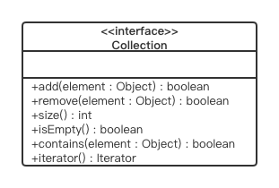
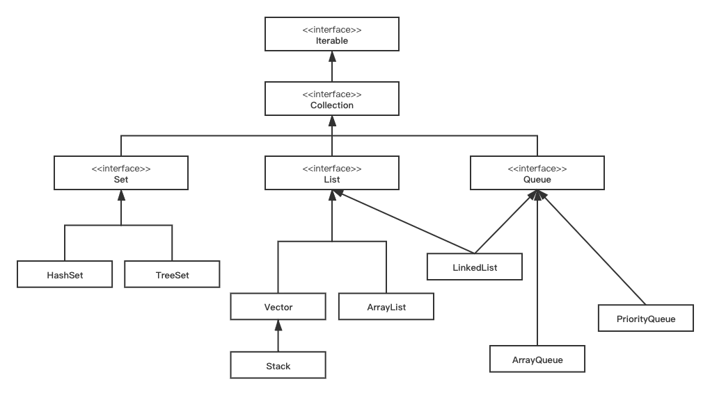
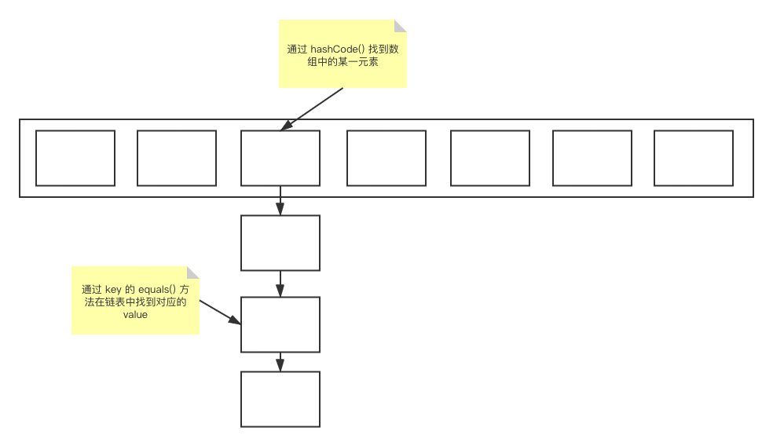
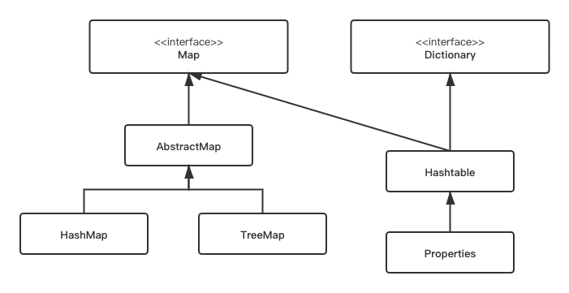

# 工具类及常用算法

内容提要：

**Java语言的基础类**，**字符串及日期**，**集合**，**排序与查找**，**泛型**，**常用算法**

## Java 中的基础类

Java 基础类库：

* `java.lang` Java 语言核心类库
    * Java 是自动导入 `java.lang.*` 的
* `java.util` 实用工具
* `java.io` 标准输入/输出类库
* `java.awt`, `javax.swing` 图形用户界面（GUI）的类库
* `java.net` 网络功能的类库
* `java.sql` 数据库访问的类库

文档：[在线 JDK API 文档](https://docs.oracle.com/javase/8/docs/api/index.html)，[文档下载](https://www.oracle.com/java/technologies/javase-jdk8-doc-downloads.html)，[更多文档](https://docs.oracle.com/javase/8/docs/index.html)

同时也可以阅读 **JDK 源码** ，一般位于 JDK 目录下的 source.zip 文件

### Object 类

`Object` 是所有类的直接或间接父类。他的存在 **保证了所有类的一致性**。

1. **`equals()` 方法**

简单地说，`equals()` 判断内容，`==` 判断引用：
```java
Integer one = new Integer(1);
Integer anotherOne = new Integer(1);
if (one == anotherOne) {    // false
    // ...
}
if (one.euqals(anotherOne)) {   // true
    // ...
}
```

如果覆盖 `equals()` 方法，一般也要覆盖 `hashCode()` 方法。目标是让 "equal" 的对象 "hashCode" 尽量相等。

2. **`getClass()` 方法**

`getClass()` 是一个 `final` 方法，不能被重写（覆盖）。

它返回一个对象在运行时所对应的类的表示：
```java
void printClassName(Object obj) {
    System.out.println("The object's class is " + obj.getClass().getName());
}

Object createNewInstanceOf(Object obj) {
    return obj.getClass().newInstance();
}
```

3. **`toString()` 方法**

`toString()` 方法用来返回对象的字符串表示。

常用于显示，例如下面的打印函数实质上就调用了对象的 `toString` 方法：
```java
System.out.println(person);
```

也可用于字符串的 `+` 号
```java
"current person is " + person;
```

通过重载 `toString()` 方法可以适当显示对象信息以进行调试。

4. **`finalize()`**

在垃圾收集前清除对象。

5. **`notify()`, `notifAall()`, `wait()`**

与线程相关的函数。

### 基本数据类型的包装类

为了适应面向对象的环境，Java 的基本数据类型也提供了包装类（wrapper）。它们是这些基本数据类型面向对象的代表。

与 8 种基本数据类型相对应，基本数据类型的包装类也有 8 种：`Character`, `Byte`, `Short`, `Integer`, `Long`, `Float`, `Double`, `Boolean`。

包装类有以下特点：

* 一些常数，例如：`Integer.MAX_VALUE`, `Double.NaN`, `Double.POSITIVE_INFINITY`
* 与字符转相互转换的函数：`valueOf(String)`, `toString()`
* 通过 `xxxValue()` 方法可以得到所包装的值，例如：`Integer` 对象的 `intValue()` 方法
* 对象中所包装的值是不可改变（immutable）的。如要改变只能生成新的对象，由此保证对象本身的 **稳定性**。
* `toString()`, `equals()` 等方法进行了覆盖

除了以上特点，有的类还提供了一些实用的方法以便操作。例如，`Double` 类就提供了 `parseDouble()`, `max`, `min` 方法等。

在 JDK1.5 以上提供了 **包装（boxing）与拆包（unboxing）** 功能：
```java
Integer I = 5;  // Integer I = Integer.valueOf(5);
int i = I;  // int i = I.intValue();
```

### Math 类

封装了一些数学上常用的 **静态函数** 和 **静态常量**。

### System 类

在 Java 中，系统属性可以通过环境变量来获得。

* `System.getProperty(String name)` 方法获得特定的系统属性值。
* `System.getProperties()` 方法获得一个 `Properties` 类的对象，其中包含了所有可用的系统属性信息。

在命令行运行 Java 程序时可使用 `-D` 选项添加新的系统属性。
```
java -D var=value MyProg
```


## 字符串和日期

字符串可以分为两大类：

* **`String` 类**：一经创建无法修改，即 immutable
* **`StringBuffer`, `StringBuilder` 类**：创建之后允许再做修改
    * 其中 `StringBuilder` 是 JDK1.5 增加的，它是 **非线程安全的**，所以执行效率更高

特别注意：在循环中使用 `String` 的 `+=` 可能会带来效率问题。因为 immutable 的特性决定它只能生成一个新的实例。

### String 类

`String` 类对象保存不可修改的 Unicode 字符序列

* `String` 类的下述方法能创建并返回一个新的 `String` 对象实例：`concat`, `replace`, `replaceAll`, `substring`, `toLowerCase`, `toUpperCase`, `trim`, `toString`
* 查找：`endsWith`, `startsWith`, `indexOf`, `lastIndexOf`
* 比较：`equals`, `equalsIgnoreCase`
* 字符及长度：`charAt`, `length`

此外，JDK1.5 增加了 `format` 函数。

除了 immutable 的特点外，还要注意 String **常量** 的内部化（interned）问题。即同样的字符串常量是 **合同**（指向同一个引用）的。

这保证了`"abc" == "abc"`，但 `"abc" != new String("abc")`

### StringBuffer 类

`StringBuffer` 类对象保存可修改的 Unicode 字符序列，`StringBuilder` 类似，它效率更高，不用考虑线程安全性。

构造方法：`StringBuffer()`, `StringBuffer(int capacity)`, `StringBuffer(String initialString)`

实现修改操作的方法：`append`, `insert`, `reverse`, `setCharAt`, `setLength`

### 字符串的分割

`java.util.StringToken` 类提供了对字符串进行分割的功能。

构造：`StringTokenizer(String str, String delim);`

该类的重要方法有：
```java
public int countTokens();   // 分割串的个数
public boolean hasMoreTokens(); // 是否还有分割串
public String nextToken();  // 得到下一个分割串
```

`String` 类的 `matches`, `replaceAll`, `split` 可以使用正则表达式。

### 日期类

`Calendar` 是 Java 内置的日历类，`Calendar.getTime()` 得到一个 `Date` 类的实例，`Data.getTime` 得到一个 `long`。

`SimpleDateFormat("yyyy-MM-dd HH:mm:ss")` 类有 `.format`, `.parse` 方法用来格式化、解析时间格式。

Java8 中引入了 time api
```java
import java.time.*;
import java.time.format.*;
```
其中，主要的类有：

* `Instant` 时刻，`Clock` 时区，`Duration` 时间段
* 常用的类 `LocalDateTime`, `LocalDate`, `LocalTime`，它们都支持 `.of`, `.parse`, `.format`, `.plus`, `.minus` 方法
* `DateTimeFormatter`


## 集合

`Collection API` 三大类：

* `Collection` 接口
    * `List` （`Collection` 的子接口）：有顺序，可重复
    * `Set` （`Collection` 的子接口）：无顺序，不重复
* `Map` 接口
    * **键值对** 集合

`Collection` 接口提供如下域：

<center></center>
<center>集合UML</center>

下图展示了由 `Collection` 派生的类：

<center></center>
<center>集合层次结构</center>

### List

`List` 接口：线性表（linear list）。

主要的实现类有：`ArrayList`, `LinkedList`，以及早期的 `Vector`

`List` 接口：
```java
public interface List<E> extends Collection<E> {
    E get(int index);
    E set(int index, E element);
    void add(int index, E element);
    E remove(int index);
    int indexOf(Object o);
    //...
}
```

所有的 `Collection` 都能产生 **迭代器** `Iterator`：
```java
Iterator iterator = iterable.iterator();
while (iterator.hasNext()) {
    doSomething(iterator.next());
}
```

Java 中的 **"for-each" 语句**，编译器就生成了 `Iterator`，通过调用它的 `hasNext()` 方法来判断是否继续迭代：
```java
for (Element e : list) {
    doSomething(e);
}
```

### Stack

* 先入后出表（LIFO）
* 线性数据结构
* 主要包含以下三个方法：
```java
public Object push(Object item);
public Object pop();
public boolean empty();
```

### Queue

* 先进先出表（FIFO）
* 一种重要的实现是 `LinkedList` 类：

|         | 可抛出异常 | 可返回元素 |
|---------|-----------|----------|
| Insert  | add(e)    | offer(e) |
| Remove  | remove()  | poll()   |
| Examine | element() | peek()   |  

几个 **早期** 的类或接口：

* 动态数组：`Vector` 现在多用 `ArrayList`
    * 比 JDK1 中的 `ArrayList` 好，有 `elementAt` 方法
* 线性栈：`Stack` 现在多用 `LinkedList`
    * `Stack` 是 `Vector` 的子类，有 `push`, `pop`, `pick` 方法。
* 哈希表：`Hashtable` 现在多用 `HashMap`
    * `Hashtable` 实现 `Map` 接口，参见 `Properties` 类
* 枚举：`Enumeration`，现在多用 `Iterator`
    * `Enumeration` 是用另一种方式实现 `Iterator` 的功能
    * `Vector` 等可以得到枚举器：
    ```java
    Enumberation<E> e = v.elements();
    while (e.hasMoreElements()) {
        doSomething(e.nextElement());
    }
    ```
    由于 `Iterator` 支持 "for-each" 的迭代形式，故替代了 `Enumeration`

### Set

`Set` 接口有两个 **重要实现**，`HashSet` 和 `TreeSet`，其中 `TreeSet` 的底层实现是用 `TreeMap` 来实现的。

`Set` 中的对象不重复，即：

* `hashCode()` 不等
* 如果 `hashCode()` 相等，再看 `equals` 或 `==` 是否为 `false`

`Hashable` 的实现：

* `String` 对象的哈希码根据以下公式计算：
$$
s[0] \times 31^{n - 1} + s[1] \times 31^{n - 2} + ... + s[n - 1]
$$

<center></center>

注：一般我们在覆盖的时候 **要同时覆盖** `hashCode` 和 `equals` 方法。

### Map

`Map` 是键值对的集合

* 其中可以取到 `entrySet()`, `ketSet()`, `values()`
* `Map.Entry` 是一个嵌套接口

`Map` 类的重要实现：`HashMap` 类和 `TreeMap` 类，其中 `TreeMap` 基于红黑树

<center></center>
<center>Map 的层次结构</center>


## 排序与查找

Java 中 `Arrays` 类及 `Collections`

### Arrays

`Arrays` 提供了 `sort()` 和 `binarySearch()` 方法：
```java
public static void sort(List list);
public static void sort(List list, Comparator c);
public static int binarySearch(List list, Object key);
public static int binarySearch(List list, Object key, Comparator c);
```
注：一般调用 `binarySearch()` 之前先调用一次 `sort()`。

看如下例子：
```java
String[] s = randStrings(4, 10);
print(s);
Arrays.<String>sort(s);
print(s);
int loc = Arrays.<String>binarySearch(s, s[2]);
System.out.println("Location of " + s[2] + " is " + loc);
```
注：这里泛型 `<String>` 是 **限定方法的**，故写在方法前面。

关于比较：

* 要么对象是 `java.lang.Comparable`，实现了如下方法：
```java
public int compareTo(Object obj) {
    return this.price - ((Book)obj).price;
}
```
* 要么提供一个 `java.lang.Comparator`，实现如下方法：
```java
public int compare(T o1, T o2);
```

注：这些方法的含义不能和 `equal` 冲突，否则 **语义上不能解释**。

### Collections

此类完全由在 `collection` 上进行操作的静态方法组成。

如 `sort`, `binary`, `reverse` 等。

从 Java8 开始，我们往往直接用 **lambda 表达式** 来定义比较器。例如：
```java
Collections.sort(school, (p1, p2)->p1.age-p2.age);
```
一次来对学校里的学生按照年龄排序。


## 泛型

泛型（Generic）是 JDK1.5 之后加入的最重要的 Java 语言特性。

使用泛型可以针对不同的类有相同的处理方法：
```java
Vector<String> v = new Vector<String>();
v.addElement("one");
String s = v.elementAt(0);
```

泛型的好处在于：

* **使类型更安全**。否则，我们只能把所有的类型都当做 `Object` 编程，并在使用时进行 **强制类型转换**，这就不具备安全性。
* **使用更广泛**，可以编写针对不同类的相同处理方法，而这些方法之间 **还没有继承关系**。

### 自定义泛型

* 自定义泛型类
* 自定义泛型方法 —— **注意这里 `<>` 要写到方法名字前面**


### 对类型的限定

* 使用 `?`，表示任意类型，例如 `Collections` 的 `reverse` 方法
```java
reverse(List<?> list)
```

* 使用 `extends`，如 `Set` 的 `addAll` 方法
```java
addAll(Collection<? extends E> col)
```
即用子类声明，

* 使用 `super`，如 `Collections` 的 `fill` 方法
```java
fill(List<? super T> list, T obj)
```
即用 **超类** 声明，例如声明这是一个水果容器，使用时候可以添加苹果、香蕉。

注：泛型一定是一个 **引用类型**，可以使用 `Integer` 但不能使用 `int`。

泛型可以有多种 **复杂** 的组合：
```java
// Arrays.sort()
public static <T> void sort(T[] a, Comparator<? super T> c)

// Stream.map()
public <R> Stream<R> map(Function<? super T, ? extends R> mapper)

// Collections.max()
public static <T extends Object & Comparable<? super T>>T max(Collection<? extends T> coll)
```


## 常用算法

### 遍历

**遍历（exhaust）**，也叫 **穷举**，即在有限范围内，对所有的值都进行试验和判断，从而找到满足条件的值。

遍历的基本模式：
```java
for( : ) { if(); }
```
经典问题：找到1000以内的“水仙花数”（定义：数值等于各位数的立方和）

### 迭代

**迭代（iteration）**，指多次使用同一公式进行计算，每次将结果再代入公式，从而逐步逼近精确解。

迭代的基本模式：
```java
while( end() ) {
    x = f(x);
}
```
经典问题：二分法求平方根

### 递归

**递归（recursion）**，就是一个过程调用该过程本身。一般过程的执行需要用到它的 **上一步或几步的结果**。

递归的基本模式：
```java
f(n) {
    f(n - 1)
}
```
经典案例：递归求阶乘

### 回溯

**回溯（back-track）**，或称 **试探回溯法**，先选择某一可能的线索进行试探，每一步都有多种方式，将每一方式都一一试探，如果不符合条件就返回纠正，反复进行这种试探再返回纠正，知道的出 **全部符合条件** 的答案或者 **问题无解** 为止。

回溯的基本模式：
```java
x++;
if () x--;
```
经典例子：八皇后问题

