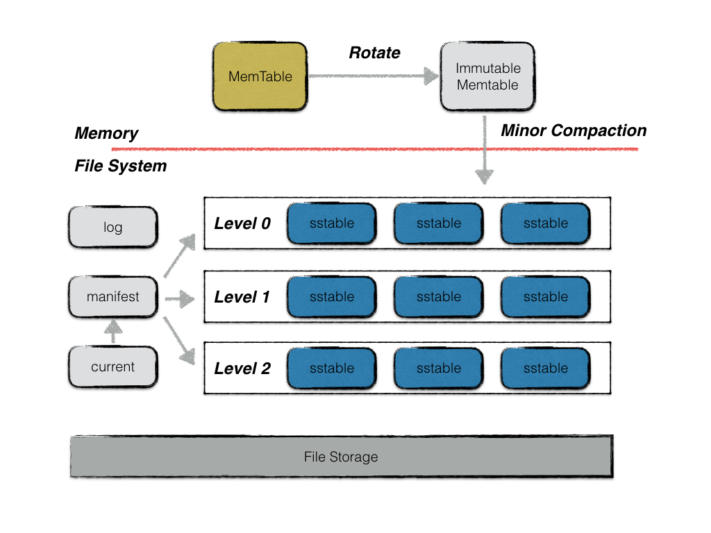

# LevelDB

LevelDB是Google数据库项目BigTable的单机版本。

* [Github](https://github.com/google/leveldb)

* [Handbook](https://leveldb-handbook.readthedocs.io/zh/latest/basic.html)

Authors: Sanjay Ghemawat (sanjay@google.com) and Jeff Dean (jeff@google.com)

## 概述

LevelDB的实现基于LSMT，主题思想是： **将数据首先更新在内存中，当内存中的数据达到一定的阈值，将这部分数据真正刷新到磁盘文件中** ，因而获得极高的写性能。

* LevelDB底层数据结构基于LSMT，放弃部分读的性能，换取最大的写入能力；
* 用布隆过滤器判断指定的key是否在SSTable中，加速查找；
* 内存数据库用跳表实现；
* 用LRUCache做缓存。

LevelDB的主要组成部分：

* memtable
* immutable memtable
* log
* sstable
* manifest
* current

## 背景和研发动机

### 背景

几乎对于所有存储介质， **顺序存储的效率一定比随机存储更高** ，并且要高很多。下图可以直观阐述了两者的效率差，其中红色部分和绿色部分分别表示硬盘随机读取和顺序读取的吞吐量：

从纵坐标可以看出二者差的不是一点半点，而是已经有数量级的差距了， **几乎达到了三个数量级** 。

### 动机

如果能够发明一个数据结构可以充分使用顺序读写的性能优势，自然会大大提高系统的 **IO能力** 。对于许多科技公司而言，尤其是大数据公司，因为数据量带来的机器开销的费用占据了日常支出的大头。如果能够优化这个问题，显然可以 **节约大量的资源** 。

一个朴素的想法是将所有的读写都设计成 **顺序读写** ，比如 **日志系统** 就是一个典型的例子。我们再记录日志的时候总是添加在文件末尾，而不会插入在文件中间。显然写的操作是顺序的，但当我们需要查找的内容在文件中间的时候，顺序读需要读入文件中的所有内容。

日志系统的主要应用有两个：

* 数据库的日志 - 当我们用数据库执行写入或者修改操作的时候，数据库会将所有变更写成log记录下俩；

* 消息系统的中间件 - 比如 kafka

在复杂的增删改查场景中，尤其是涉及到 **批量读写** 的场景，简单的文件顺序读写就不能满足需求了。B+树和哈希表这种数据结构都会引入比较慢的随机读写操作。我们需要 **尽量少的随机读写** ，LSMT牺牲了一些读操作的性能，保证了写操作的性能，能够让所有操作顺序化，几乎完全避免了随机读写。

LevelDB正是基于LSMT实现的。

## LSMT

LSMT写入性能极高的原理，简单来说就是尽量减少随机写的次数。对于每次写入操作，并不是直接将最新的数据驻留在磁盘中，而是将其拆分成：

* 一次日志文件的顺序写

* 一次内存中数据的插入

### SSTable

SSTable的全称是Sorted String Table，本质是一个KV结构顺序排列的文件，如下图所示：

基本的SSTable就是上图中的右侧部分，即键值对按照键的大小排序，并存储在文件当中。当需要查找某个键对应的数据的时候，我们会将 **整个文件读入内存** ，进行查找。同样，写入也是如此，我们会将插入的操作在内存中进行，得到结果之后直接覆盖原来的文件，而不会在文件当中修改，因为这样会牵扯到大量的数据移动。

如果文件中的数据量过大，我们需要另外建立一个 **索引文件** ，存储不同的键对应的偏移量，方便我们在读取文件的时候快速查找到我们想要查找的文件。索引文件即上图中的左侧部分。

注意：SSTable是不可修改的，我们只会用新的SSTable去覆盖就得，而不会在原本的基础上修改。因为修改会涉及到随机读写，这不是我们所希望的。

### LSMT

LSMT的全称是Log-structed Merge-tree，本质上就是在SSTable的基础上增加了一个Memtable，Memtable顾名思义就是一个 **存放在内存中的表结构** 。当然也不一定是表结构，也可以是树结构，只要是一个支持快速增删改查的数据结构即可，比如红黑树、跳表都可以。

在其基础上我们还需要一个log文件，和数据库当中的log一样，记录数据发生的变化。方便系统故障或数据丢失的时候进行找回。

#### 查找

当需要查找一个元素的时候，我们会先查找Memtable，如果Memtable中没有找到，我们再一个一个查找SSTable，由于SSTable当中的数据也是顺序存储的，所以我们可以使用二分查找，整个查找的过程会很快。

有一个问题 —— 由于 **SSTable的数量可能会很多** ，而且我们必须要顺序查找，所以当SSTable数量很大的时候，也会影响查找速度。这个问题可以通过引入 **布隆过滤器** 进行优化。我们对每一个SSTable建立一个布隆过滤器，可以快速地判断元素是否在某一个SSTable当中。布隆过滤器判断元素不存在一定是准确的，但判断存在可能会有一个很小的失败概率，但这个概率是可以控制的，我们可以设置合理的参数，是的失误率足够低。

加上了布隆过滤器之后的查找操作是这样的：

如图所示，部分SSTable先通过布隆过滤器判断元素是否存在之后，在进行查找。

#### 增、删、改

除了查找之外的其他操作都发生在Memtable中，比如当我们要增加一个元素的时候，我们直接在Memtable中增加，而不是写入文件。这也保证了增加的速度可以非常快。

修改、删除与之类似，如果需要修改的元素刚好在Memtable当中，直接修改即可；如果不在Memtable当中，如果我们要先查找再去修改免不了磁盘IO，这会消耗大量资源。所以我们还是在Memtable中操作，我们会插入这个元素，标记成修改或是删除。

综上，我们 **可以把增、删、改三个操作都看成是添加** ，但这么做会导致一个问题 —— **Memtable当中很快就会积累大量数据** ，内存资源很容易爆。为了解决这个问题，我们需要定期将Memtable当中的内容存储到磁盘，存储成一个SSTable。这也是SSTable的来源 —— 由Memtable中的数据落盘产生。

同样，大量的落盘操作也会导致 **SSTable的数量暴增** ，根据上述分析，SSTable的数量增加会影响我们查找的效率。另一方面，我们储存了许多修改和删除的信息，并且需要吧这些信息落实。为了达成这点，我们需要定期将所有SSTable
合并，并在过程中完成数据的删除、修改工作。换句话说，之前的删除、修改操作只是被记录了下来，知道合并的时候才真正执行。

整个归并的过程类似于归并排序中的归并操作，但需要在此基础上加上状态的判断。

#### 适用场景

总结来说LSMT适用于 **大量写、少量读** 的场景。

对比B+树，在B+树中，我们为了能够快速读取而使用了多路平衡树，这样可以迅速找到对应key的节点，之后只需要读入节点中的内容即可。但平衡树需要保持其特有的性质，导致我们在写入数据的时候需要 **对树的结构进行调整和变动** ，这个过程涉及到多次文件的随机读写。当数据量很大的时候会带来巨大开销。

LSMT的读取速度相比B+树要低，但对于大数据的写入支持更好。许多大数据场景对系统IO有着很高的要求，比如消息系统、分布式存储等。这个时候B+树就有些无能为力了。相反地，在对查找效率要求很高的场景下，LSMT就不合适了。

## 主体架构

## 设计亮点

## 参考文献

[1] [leveldb-handbook](https://leveldb-handbook.readthedocs.io/zh/latest/basic.html)

[2] [TechFlow讲解LSMT](https://mp.weixin.qq.com/s?__biz=MzUyMTM5OTM2NA==&mid=2247484853&idx=1&sn=99fa9bf9cc6a31d1f248a87c25966858&chksm=f9daf89ecead71885c7fb7cabc2ba719500aea4a8af277cd0744536dedd9b3dbead5f9253898&scene=21#wechat_redirect)