# 内存管理

计算机系统的主要目的是执行程序。在执行时，这些程序机器访问数据应该至少部分在内存里。

为了提高CPU的利用率和响应用户的速度，通用计算机在内存里必须保留多个进程。内存管理方案有很多，采用的方法也不同；每个算法的有效性取决于特定的情况。系统内存管理方案的选择取决于很多因素，特别是系统的硬件设计。大多数算法都需要硬件支持。

## 内存管理策略

一组进程可以共享一个CPU。正是由于CPU调度，提高了CPU的利用率和计算机响应用户的速度。然而，为了实现性能的改进，应将多个程序保存在内存中；也就是说，必须共享内存。

这一部分讨论内存的各种管理方法。内存管理算法有很多：从原始的裸机方法，到分页和分段的方法。每种方法都有各自的优点和缺点。为特定系统选择内存管理方法取决于很多因素，特别是系统的硬件设计。正如将会看到，许多算法都需要硬件支持，导致许多操作系统内存管理和硬件的紧密结合。

### 背景

内存是现代操作系统的核心。内存由一个很大的字节数组组成，每个字节都有各自的地址。CPU根据程序计数器的值从内存中提取指令，这些指令可能引起对特定内存地址的额外加载与存储。

例如，一个典型的指令执行周期，首先从内存读取指令。接着，该指令会被解码，也可能需要从内存中读取操作数。在指令对操作数执行后，它的结果可能存回到内存。内存单元只看到地址流，而并不知道这些地址是如何产生的（由指令计数器、索引、间接寻址、常亮地址等）或它们是什么（指令或数据）的地址。相应地，我们可以忽略内存地址是如何由程序产生的，而只是对运行程序产生的的内存地址序列感兴趣。

#### 基本硬件

CPU内置寄存器通常可以在一个CPU时钟周期内完成访问。但内存访问可能需要多个CPU时钟周期。这种情况下，由于没有数据以便完成正在执行的指令，CPU通常需要 **暂停**（stall）。补救措施是在CPU与内存之间——通常是在CPU芯片上——增加 **高速缓存**（cache）。为管理CPU内置的缓存，硬件加快内存访问，无需任何操作系统的控制。

出于保护，需要保证每个进程有单独的地址空间，**基地址寄存器**（base register）含有最小的合法的物理内存地址。**界地址寄存器**（limit register）指定了范围的大小。如下如所示：

<center>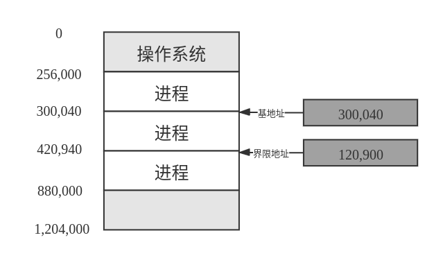</center>
<center>基地址寄存器和接线地址寄存器定义逻辑地址空间</center>

内存空间保护的实现是通过CPU硬件对在用户模式下产生的地址与寄存器的地址进行比较来完成的。当在用户模式下执行的程序试图访问操作系统内存或其他用户内存时，会陷入操作系统，而操作系统则将其作为致命错误来处理，如下如所示。这种方案防止用户程序无意或故意修改操作系统或其他用户的代码或数据结构。

<center>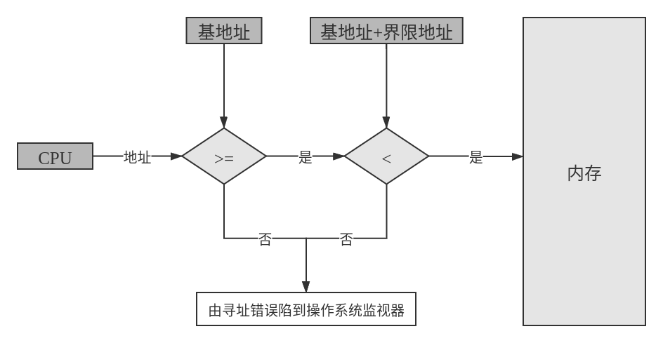</center>
<center>采用基地址寄存器和接线地址寄存器的硬件地址保护</center>

在内核模式下执行的操作系统可以无限制地访问操作系统及用户的内存。这项规定允许操作系统：加载用户程序到用户内存，转储出现错误的程序，访问和修改操作系统调用的参数，执行用户内存的I/O，以及提供许多其他服务等。例如，多任务系统的操作系统在进行上下文切换时，应将一个进程的寄存器的状态存贷内存，再从内存中调入下个进程的上下文到寄存器。

#### 地址绑定

在磁盘上等待调到内存以便执行的进程形成 **输入队列**（input queue）。

用户程序在执行前一般会经过若干步骤，如下图所示：

<center>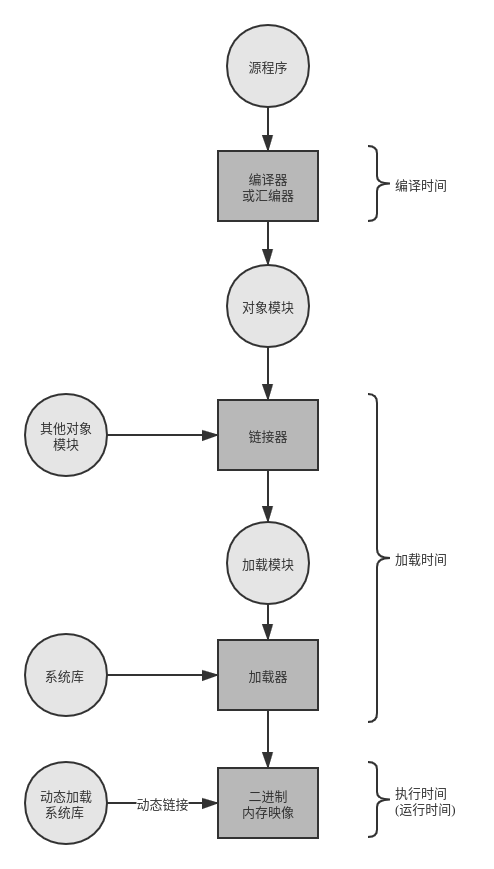</center>
<center>一个用户程序的多步骤处理</center>

通常，数据 **绑定**（bind）到存储器地址可在沿途的的任何一步进行：

* **编译时**（compile time）：如果在编译时就可以知道进程在内存中的驻留地址，那么就可以生成 **绝对代码**（absolute code）。  
例如，如果事先知道用户进程驻留在内存地址 $R$ 处，那么生成的编译代码就可以从该位置开始并向后延伸。如果将来开始地址发生变化，那么就必须重新编译代码。MS-DOS的.COM格式的程序就是在编译时绑定成绝对代码的。
* **加载时**（load time）：如果在编译时并不知道进程将驻留在何处，那么编译器就应该生成 **可重定位代码**（relocatable code）。对这种情况，最后绑定会延迟到加载时才进行。如果开始地址发生变化，那么只需要重新加载用户代码已合并更改的值。
* **执行时**（runtime time）如果进程在执行时可以从一个内存段移到另一个内存段，那么绑定应延迟到执行时才进行。如下节所属，采用这种方案需要特定硬件支持。大多数的通用计算机操作系统采用这种方法。

#### 逻辑地址空间和物理地址空间

CPU生成的地址通常称为 **逻辑地址**（logical address），而内存单元看到的地址（即加载到 **内存地址寄存器**（memory-address register）的地址）通常称为 **物理地址**（physical address）。

编译时和加载时的地址绑定方法生成相同的逻辑地址和物理地址。然而，执行时的地址绑定方案生成不同的逻辑地址和物理地址。在这种情况下，通常称逻辑地址为 **虚拟地址**（virtual address）。在 **基础梳理** 部分我们对 *逻辑地址* 和 *虚拟地址* 不加区分。有程序生成的逻辑地址集合称为 **逻辑地址空间**（logical address space），这些逻辑地址对应的所有物理地址集合称为 **物理地址空间**（physical address space）。

从虚拟地址到物理地址的运行时映射是由 **内存管理单元**（Memory-Management Unit，MMU）的硬件设备来完成。有多种方案来完成这种映射，这里以一个简单的实现方案为例（也是前述基地址寄存器方案的推广）。基地址寄存器这里称为 **重定位寄存器**（relocation register）。

<center>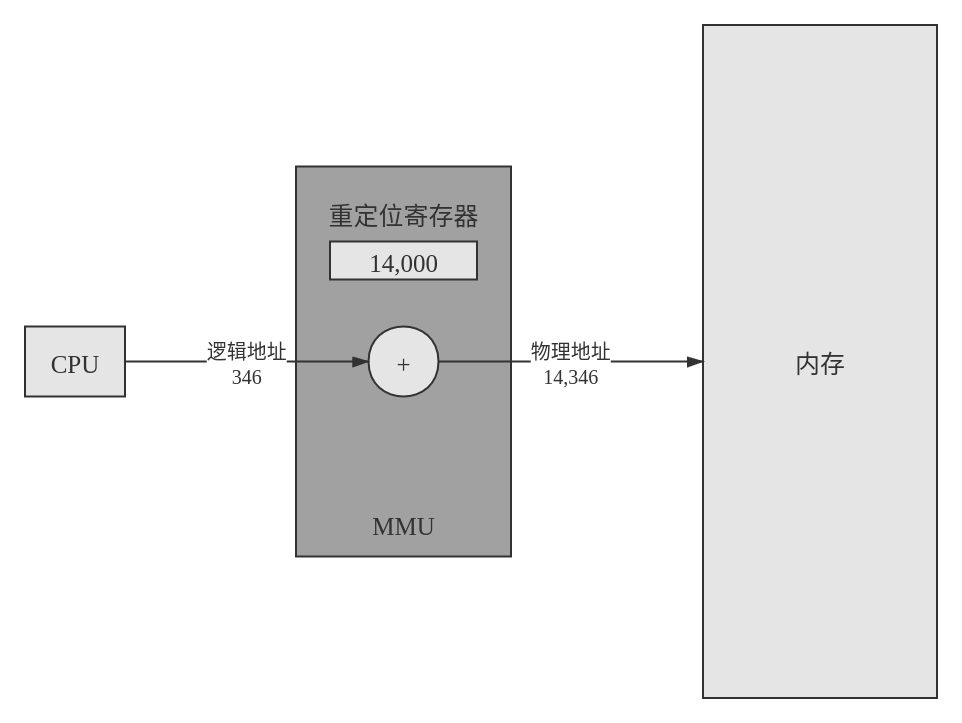</center>
<center>使用重定位寄存器的动态重定位</center>

#### 动态加载

如果一个进程的所有数据都在物理内存中，则进程的大小将受限于内存的大小。为了获得更好的内存空间利用率，可以使用 **动态加载**（dynamic loading）。

#### 动态链接与共享库

**动态链接库**（dynamically linked library）为系统库，可链接到用户程序，以便运行。有的操作系统只支持 **静态链接**（static linking），它的系统库与其他目标模块一样，通过加载程需，被合并到二进制程序映像。动态链接类似于动态加载。这里，不是加载而是连接，会延迟到运行时。这种功能通常用于系统库，如语言的子程序库。没有这种功能，系统内的所有程序都需要一份语言库的副本（或至少那些被程序所引用的子程序）。这种要求浪费了磁盘空间和内存空间。

如果有动态链接，在二进制映像内，每个库程序的引用都有一个 **存根**（stub）。存根是一小段代码，用来指出如何定位适当的内存驻留库程序，或者在程序不在内存时应如何加载库。

动态链接也可以用于库的更新（如修改bug）。版本信息包含在程序和库中。一个哭的多个版本都可以加载到内存，程序将通过版本信息确定使用哪个库的副本。次要更改保留相同的版本号，而主要更改则增加版本号。因此，只有采用新库编译的程序才会受新库的不兼容改动的影响。在新库安装之前链接的其他程序将继续使用较旧的库。这种系统也称为 **共享库**（shared library）。

与动态加载不同，动态链接通常需要操作系统的帮助。如果内存中的进程是彼此保护的，那么只有操作系统才可以检查所需程序是否在某个进程的内存空间内，或是允许多个进程访问同样的内存地址。这个概念将在 **分页** 部分被更详细地讨论。

### 交换

进程必须在内存中以便执行。不过，进程可以暂时从内存 **交换**（swap）到 **备份存储**（backing store），当再次执行时在调回到内存中，如下图：

<center>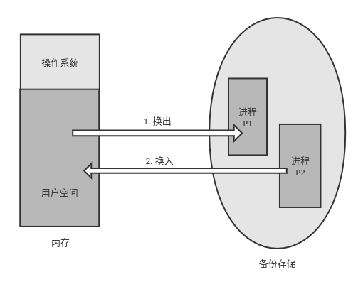</center>
<center>使用磁盘作为存储仓库的两个进程的交换</center>

交换有可能让所有进程的总的物理地址空间超过真实系统的物理地址空间，从而增加了系统的多道程序程度。

#### 标准交换

标准交换在内存和备份存储之间移动进程。系统维护一个可运行的所有进程的 **就绪队列**（ready queue），它们的映像在备份存储或内存中。当CPU决定要执行一个进程时，他调用分派器。分配器检查队列中的下一个进程是否在内存中。如果不在，并且没有空闲内存区域，那么分派器会换出（swap out）当前位于内存中的一个进程，并换入（swap in）所需进程。然后重新加载寄存器，并将控制权转移到所选进程。

这种交换系统的上下文切换时间相当高。因此知道一个进程真正需要的内存空间而不是可能需要的内存空间是非常有用的。用户需要告诉系统它的内存需求情况。因此，具有动态内存需求的进程需要通过系统调用（`request_memory()`和`release_memory()`）来通知操作系统它的内存需求变化情况。

考虑一种特殊情况，我们需要换出进程 $P_1$ 而换入进程 $P_2$，显然 $P_1$ 应处于空闲状态。然而如果如果I/O异步访问用户内存的I/O缓冲区，那么该进程就不能换出。I/O操作可能试图使用现在已属于进程 $P_2$ 的内存。解决这个问题有两种主要方法：

* 不能换出等待处理I/O的进程；
* I/O操作的执行只能使用操作系统的缓冲。

第二种方法只有在进程换入时，操作系统缓冲与进程内存之间才能进行数据转移。这种 **双缓冲**（double buffering）本身增加了开销。我们现在需要再次复制数据，从内核内存到用户内存，然后用户进程可以访问它。

现代操作系统并不适用标准交换，而是使用一些常见变种：

* 正常情况下，禁止交换；当空闲内存（未被操作系统或进程使用的内存）低于某个阈值时，启用交换。当空闲内存数量增加了，就停止交换。
* 交换进程的部分（而不是整个进程），以降低交换时间。

通常这些交换的变种与虚拟内存一起工作。

#### 移动系统的交换

移动系统通常不支持任何形式的交换。移动设备通常采用闪存，导致的空间约束是移动操作系统设计者避免交换的原因之一。另外其他的原因：

* 闪存写入次数的限制
* 内存闪存之间吞吐量的差异


### 连续内存分配

内存通常分为两个区域：一个用于 *驻留操作系统*，另一个用于 *用户进程*。操作系统可以放在低内存或高内存。影响这一决定的主要因素是中断向量的位置。由于中断向量通常位于低内存。因此工程师一般将操作系统也放在低内存。

需要考虑，如何将输入队列中需要调入内存的进程分配内存空间。在采用 **连续内存分配**（contiguous memory allocation）时，每个进程位于一个连续的内存区域，与包含下一进城的内存相连。

#### 内存保护

前面讨论过基于重定位寄存器和界限寄存器的内存地址保护机制。同时重定位方案提供了一种方式以便 *操作系统动态改变其大小*。这一灵活性用途广泛。例如，操作系统的驱动程序需要代码和缓冲空间。如果一个驱动程序（或其他操作系统的服务）不常使用，可以不必在内存中保留它的代码和数据，这部分空间可以用于其他目的。这类代码有时称为 **暂时**（transient）的操作系统代码；它们根据需要调入调出。

#### 内存分配

最简单的分配方法之一，就是将内存分为多个固定大小的 **分区**（partition）。每个分区可以只包含一个进程。因此，多道程序的程序受限于分区数。如果使用这种 **多分区方法**（multiple-partition method），那么当一个分区空闲时，它的分区可以用于其他进程。

对于 **可变分区**（variable-partition）方案，操作系统有一个表，用于记录哪些内存可用和哪些内存已用。开始，所有内存都可用于用户进程，因此可以作为一大块的可用内存，称为 **孔**（hole）。最终，内存是一个包括各种大小的孔的集合。

这种方法是通过 **动态存储分配问题**（dynamic storage-allocation problem）（根据一组空闲孔来分配大小为 $n$ 的请求）的一个特例。这个问题有许多解决方案。从一组可用孔中选择一个空闲孔的最为常用的方法包括：

* **首次适应**（first-fit）：分配首个足够大的孔。查找可以从头开始，也可以从上次首次适应结束时开始。一旦找到足够大的空闲孔，就可以停止。
* **最优适应**（best-fit）：分配最小的足够大的孔。应查找整个表，除非列表按大小排序。这种方法可以产生最小剩余孔。
* **最差适应**（worst-fit）：分配最大的孔。同样，应该查找整个列表，除非列表按大小排序。这种方法可以产生最大剩余孔，该孔可能比最优适应产生的较小剩余孔更为适用。

模拟结果显示，首次适应和最优适应在执行时间和利用空间方面都好于最差适应。首次适应和最优适应在利用空间方面难分伯仲，但是首次适应更快一些。

#### 碎片

内存分配的首次适应和最优适应算法都有 **外部碎片**（external fragmentation）的问题。采用首次适应方法的统计说明，不管使用什么优化，假定有 $N$ 个可分配块，那么可能有 $0.5N$ 个块为外部碎片。即 $\frac{1}{3}$ 的内存可能不能使用。这一特性称为 $50%规则$（50-percent rule）。

内存碎片也可以是外部的，也可以是内部的。假设有一个 $18464$ 字节大小的孔，并采用多分区分配方案。假设有一个进程需要 $18462$ 字节。如果只能分配所要求的块，那么还剩下一个 $2$ 个字节的孔。维护这个孔的开销要比孔本身大很多。因此，通常按固定大小的块为单位（而不是字节）来分配内存。采用这种方案，进程所分配的内存可能比所需要的要大。这两个数字只差称为 **内部碎片**（internal fragmentation），这部分内存在分区内部，但又不能用。

外部碎片问题的一种解决方案是 **紧缩**（compaction），它的目的是移动内存内容，以便将所有空闲空间合并成一整块。这种方法的开销昂贵。

外部碎片问题的另一个可能的解决方案是：允许进程的逻辑地址空间是不连续的；这样，只要有物理内存可用，就允许为进程分配内存。有两种互补的技术可以实现这个解决方案：分段和分页。这两个技术也可以组合起来。

碎片是一个常见的问题；当需要管理数据块时它就可能出现。在存储管理部分也会=有讨论。

### 分段

正如已经看到的，用户的内存视图和实际的物理内存不一样。这同样适用于程序员的内存视图。事实上，对操作系统和程序员来说，按物理性质来处理内存是不方便的。如果硬件可以提供内存机制，以便将程序员的内存视图映射到实际的物理内存，那么会如何？这样，系统将有更多的自由来管理内存，而程序员将有一个更自然的编程环境。分段提供了这种机制。

#### 基本方法

在大多数程序员眼中，内存不是一个字节的线性数组，有的包含指令而其他的包含数据。他们眼中的内存通常是一组不同长度的段，这些段之间并没有一定的顺序。

<center>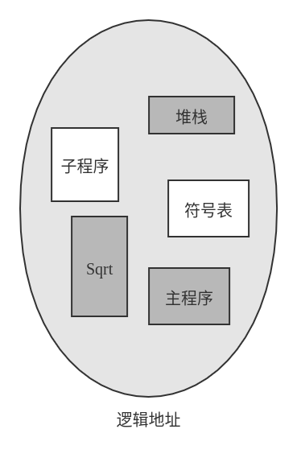</center>
<center>程序员眼中的程序</center>

程序员眼中的程序是由主程序加上一组方法、过程或函数所构成的。它还可以包括各种数据结构：对象、数组、堆栈、变量等。每个模块或数据元素通过名称来引用。程序员会说“堆栈”、“数学库” 和 “主程序” 等，而并不关心这些元素所在内存的位置。她不关心堆栈式放在函数`Sqrt()`之前还是之后。这些段的长度是不同的，其长度是有这些段在程序中的目的决定的。段内的元素是通过它们距离段首的偏移来指定：程序的第一条语句、在堆栈里的第 $7$ 个栈帧、函数`Sqrt()`的第五条指令。

**分段**（segmentation）就是支持这种用户视图的内存管理方案。逻辑地址空间是由一组段构成。每个段都有名称和长度。地址指定了段名称和段内偏移。因此用户通过两个量来指定地址：段名称和段偏移。

为了实现简单起见，段是编号的，是通过短号而不是段名称来引用。因此，逻辑地址由有序对（two tuple）组成：

<center><段号，偏移></center>

通常，在编译用户程序时，编译器会根据输入程序来自动构造段。

一个 C 编译器可能会创建如下段：

* 代码
* 全局变量
* 堆（内存从堆上分配）
* 每个线程使用的栈
* 标准的 C 库

在编译时链接的库可能分配不同的段。加载程序会装入所有这些段，并为它们分配段号。

#### 分段硬件

虽然用户现在能通过二位地址来引用程序内的对象，但是实际物理内存仍然是一维的字节序列。因此，我们应定义一个实现方式，以便映射用户定义的二维地址到一维物理地址。这个地址是通过 **段表**（segment table）来实现的。段表的每个条目都有 **段基地址**（segment base）和 **段界限**（segment limit）。段基地址包含该段在内存中的开始物理地址，而段界限指定该段的长度。

<center>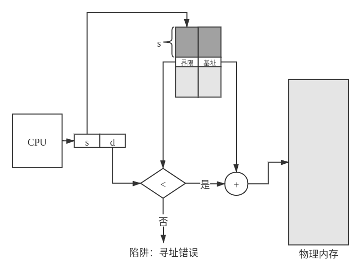</center>
<center>分段硬件</center>

段表的使用如上图所示。每个逻辑地址由两部分组成：段号 $s$ 和段偏移 $d$。段号用作段表的索引，逻辑地址的偏移 $d$ 应位于 $0$ 和段界限之间。如果不是这样，那么会陷入操作系统中（逻辑地址试图访问段的外面）。如果偏移 $d$ 合法，那么就与基址相加得到所需字节的物理内存地址。因此，段表实际上二元组 （*基址寄存器值*， *界限寄存器值*） 的数组。

<center>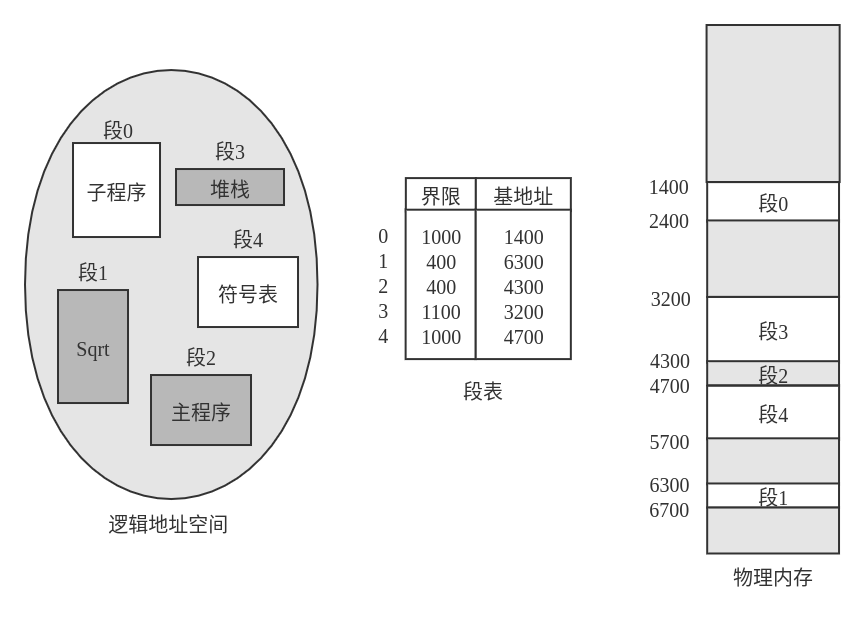</center>
<center>分段的例子</center>

如上图所示，前述例子中逻辑地址空间和物理内存之间通过段表映射。

### 分页

分段允许进程的物理地址空间是非连续的。**分页**（paging）是提供这种优势的另一种内存管理方案。然而，分页避免了外部碎片和紧缩，而分段不可以。分页也避免了 *将不同大小的内存块匹配到交换空间* 的麻烦问题。在分页引入之前采用的内存管理方案都有这个问题。这个问题出现的原因是：当位于内存的代码和数据段需要换出时，应在备份存储上找到空间。备份存储也有同样的与内存相关的碎片问题，但是访问更慢，因此紧缩是不可能的。由于比早起方法更优越，各种形式的分页为大多数操作系统所采用，包括大型机和智能手机的操作系统。实现分页需要操作系统和计算机硬件的协作。

#### 基本方法

实现分页的基本方法涉及将物理内存分为固定大小的块，称为 **帧** 或 **页帧**（frame）；而将逻辑内存也分为同样大小的块，称为 **页** 或 **页面**（page）。当需要执行一个进程时，它的页从文件系统或备份存储等源处，加载到内存可用帧。备份存储划分为固定大小的块，它与单个内存中或多个内存帧（簇）的大小一样。这个相当简单的方法功能强且变化多。例如，一个进程可以有一个 $64$ 位的逻辑地址空间，而系统的物理内存小于 $2^{64}$ 字节。

<center>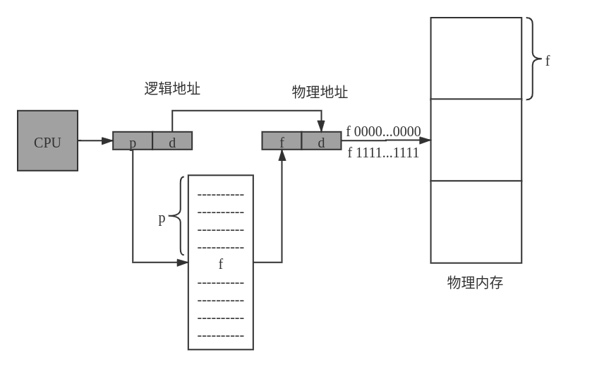</center>
<center>分页的硬件支持</center>

分页的硬件支持如上图所示。由CPU生成的每个地址分为两部分：**页码**（page number）($p$)和 **页偏移**（page offset）($d$)。页码作为 **页表** 的索引。页表包含每页所在物理内存的基地址。这个基地址与页偏移的组合就形成了物理内存地址，可发送到物理单元。内存的分页模型如下如所示：

<center>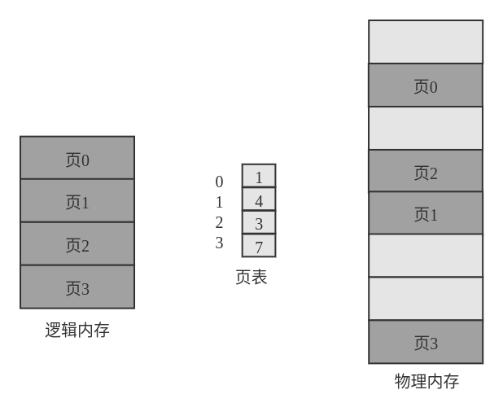</center>
<center>逻辑内存和物理内存的分页模型</center>

页大小（与帧大小一样）是由硬件来决定的。也得大小为 $2$ 的幂；根据计算机体系结构的不同，页大小可以从 $512$ 字节到 $1$ GB不等。如果逻辑地址空间为 $2^m$，页大小为 $2^n$ 字节，那么逻辑地址的高 $m - n$ 位表示页码，而低 $n$ 位表示页偏移。如下图所示：

<center></center>

其中 $p$ 是页表索引（页码），$d$ 为页内偏移。

??? note "获取 Linux 系统的页的大小"
    在 Linux 系统上，页大小根据架构而变化，有多个方法可以获取页大小。一种方法采用系统调用 `getpagesize()` 。另一个策略是终端命令
    ```
    getconf PAGESIZE
    ```
    这些方法都返回按字节计数的页大小。

不难注意到，分页本身是一种动态的重定位。每个逻辑地址由分页硬件绑定绑定为某个物理地址。采用分页类似于采用一组基址（重定位）寄存器，每个基址对应着一个内存帧。

由于操作系统管理物理内存，塔影之道物理内存的分配细节：哪些帧已分配，哪些帧空着，总共有多少针，等等。这些信息通常保存在称为 **帧表**（frame table）的数据结构中。在帧表中，每个条目对应着一个帧，以表示该帧是空闲还是已占用；如果占用，是被哪个（或哪些）进程的哪个页所占用。

操作系统为每个进程维护一个页表的副本，如同需要维护指令计数器和寄存器内容一样。每当操作系统自己将逻辑地址映射成物理地址，这个副本可用于转换。当一个进程可分配到CPU时，CPU分派器也根据该副本来定义硬件也表。因此，*分页增加了上下文切换的开销*。

#### 硬件支持

每个操作系统都有自己保存页表的方法。有的为每个进程分配一个页表。页表的指针，与其他寄存器的值（如指令计数器），一起被存入 PCB。当分派器需要启动一个进程时，他首先加载用户寄存器，并根据保存的用户页表来定义正确的页表值。其他操作系统提供一个或多个页表，以便减少进程的上下文切换的开销。

由于每次访问内存都需要经过分页映射，因此效率是一个重要而考虑因素。

页表的硬件实现有多种方法。最简单的一种是：将夜表作为一组专用的 **寄存器** 来实现。

如果页表较小（例如 $256$ 个条目），那么尚且可以用寄存器实现。但是，大多数现代操作系统的页表很大（例如 $100$ 万个条目）。对于这些机器，需要将夜表放在内存中，并将 **页表基地址寄存器**（Page-Table Base Register, PTBR）指向页表。改变页表只需改变这一寄存器就可以，这也大大降低了上下文切换的开销。

然而采用这种方案访问一个字节需要 *两次* 访问内存（一次用于页表条目，一次用于字节），相当于内存访问速度减半。这个问题的解决方法是采用专用的、较小的、查找快读的高速硬件缓冲，它称为 **转换表缓冲区**（Translation Look-aside Buffer, TLB）。如下图所示：

<center>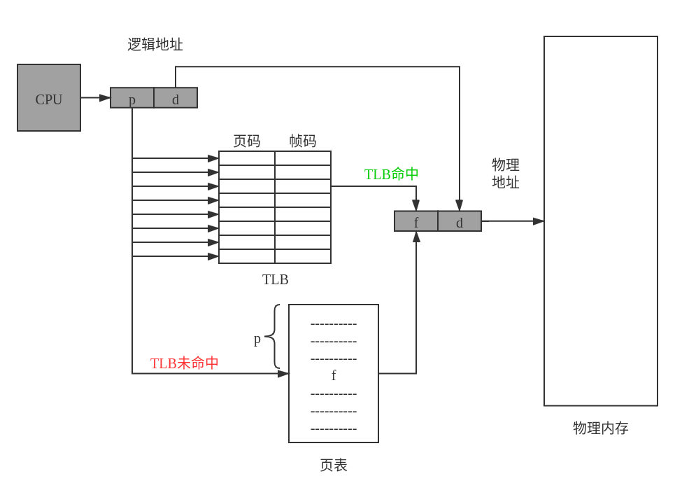</center>
<center>逻辑内存和物理内存的分页模型</center>

有的CPU允许操作系统参与缓存中 LRU 条目的替换。另外，有的 TLB 允许固有条目。通常，重要的内核代码条目是固定下来的。

有的TLB在每个条目中还保存 **地址空间标识符**（Address-Space Identifierm, ASID）。ASID唯一标识每个进程，并为进程提供地址空间的保护。

**命中率**（hit ratio）可以衡量 TLB 条目命中的比率。对于任意内存字节，TLB 命中意味着一次内存访问，未命中则意味着两次内存访问。基于CPU访存时间（如 $100$ ns），可以求得 **有效内存访问时间**（effective memory-access time）。

??? note "Intel Core i7 的两级 TLB"
    Intel Core i7 CPU 有一个 $128$ 指令条目的 L1 TLB 和 $64$ 数据条目的 L1 TLB。当 L1 未命中时，CPU 花费 $6$ 个周期来检查 L2 TLB 的 $512$ 条目。L2 未命中意味着，CPU 需要通过内存的页表条件来查找相关的帧地址，这可能需要数百个周期，或者通过中断操作系统以完成它的工作。

#### 保护

分页环境下的内存保护是通过与每个帧关联保护位来实现的。通常，这些位保存在页表中。

可以用一个位定义一个页是可读可写或只读。非法访问会陷入操作系统。

还有一个位通常与页表总的每一条木相关联：**有效-无效位**（valid-invalie bit）。表示相关的页是否在进程的逻辑地址空间内。操作系统通过对该位的设置，可以允许或不允许对某页的访问。

<center>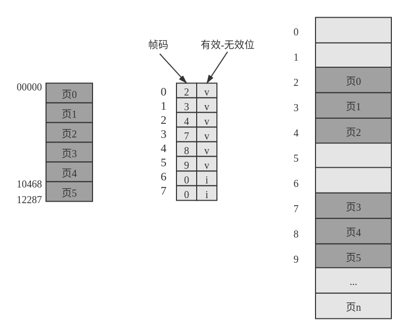</center>
<center>页表的有效位（v）或无效位（i）</center>

如上图所示，如果试图产生页表 $6$ 或 $7$ 的地址时，则会发现有效-无效位为无效，操作系统会捕捉到这一非法操作（*无效位引用*）。

一个进程很少会使用它的全部地址空间。事实上，许多进程只用到地址空间的一小部分。对于这些情况，如果为地址范围内的所有页都在页表中建立一个条目是非常浪费的！为此有的系统提供硬件，如 **页表长度寄存器**（Page-Table Length Register, PTLR）来表示页表的大小，该寄存器的值可用于检查每个逻辑地址以验证其是否位于进程的有效范围内。如果检测无法通过，则会被操作系统捕捉到。

#### 共享页

分页的优点之一是可以 *共享* 公共代码。对于分时环境，这种考虑尤其重要。假设一个支持 $40$ 个用户的系统，每个都执行一个文本编辑器。如果该文本编辑器包括 $150$KB 的代码及 $50$KB 的数据空间，则需要 $8000$KB 来支持这 $40$ 个用户。如果代码是 **可重入代码**（reentrant code）或 **纯代码**（pure code），则可以共享。如下图所示：

<center>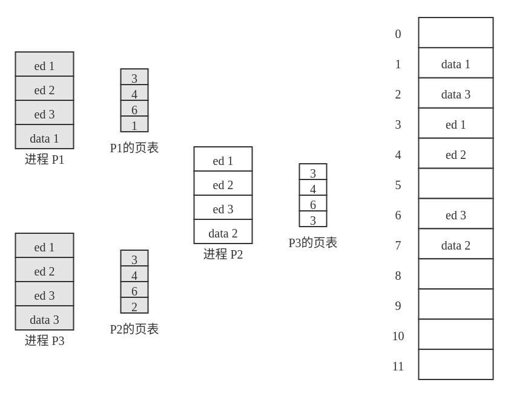</center>
<center>分页环境的代码共享</center>

如上图所示，这里有 $3$ 个进程，它们共享 $3$ 页的编辑器，这里每页大小为 $50$KB （为了简化图示这里采用大页面）。每个进程都有自己得数据页。

**可重入代码** 是不能自我修改的代码：它在执行期间不会改变。因此，两个或更多个进程可以同时执行相同代码。每个进程都有它自己的寄存器副本和数据存储，以便保存进程执行的数据。当然，不同进程的数据不同。

在物理内存中，秩序保存一个编辑器副本。每个用户的页表映射到编辑器的同一个物理副本，但是数据页映射到不同的帧。因此，为支持 $40$ 个用户，只需一个编辑器副本（$150$KB），在加上 $40$ 个用户数据的空间 $50$KB，总的需求空间为 $2150$KB 而非 $8000$KB，这个节省还是很大的。

其他大量使用的程序也可以共享，如编辑器、窗口系统、运行时库、数据库系统等。为了共享，代码应可重入。共享代码的只读属性不应由代码的正确性来保证；而应由操作系统来强制实现。

系统内进程之间的共享内存，类似于通过线程共享同一任务的地址空间。此外，对用于进程间通信的共享内存，有的操作系统通过共享页来实现共享内存。

### 页表结构

这部分探讨组织也表的一些最常用技术。

#### 分层页表

大多数现代操作系统支持大逻辑地址空间（$2^{32} ~ 2^{64}$）。在这种情况下，页表本身可以非常大。例如，假设具有 $32$ 位逻辑地址空间的一个计算机系统。如果系统的页大小为 $4$KB（$2^{12}$）。假设每个条目有 $4$ 字节，那么每个进程需要 $4$MB 物理地址空间来存储页表本身。在内存中为这个页表开辟连续空间开销太大。

一种方法是使用两层分页算法，将页表再分页。

如下图例子，假设一个系统，具有 $32$ 位逻辑地址空间和 $4$K 大小的页。一个逻辑地址被分为 $20$ 位的页码和 $12$ 位的页偏移。因为要对页表进行再分页，所以该页码可分为 $10$ 位的页码和 $10$ 位的页偏移。这样，一个逻辑地址就分为如下形式：

<center>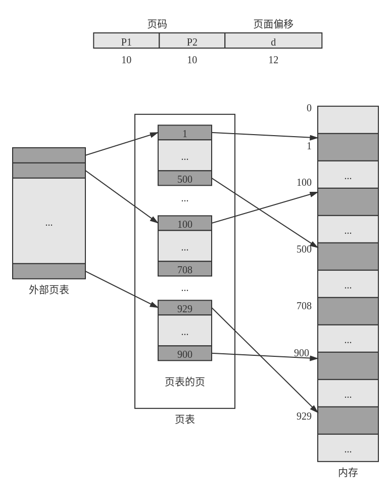</center>
<center>分页环境的代码共享</center>


#### 哈希页表

#### 倒置页表

### Intel 32位和64位体系结构

### ARM架构


## 虚存管理

上一部分讨论了计算机系统的各种内存管理策略。搜有这些策略都有共同的目标：同时将多个进程保存在内存中，以便允许多道程序。然而，这些策略都倾向于要求每个进程在执行之前应完全处于内存中。

虚拟内存技术允许执行进程不必完全处于内存。这种方案的一个主要优点是：程序可以大于物理内存。此外，虚拟内存将内存抽象成一个巨大的、统一的存储数组，进而实现了用户看到的逻辑内存与物理内存的分离。这种技术使得开发人员不再但担忧内存容量的限制。虚拟内存还允许进程轻松共享文件和实现内存共享。此外，它为创建进程提供了有效的机制。然而，虚拟内存的实现并不容易，并且使用不当还可能会大大降低性能。这一部分以请求调页为例讨论虚拟内存，并讨论其复杂性和开销。

### 背景

### 请求调页

### 写时复制

### 页面置换

### 帧分配

### 系统抖动

### 内存映射文件

### 分配内核内存

### 其他注意事项

### 操作系统例子

本节讨论 Windows 和 Solaris 如何实现虚拟内存。

#### Windows

#### Solaris
