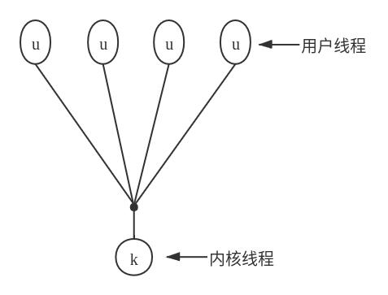
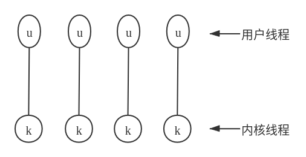
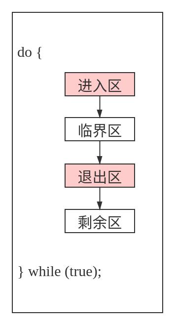
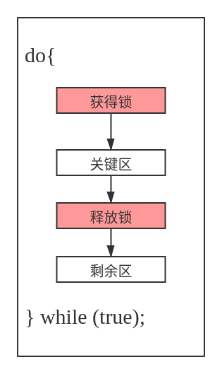

# 进程管理

## 进程

### 进程概念

进程是执行的程序，随着进程的执行，它改变状态。进程状态是由进程当前活动定义的。每个进程可以处于如下状态：**新的**、**就绪**、**运行**、**等待**、**终止**。在操作系统内，每个进程通过它的 **进程控制块（PCB）** 来表示。

### 进程调度

进程，当不执行时，位于某个等待队列。操作系统有两种主要队列：**IO请求队列**、**就绪队列** 。就绪队列包括所有等待执行并等待CPU的进程。每个进程都用PCB来表示。

操作系统应从各个调度队列中选择进程。**长期调度**（用于作业）选择进程以便竞争CPU。通常，长期调度充分考虑资源分配，尤其内存管理。**短期调度** 从就绪队列中选择进程。

### 进程运行

操作系统必须提供一种机制，以便父进程创建子进程。父进程在继续之前可以等待其子进程终止，也可以与子进程并发执行。允许并发有多个原因：信息共享、计算加速、模块化、方便。

### 进程间通信

操作系统内的执行进程可以是独立的，也可以是协作的。协作进程需要进程间具有相互通信的机制。通信主要有两种形式： **共享内存** 和 **消息系统** 。

* **共享内存**：进程共享一些变量，进程通过使用这些共享变量来交换信息。对于共享内存系统，提供通信的责任主要在应用程序员，操作系统只需要提供共享内存。
* **消息系统**：操作系统负责提供通信机制。

两种方法相互不排斥，可以在统一操作系统内同时实现。

### IPC系统例子

POSIX共享内存、Mach的消息传递、Windows的ALPC（高级本地程序调用）工具。

### 客户机/服务器通信

**套接字** 、 **远程过程调用（PRC）** 、 **管道** 

* **套接字**：套接字定义为通信的端点。一对应用程序之间的连接由一对套接字组成，通信的两端各有一个套接字。
* **RPC**：是另一种形式的分布式通信，当一个进程/线程调用一个远程应用的过程时，就有了RPC。
* **管道**：提供了一个相对简单的进程间相互通信，普通管道允许父进程和子进程之间的通信，命名管道允许不相关进程的通信。


## 多线程编程

### 概述

线程是进程内的控制流。多线程进程在同一地址空间内包括多个不同的控制流。多线程的优点包括：用户响应的改进、进程内资源的共享、经济和可扩展性的因素（如更有效的使用多个处理核）。

### 多核编程

多核系统的引入使得 **并发** 表示线程能够 **并行** 执行，因为系统可以给每个核分配一个单独线程。

多核机制引入的编程挑战：

* **任务识别**：这涉及分析应用程序，查找区域以便分为独立的、并发的任务。在理想情况下，任务是相互独立的，因此可以在多核上并行运行。
* **平衡**：在识别可以并行运行的任务时，程序员还需确保任务执行同等价值的工作。在有些情况下，有的任务与其他任务相比，可能对整个任务的贡献并不多；采用单独核来执行整个任务就不值得了。
* **数据分割**：正如应用程序要分为单独任务，有任务访问和操作的数据也应划分以便运行在单独的核上。
* **数据依赖**：任务访问的数据必须分析多个任务之间的依赖关系。当一个任务依赖于另一个任务的数据时，程序员必须确保任务执行是同步的，以适应数据依赖性。
* **测试与调试**：当一个程序并行运行于多核时，可能产生许多不同的执行路径。测试与调试这样的并发程序比测试和调试单线程的应用程序难度大得多。

通常，有两种类型的并行：**数据并行** 和 **任务并行**。

* **数据并行**：将数据分布在相同的计算核上，并在每个核上执行相同操作；
* **任务并行**：将任务（线程）而不是数据分配到多个计算核，每个线程都执行一个独特的操作。

### 多线程模型

**用户线程**（user thread）对用户来说是可见的，对内核则是未知的。操作系统支持和管理 **内核级线程**（kernel thread）。通常，用户线程与内核线程相比，创建和管理要更快，因为它不需要内核干预。

三种不同类型的模型关联用户线程和内核线程 

* **多对一模型**：将多个用户线程映射到一个内核线程



* **一对一模型**：将每个用户线程映射到一个对应的内核线程



* **多对多模型**：将多个用户线程在同样（或更少）数量的内核线程之间切换


以上设计对并发性的影响  
*虽然多对一模型允许开发人员创建任意多的用户线程，但由于内核只能一次调度一个线程，所以并未增加并发性。虽然一对一模型提供了更大的并发性，但是开发人员不宜在应用程序内创建太多线程（有时系统可能会限制创建线程的数量）。多对多模型没有这两个缺点：开发人员可以创建任意多的用户线程，并且相应内核线程能在多处理器系统上并发执行。而且，当一个线程执行阻塞系统调用时，内核可以调度另一个线程来执行。*

大多数现代操作系统，如Windows、Mac OS X、Linux和Solaris等，都对线程提供内核支持。

### 线程库

线程库为应用程序员提供了创建和管理线程的API。常用的主要线程库有三个：**POSIX Pthreads**、**Windows线程** 和 **Java线程**。

### 隐式多线程

除了采用线程库API来显式创建线程，还可以使用隐式线程，这种线程的创建和管理交由编译器和运行时库来完成。隐式线程方法包括：**线程池**、**OpenMP** 和 **Grand Central Dispatch** 等。

### 多线程问题

多线程程序为程序员带来了许多挑战，包括`fork()`和`exec()`系统调用的语义。其他问题包括 **信号处理**、**线程撤销**、**线程本地存储** 和 **调度激活** 等

### 操作系统例子

#### Windows线程

每个Windows应用程序按单独进程来运行，每个进程可以包括一个或多个线程。Windows使用一对一映射，即每个用户线程映射到一个相关的内核线程。

线程一般包括如下部件：

* **线程ID** - 用于唯一标识线程。
* **寄存器组** - 用于表示处理器状态。
* **堆栈** - **用户堆栈**，以供线程在用户模式下运行；**内核堆栈**，以供线程在内核模式下运行。
* **私有存储区域** - 用于各种运行时库和动态链接库（DLL）。

寄存器组、堆栈和私有存储区域，通常称为 **线程上下文**（context）

线程的主要数据结构：

* **ETHREAD**：执行线程快。包括所属进程指针、线程控制开始的程序的地址以及对应的KTHREAD的指针等。
* **KTHREAD**：内核线程快。包括线程的调度和同步信息。另外，KTHREAD也包括内核堆栈（以供线程在内核模式下运行）和TEB的指针。
* **TEB**：线程环境块

#### Linux线程

* 系统调用`fork()`：进程复制的传统功能
* 系统调用`clone()`：创建线程

Linux在讨论程序的控制流时，常采用任务（task）一词，而非进程（process）或线程（thread）。


## 进程调度

### 基本概念

CPU调度的任务是，从就绪队列中选择一个等待进程，并为其分配CPU。调度程序分配CPU到选中的进程。

### 调度准则

* **CPU使用率**：应使CPU尽可能地忙碌。从概念上讲，CPU使用率从 $0%$ 到 $100%$。对于一个实际系统，他的范围应从和 $40%$（轻复核系统）到 $90%$（重符合系统）。
* **吞吐量**：如果CPU忙于执行进程，那么工作就在完成。一种测量工作的方法称为 **吞吐量**（throughput），它是在一个时间单元内进城完成的数量。对于长进程，吞吐量可能为每小时一个进程；对于短进程，吞土量可能为每秒是个进程。
* **周转时间**：从一个特定进程的角度看，一个重要准则是运行这个进程需要多长时间。从进程提交到进城完成的时间段称为周转时间（turnaround time）。周转时间为所有时间段之和，包括进程等待进入内存、在就绪队列中等待、在CPU上执行和I/O执行。
* **等待时间**：CPU调度算法并不影响进程运行和执行I/O的时间，它只影响进程在就绪队列中因等待所需的时间。等待时间为在就绪队列中等待所花时间之和。
* **响应时间**：对于交互系统，周转时间不是最佳准则。通常，进程可以相当早地产生输出，并且继续计算新的结果同时输出以前的结果给用户。因此，另一时间是从提交请求到产生第一响应的时间。这种时间称为响应时间，是开始相应所需的时间，而非输出相应所需的时间。周转时间通常受输出设备速度的限制。

### 调度算法

CPU调度处理的问题是：从就绪队列中选择进程以便为其分配CPU。

#### 先到先服务

First-Come First-Served, FCFS，最简单的调度算法，但它会让段进城等待很长的进程。

#### 最短作业优先调度

Shortest-Job-First, SJF，在最短平均等待时间意义上是最佳的。

然而，SJF调度实现的难点在于预测下一个CPU执行的长度。

#### 优先级调度

Priority-Scheduling，SJF算法是通用优先级调度算法（简单分配CPU到具有最优优先级的进程）的一个特例。

优先级和SJF的调度可能产生饥饿，老化技术阻止饥饿。

#### 轮转调度

Round-Robin, RR，更适合于分时（交互）系统。RR调度为就绪队列的首个进程，分配 $q$ 个时间单位，这里 $q$ 是时间片。在 $q$ 个时间单位之后，如果该进程还没有释放CPU，那么它被强占并添加到就绪队列尾部。

该算法的主要问题是选择时间片。如果时间片太大，那么RR算法就变成了FCFS算法；如果时间片太小，那么有上下文切换引起的调度开销就过大。

FCFS算法是非抢占的，而RR算法是抢占的。SJF和优先级算法可以是抢占的也可以是非抢占的。

#### 多级队列调度

Multilevel queue scheduling，允许多个不同算法用于不同类型的进程。最常用模型包括：使用RR调度的 **前台交互队列** 与使用FCFS调度的 **后台批处理队列** 。

#### 多级反馈队列调度

Multilevel feedback queue scheduling，多及反馈队列允许进程在队列之间迁移。

### 线程调度

在支持线程的操作系统上，内核级线程（而不是进程）才是操作系统所调度的。用户级线程是由线程库来管理的，而内核并不知道它们。用户线程为了运行在CPU上，最终应映射到相关的内核级线程，但这种映射可能不是直接的，可能采用 **轻量级进程（LWP）** 。

### 多处理器调度

许多现代操作系统支持多处理器，并允许每个处理器独立调度。通常，每个处理器维护各自的、私有的、可运行的进程（或线程）队列。与多处理器调度相关的问题包括处理器亲和性、负载平衡和多核处理等。

### 实时CPU调度

实时计算机系统要求在截止期限之前得到结果；在截止期限之后得到的结果是无用的。**硬实时系统**（hard read-time system）应保证，实时任务在截止期限内得到服务。**软实时系统**（soft read-time system）的限制较少，分配给实时任务的调度优先级高于其他服务。

实时调度算法包括 **单调速率**（rate-monotonic）和 **最早截止优先**（Earliest-Deadline-First, EDF）调度。单调速率调度通常为需要更多CPU的任务，分配更高优先级。最早截止优先队列根据即将到来的截止期限来分配优先级；截止期限越早，优先级越高。**比例分享调度**（proportional share）将处理器时间划分为股份，并为每个进程分配一个数量的份额，从而保证每个进程具有按比例的CPU时间份额。

POSIX和Pthreads API为实时调度线程，也提供各种特征。

### 操作系统例子

支持内核级线程的操作系统应调度执行线程（而不是进程）。Solaris和Windows就是这样的系统。这两个系统都通过基于抢占的优先级调度算法来调度线程，包括支持实时线程。Linux进程调度程序使用基于优先级的算法，也提供实时支持。这三个操作系统的调度算法通常偏向支持交互式进程（而非CPU密集型继承）。

### 算法评估

各种各样的调度算法要求有选择算法的方法。分析方法使用 **数学分析** 法以确定算法性能。**仿真** 方法对代表性的进程，采用调度算法仿真，并计算性能，进而确定优劣。然而，仿真最多只能提供真实系统性能的近似值。评估调度算法的唯一可靠技术是：在实际系统上实现算法，并在“现实世界”环境中监视性能。


## 同步

**协作进程**（cooperating process）能与系统内的其他进程相互影响。协作进程或能直接共享逻辑地址空间（即代码和数据），或能通过文件或消息来共享数据。前一种情况可以通过线程来实现。然而，共享数据的并发可能导致数据的不一致。这一节讨论多种机制，以便确保同一逻辑地址空间的协作进程的有序执行，从而维护数据的一致性。

### 背景

* **竞争条件**（race condition）：多个进程并发访问和操作同一数据并且执行结果与特定访问顺序有关。

由于竞争条件的存在，我们分析 **进程同步**（process synchronization）和 **进程协调**（process coordination）。

### 临界区问题

假设某个系统有 $n$ 个进程 ${P_0, P_1, ..., P_{n-1}}$。每个进程有一段代码，称为 **临界区**（critical section），进程在执行该区时可能修改公共变量、更新一个表、写一个文件等。该系统的一个重要特征是，当一个进程在临界区内执行时，其他进程不允许在各自的临界区执行。

**临界区问题**（ciritical-section problem）是，设计一个协议以便协作进程。在进入临界区前，每个进程应请求许可。实现这一请求的代码段称为 **进入区**（entry section）。临界区之后可以有 **退出区**（exit-section），其他代码为 **剩余区**（remainder section）。一个典型进程 $P_i$ 的通用结构如下如所示：



临界区问题的解决方案应满足如下三条要求：

* **互斥**（mutual exclusion）：如果进程 $P_i$ 在其临界区内执行，，那么其它进程都不能在其临界区内执行。
* **进步**（progress）：如果没有进程在其临界区内执行，并且有进程需要进入临界区，那么只有那些不在剩余区内执行的进程可作备选，以便确定谁能下次进入临界区，而且这种选择不能无限推迟。
* **有限等待**（bounded waiting）：从一个进程做出进入临界区的请求直到这个请求允许为止，其他进程允许进入临界区的次数具有上限。

**Peterson解决方案** 是一个经典的基于软件的临界区问题解决方案。满足互斥、进步、有限等待等要求的软件设计的复杂性要求。

### 硬件同步

对于临界区问题，基于软件的解决方案（如Peterson解答）并不保证在现代计算机体系结构上正确工作。

下面探讨一些其他解答，包括内核开发人员和应用程序员采用的硬件和软件API技术。所有这些皆大都是基于 **加锁**（locking）为前提的，即通过锁来保护临界区。

简单地 **禁止中断** 可以用于单处理器环境：在修改共享变量时禁止中断出现。

然而，多处理其环境下消息要传递到所有处理器，该过程导致的延时会降低系统效率；另外，如果系统时钟是通过中断更新的，则也会受到影响。

因此，在许多现代系统提供特殊硬件指令，用于监测和修改字的内容，或者用于 **原子地**（atomically）交换两个字（作为不可中断的指令）。

### 互斥锁

临界区问题基于硬件的解决方案不但复杂，而且不能为程序员直接使用。因此，操作系统设计人员构建软件工具，以解决临界区问题。最简单的工具就是 **互斥锁**（mutex lock）。我们使用互斥锁来个保护临界区，从而防止竞争条件。也就是说，一个进程在进入临界区时应得到锁；它在退出临界区时释放锁。函数`acquire()`获取所，而函数`release()`释放锁，如下图所示：



每个互斥锁有一个布尔变量`available`，它的值表示锁是否可用。如果锁是可用的，那么调用`acquire()`会成功，并且锁不再可用。当一个进程试图获取不可用的锁时，它会阻塞，知道锁被释放。

按如下定义`acquire()`：
```
acquire() {
    while (!available)
        ; /* busy wait */
    available = false;
}
```

按如下定义`release()`：
```
release() {
    available = true;
}
```

对`acquire()`和`release()`的调用必须原子地执行。因此，互斥锁通常采用硬件机制来实现。

这里所给实现的主要缺点是：它需要 **忙等待**（busy waiting）。当有一个进程在临界区中，任何其他进程在进入临界区时必须连续循环地调用`acquire()`。这种类型的互斥锁也被称为 **自旋锁**（spinlock），因为进程不停地旋转，以等待锁变得可用。在实际多道程序系统中，即当多个进程共享同一CPU时，这种连续循环显然是个问题。忙等待浪费CPU周期，而这原本可以有效用于其他进程。

自旋锁的优点：  
当进程在等待锁时，没有上下文切换（上下文切换可能需要相当长的时间）。因此，当使用锁的时间较短时，自旋锁还是有用的。自旋锁通常用于多处理器系统，一个线程可以在一个处理器上“旋转”，而其他线程在其他处理器上执行临界区。

### 信号量

互斥锁通常被认为是最简单的同步工具。本节讨论一个更鲁棒的工具，它的功能类似于互斥锁，但它能提供更为高级的方法，以便进程能够同步活动。

一个 **信号量**（semaphore）$S$是一个整型变量，它除了初始化外能通过两个标准原子操作：`wait()`和`signal()`来访问。

可按如下定义`wait()`:
```
wait(S) {
    while (S <= 0)
        ; // busy wait
    S--;
}
```

可按如下定义`signal()`：
```
signal(S) {
    S++;
}
```

#### 信号量的使用

操作系统通常区分计数信号量和二进制信号量。**计数信号量**（counting semaphore）的值不受限制，而 **二进制信号量**（binary semaphore）的值只能为 $0$ 或 $1$。因此，二进制信号量类似于互斥锁。事实上，在没有提供互斥锁的系统上，可以使用二进制信号量来实现互斥。

计数信号量可以用于控制访问具有多个实例的某种资源。信号量的初值为可用资源的数量。当进程需要使用资源时，需要对该信号量执行`wait()`操作（减少信号量的计数）。当进行资源释放时，需要对该信号量执行`signal()`操作（增加信号量的计数）。当信号量的计数为 $0$ 时，所有资源都在使用中。之后，需要使用资源的进程将会阻塞，直到计数大于 $0$ 。

*使用信号量解决同步问题的例子：*  
现有两个并发执行的进程：P1有语句`S1`而P2有语句`S2`。假设要求只有在`S1`执行后才能执行`S2`，则可以用信号量轻松实现这一要求：让P1和P2共享同一信号量`synch`，并且初始化为 $0$。在进程P1中，插入语句：
```
S1;
signal(synch);
```

在进程P2中，插入语句：
```
wait(synch);
S2;
```

#### 信号量的实现

与自旋锁的实现具有忙等待相同，上述信号量操作`wait()`和`signal()`也有同样的问题。为了克服忙等待需要，可以这样修改忙等待操作`wait()`和`signal()`的定义：当一个进程执行操作`wait()`并且发现信号量值不为正时，它必须等待。然而，该进程不是忙等待而是阻塞自己。阻塞操作将一个进程放到与信号量有关的等待队列中，并且将该进程状态切换成等待状态。然后，转到CPU调度程序，一边选择执行另一个进程。

等待信号量 $S$ 而阻塞的进程，在其它进程执行`signal()`后，应被重新执行。进程的重新执行是通过操作`wakeup()`来进行的，它将进程从等待状态改为就绪状态。然而，进程被添加到就绪队列。（取决于CPU调度算法，CPU可能会也可能不会从正在运行的进程切换到新的就绪进程。）

为了实现这样定义的信号量，按如下定义信号量：
```cpp
typedef struct {
    int value;
    struct process *list;
} semaphore;
```

每个信号量都有一个整数`value`和一个进程链表`list`。当一个进程必须等待信号量时，就被添加到进程链表。操作`signal()`从等待进程链表上取走一个进程，并加以唤醒。

现在，信号量操作`wait()`可以定义如下L：
```cpp
wait(semaphore *S) {
    S->value--;
    if (S->value < 0) {
        add this process to S->list;
        block();
    }
}
```

而信号量操作`signal()`可定义如下：
```cpp
signal(semaphore *S) {
    S->value++;
    if (S->value <= 0) {
        remove a process P from S->list;
        wakeup(P);
    }
}
```

操作`block()`挂起调用它的进程。操作`wakeup(P)`重新启动阻塞进程 $P$ 的执行。这两个操作都是由操作系统作为基本是系统调用来提供的。

### 经典同步问题

#### 有限缓冲问题

#### 读者-作者问题

假设一个数据库为多个并发进程所共享。有的进程可能只需要读数据库，而其他进程可能需要更新（读和写）数据库。为区分这两类进程，称前者为 **读者**（reader），后者为 **作者**（writer）。如果

以数据库为例，我们要求作者在写入数据库时具有共享数据库独占的访问权。这一同步问题即 **读者-作者问题**（reader-writer problem）。该问题自从被提出就一直用于测试几乎所有新的同步原语。

* 第一读者-作者问题：读者不应保持等待，除非作者已经获得权限使用共享对象。  
换句话说，没有读者，由于某个作者等待，而等待其他读者的完成。
* 第二读者-作者问题：一旦作者就绪，那么作者会尽可能快地执行。  
换句话说，如果有一个作者等待访问对象，那么不会有读者可以开始读。

有些系统将读者-作者问题进行抽象，从而提供 **读写锁**（read-writer lock），在获取读写锁时，需要指定锁的模式：**读访问** 和 **写访问**。当一个进程只需要读共享数据时，可申请读模式的读写锁；当一个进程希望修改共享数据时，应申请写模式的读写锁。多个进程可允许并发获取读模式的读写锁，但只有一个进程可获取写模式的读写锁，作者进程需要互斥访问。

读写锁的适用场景：

* 容易识别哪些进程只读共享数据和哪些进程只写共享数据的应用程序。
* 读者进程数比坐着进程数多的应用程序。这是因为读写锁的建立开销通常大于信号量或互斥锁的，但是这一开销可以通过允许多个读者的并发程序的增加来弥补。

#### 哲学家就餐问题

### 管程

操作系统应提供机制以防止时序出错，已有多个语言结构可处理这些问题。管程为共享抽象数据类型提供了同步机制。条件变量提供了一个方法，以便管程函数阻塞执行直到被通知可继续为止。

### 同步例子

操作系统也提供同步支持。例如，Windows、Linux和Solaris都提供机制，如信号量、互斥锁、自旋锁及条件变量，以便提供访问共享数据。Pthread API支持互斥锁、信号量以及条件变量。

#### Windows同步

#### Linux同步

#### Solaris同步

#### Pthreads同步

### 替代方法

多线程应用程序会增加竞争条件和死锁的风险。传统上，诸如互斥锁、信号量和管程等技术用于解决这些问题，但是随着处理核数量的增加，设计多线程应用程序并且避免竞争条件和死锁变得越来越困难。

有多个替代方法重点关注多核系统的同步。一个方法采用 **事物内存**，它通过软件或硬件技术来处理同步问题。另一个方法采用由 **OpenMP** 提供的编译器扩展。最后，**函数是编程语言** 通过不允许可变性来处理同步问题。


## 死锁

多道程序环境中，多个进程可以竞争有限数量的资源。当一个进程申请资源时，如果这时没有可用资源，那么这个进程进入等待状态。有时，如果申请的资源被其他等待进程占有，那么该等待进程有可能再也无法改变状态。这种情况称为 **死锁**（deadlock）。

### 系统模型

### 死锁特征

#### 必要条件

如果在一个系统中以下四个条件同时成立，那么就能引起死锁：

* **互斥**（mutual exclusion）：至少有一个资源必须处于非共享模式，记一次只有一个进程可使用。如果另一个进程申请该资源，那么申请进程应该等到该资源释放为止。
* **占有并等待**（hold and wait）：一个进程应占有至少一个资源，并等待两一个资源，该资源为其它进程所占有。
* **非抢占**（no preemption）：资源不能被强占，即资源只能被进程在完成任务后自愿释放。
* **循环等待**（circular wait）：有一组等待进程 ${P_0, P_1, ..., P_n}$，$P_0$ 等待的资源为 $P_1$ 占有，$P_1$ 等待的资源为 $P_2$ 占有，......，$P_{n - 1}$ 等待的资源为 $P_n$ 占有，$P_n$ 等待的资源为 $P_0$ 占有。

需要强调，所有四个条件必须同时成立才会出现死锁。注意到循环等待条件意味着占有并等待条件，故四个条件并不是完全独立。但只要确保其中一个不成立即可预防死锁。

#### 资源分配图

总而言之，如果资源分配图没有环，那么系统就不处于死锁状态。如果有环，那么系统 **可能会** 处于死锁状态。

### 死锁处理方法

一般来说，处理死锁问题有三种方法：

* 通过协议来预防或避免死锁，确保系统不会进入死锁状态。
* 允许系统进入死锁状态，然后检测它，并加以恢复。
* 忽视这个问题，认为死锁不可能在系统内发生。

第三种解决方法为大多数操作系统所采用，包括Linux和Windows。因此，应用程序开发人员需要自己编写程序，以便处理死锁。

为了确保死锁不会发生，操作系统可以采用死锁预防和死锁避免方案。**死锁预防**（deadlock prevention）方法确保至少有一个便要条件不成立。这些方法通过限制如何申请资源的方法来预防死锁。

**死锁避免**（deadlock avoidance）要求，操作系统事先得到有关进程申请资源和使用资源的额外信息。有了这些额外信息，系统可以确定：对于每个申请，进程是否应等待。为了确定当前申请是确定还是延迟，系统应考虑：现有的可用资源、已分配给每个进程的资源以及每个进程将来申请和释放的资源。

如果系统不提供死锁预防或死锁避免的算法，则可以提供一个算法来 **检测** 系统状态以确定死锁是否发生，提供零一个算法来从死锁中 **恢复**。

当没有算法用于检测和恢复死锁时，可能出现这样的情况：系统处于死锁，而又没有方法检测到底发生了什么。在这种情况下，未被发现的死锁会导致系统性能下降，因为资源被不能运行的进程占有，而越来越多的资源会因申请资源而陷入死锁。最后，整个系统会停止工作，需要 **人工重启**。虽然这看起来似乎不能自动化解决死锁问题，但却为大多数操作系统所采用。因为对于大多数系统，死锁很少发生（如一年一次），与频繁使用的并且开销昂贵的死锁预防、死锁避免和死锁检测与恢复算法相比，这种方法成本更低。

此外，用于其他条件的恢复方法也可以用于死锁恢复。在有些情况下，系统处于冻结状态而不是思索状态。例如：一个实时进程按最高优先级来运行（或其它进程在非抢占调度程序下运行），并且不将控制返回到操作系统。因此，系统应有人工方法可从这些状态中恢复过来，这些方法也可用于死锁。

### 死锁预防

根据上述死锁发生的四个必要条件，只要确保其中一个条件不成立，就能预防死锁发生。

#### 互斥

通常不能通过破坏互斥条件来预防死锁。因为有些资源本身就是非共享的。例如，一个互斥锁不能同事被多个进程所共享。

#### 持有且等待

#### 无抢占

#### 循环等待

### 死锁避免

死锁避免算法，不是预防死锁，要求操作系统拥有每个进程如何利用资源的先验信息。例如，银行家算法需要知道每个进程请求的各种资源的最大数量。通过这种信息，我们可以定义死锁避免算法。

### 死锁检测

如果不采用协议以确保死锁不会发生，那么也可以使用检测并恢复的方案。应调用检测算法，确定是否出现了死锁。如果检测到死锁，那么系统应通过终止某些死锁进程或通过抢占某些死锁进程的资源来恢复。

### 死锁恢复

当通过抢占来处理死锁时，应考虑三个问题：选择一个牺牲进程、回滚及饥饿。如果系统主要根据代价来选择牺牲进程回滚，那么可能出现饥饿，导致所选进程永远不能完成指定任务。

研究人员认为，没有单独的基本方法能够处理操作系统资源分配的所有问题。然而，通过合并基本方法，使得我们能够为系统中的每一类资源算则最佳方法。