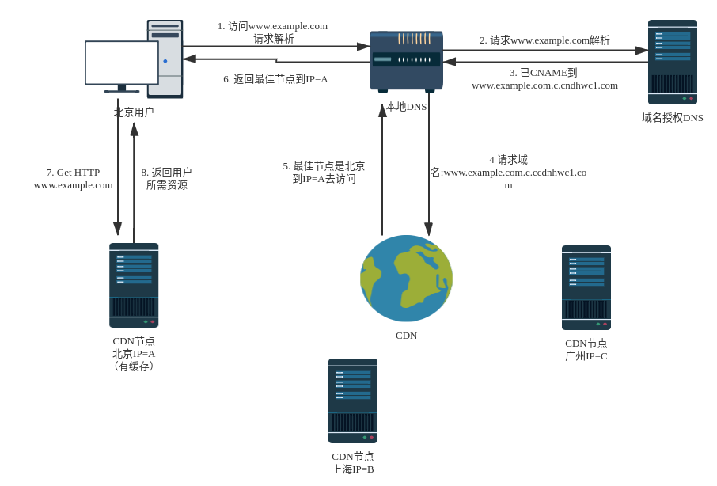
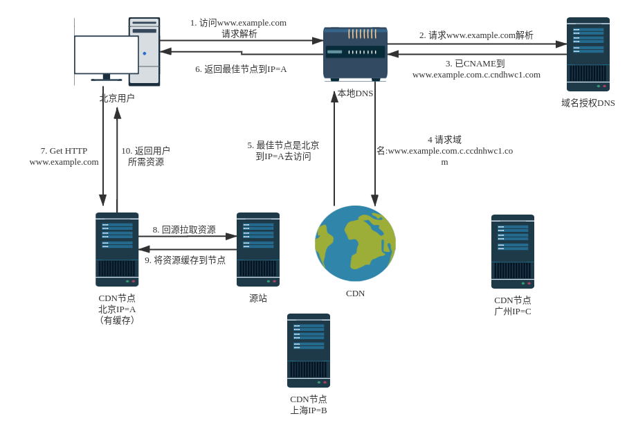

# 内容分发网络

Content Delivery Network

更新日期：2020.5.30

## 概述

CDN（Content Delivery Network，内容分发网络）是构建在现有互联网基础之上的一层智能虚拟网络，通过在网络隔出部署节点服务器，实现将源站内容分发至所有CDN节点，使用户可以就近获得所需内容。CDN服务缩短了用户查看内容的访问延迟，提高了用户访问网站的响应速度和网站的可用性，解决了网络带宽小、用户访问量大、网点分布不均等问题。

## 加速原理

当用户访问使用CDN服务的网站时，本地DNS服务器通过CNAME方式将最终域名请求重定向到CDN服务。CDN通过一组预先定义好的策略（根据内容类型、地理区域、网络负载情况等），将当时能够最快响应用户的CDN节点IP地址提供给用户，是用户可以以最快的速度获得网站内容。使用CDN后的HTTP请求处理流程如下：

* CDN节点有缓存场景

图1. HTTP请求处理流程（节点有缓存场景）

* CDN节点无缓存场景（增加回源步骤）

图1. HTTP请求处理流程（节点有缓存场景）

## 参考文献

[1] 华为云 什么是CDN https://support.huaweicloud.com/productdesc-cdn/zh-cn_topic_0064907747.html

[2] lin_zone CDN技术原理概要 https://cloud.tencent.com/developer/article/1185727
