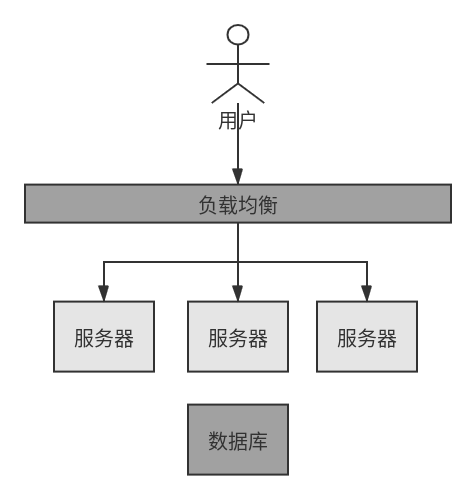

# Serverless 技术概述

本节内容参考自阿里云开发者社区公开课 [建立 Serverless 思维](https://developer.aliyun.com/course/2023?spm=5176.10731542.0.0.2f66596b9CceIY)

## 架构的演进

为了更好的介绍 Serverless，本节首先研究应用架构的演进方式。

### 单体架构

21世纪前的架构都是单体应用，如下图所示：

单体架构

单体架构的问题：

* 可用性风险：服务器出问题，则整个服务不可用
* 业务增长后流量增大，服务器计算资源不够

对于第二个问题，一般有两种做法 —— 一般有 **垂直伸缩**、**水平伸缩** 。垂直伸缩代价高昂且有瓶颈，于是架构演进程如下的水平伸缩方式：

单体架构（水平伸缩）

采用水平伸缩后的问题：

* 随研发人员增多，代码冲突难于处理，因为单体架构下的代码是没有明确物理边界。

### 微服务架构

微服务架构下开发、测试、部署、运维被分拆。

单体架构（水平伸缩）

微服务架构引入的挑战：

* 分布式技术选型：服务间通信（同步如gRPC、异步如Kafka）、缓存、追踪服务

* 拆分方法论：领域驱动设计、限界上下文

### 云原生

所谓云原生服务：

1. 基于云产品架构

2. 应用生命周期托管

## Serverless的价值

Serless 不是指 Server 真正消失，而是指开发者不用关心。类似于 Java、Python 等现代编程语言下，开发者不用担心内存分配问题。但内存还在那里，只是交给垃圾收集器去管理。

### 背景

云上资源除了服务器所包含的 **基础计算**、**存储**、**网络之外**，还包括各种类别的上层资源。如 **数据库**、**缓存**、**消息**。

Berkeley有一篇[Serverless Computing概述](https://www2.eecs.berkeley.edu/Pubs/TechRpts/2019/EECS-2019-3.pdf)，里面有一个描述：

??? note "Serverless 愿景"
    “在云的上下文中，Serverful 的计算就像使用低级的汇编语言编程，而 Serverless 的计算就像使用 Python 这样的高级语言进行编程。例如如 $c = a + b$ 这样简单的表达式，如果用汇编描述，就必须先选择几个寄存器，把值加载到寄存器，进行数学计算，再存储结果。这就好比今天在云环境下 Serverful 的计算，开发首先需要分配或找到可用的资源，然后加载代码和数据，再执行计算，将计算的结果存储起来，最后还需要管理资源的释放。”

截止2020年，Serverful 还是云计算主流的使用方式，但未来在 Serverless 架构下，开发应该只需要关心业务逻辑，而将资源管理交给工具。

### Serverless的价值

* 不用关心服务器

自动识别故障、摘除有问题的实例、操作系统的安全补丁升级不影响业务、日志和监控系统默认打通、自同配置系统安全策略以避免风险、当资源不够时自动分配资源并安装相关代码和配置等。

* 自动弹性

互联网架构应可伸缩，业务会有明显的高峰和低估，如一些营销场景下有明显的容量需求，Serverless 平台需要及时、稳定地实现自动弹性。

为此平台需要有很强的资源调度能力，以及对各项指标（如负载、内存、并发）有敏锐的感知能力。

* 按实际资源使用收费

Serverful 架构下资源一般按占用而非使用计费。但 Serverless 架构下用户只需为实际使用的资源付费，如数据库的 Query 次数、数据存储情况。

* 更少的代码，更快的交付速度

基于 Serverless 的架构下代码一般会重度使用后端服务，将数据、状态等内容从代码分离出去，移至后端服务。被撤走的 FaaS 架构将运行时的 Runtime 也交给平台来管理，这意味着 Serverless 下应用代码体积更小、分发更快。因此发布、扩容的时间会加快。

Serverless 平台通常会提供一个丰富的 代码存储/构建服务、版本管理服务、发布服务，以及版本切换能力，以帮助提升发布速度。

## 常见Serverless模式

## Serverless技术选型

## 参考文献

[建立 Serverless 思维](https://developer.aliyun.com/course/2023?spm=5176.10731542.0.0.2f66596b9CceIY)