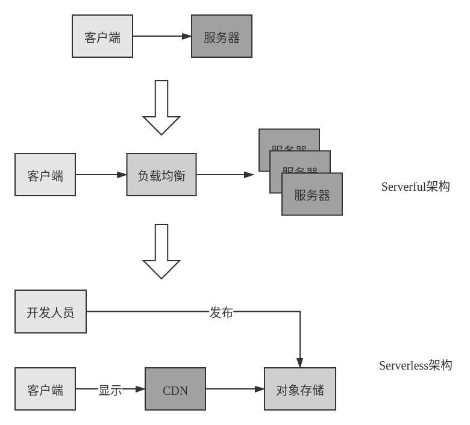
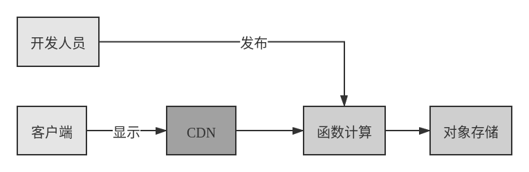
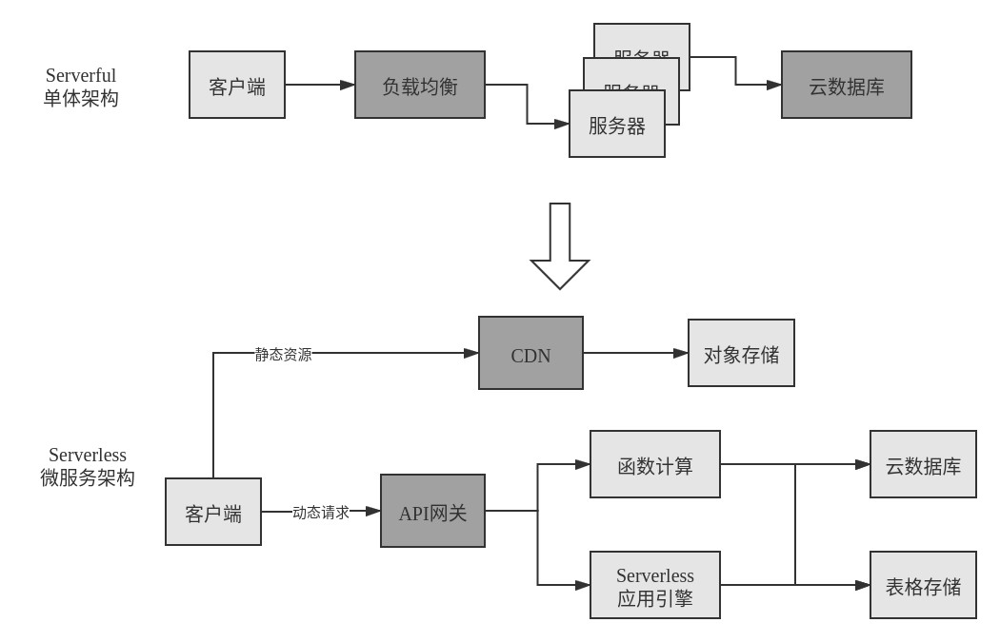
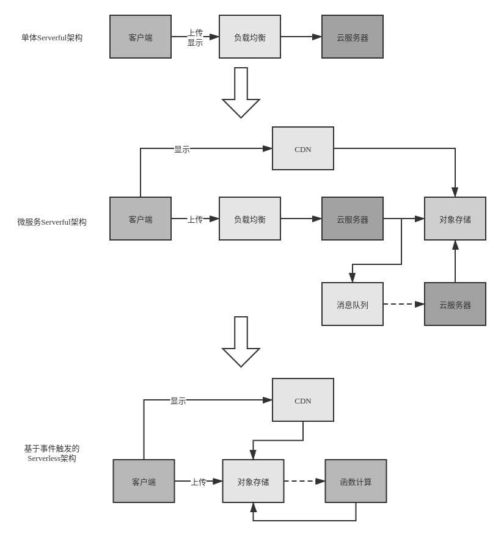
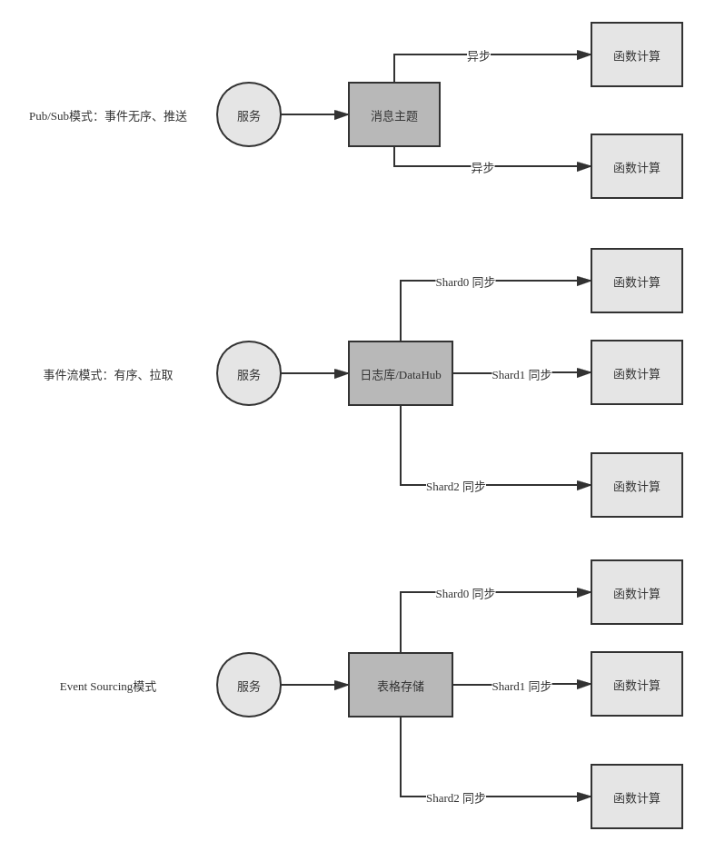
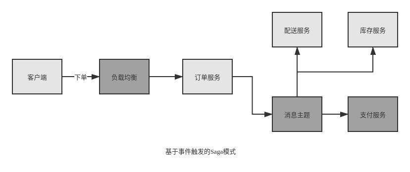
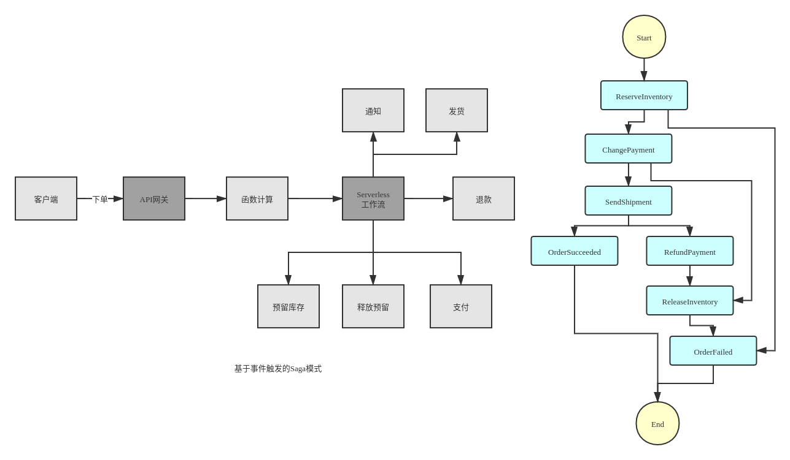

# Serverless 技术概述

本节内容参考自阿里云开发者社区公开课 [建立 Serverless 思维](https://developer.aliyun.com/course/2023?spm=5176.10731542.0.0.2f66596b9CceIY)

Serverless的设计目标在于让业务开发人员专注业务代码，而无需考虑所有服务器相关的问题。

## 架构的演进

为了更好的介绍 Serverless，本节首先研究应用架构的演进方式。

### 单体架构

21世纪前的架构都是单体应用，如下图所示：

单体架构

单体架构的问题：

* 可用性风险：服务器出问题，则整个服务不可用
* 业务增长后流量增大，服务器计算资源不够

对于第二个问题，一般有两种做法 —— 一般有 **垂直伸缩**、**水平伸缩** 。垂直伸缩代价高昂且有瓶颈，于是架构演进程如下的水平伸缩方式：

单体架构（水平伸缩）

采用水平伸缩后的问题：

* 随研发人员增多，代码冲突难于处理，因为单体架构下的代码是没有明确物理边界。

### 微服务架构

微服务架构下开发、测试、部署、运维被分拆。

单体架构（水平伸缩）

微服务架构引入的挑战：

* 分布式技术选型：服务间通信（同步如gRPC、异步如Kafka）、缓存、追踪服务

* 拆分方法论：领域驱动设计、限界上下文

### 云原生

所谓云原生服务：

1. 基于云产品架构

2. 应用生命周期托管

## Serverless 的价值

Serverless 不是指 Server 真正消失，而是指开发者不用关心。类似于 Java、Python 等现代编程语言下，开发者不用担心内存分配问题。但内存还在那里，只是交给垃圾收集器去管理。

### 背景

云上资源除了服务器所包含的 **基础计算**、**存储**、**网络之外**，还包括各种类别的上层资源。如 **数据库**、**缓存**、**消息**。

Berkeley有一篇[Serverless Computing概述](https://www2.eecs.berkeley.edu/Pubs/TechRpts/2019/EECS-2019-3.pdf)，里面有一个描述：

??? note "Serverless 愿景"
    “在云的上下文中，Serverful 的计算就像使用低级的汇编语言编程，而 Serverless 的计算就像使用 Python 这样的高级语言进行编程。例如如 $c = a + b$ 这样简单的表达式，如果用汇编描述，就必须先选择几个寄存器，把值加载到寄存器，进行数学计算，再存储结果。这就好比今天在云环境下 Serverful 的计算，开发首先需要分配或找到可用的资源，然后加载代码和数据，再执行计算，将计算的结果存储起来，最后还需要管理资源的释放。”

截止2020年，Serverful 还是云计算主流的使用方式，但未来在 Serverless 架构下，开发应该只需要关心业务逻辑，而将资源管理交给工具。

### Serverless 的价值

* 不用关心服务器

自动识别故障、摘除有问题的实例、操作系统的安全补丁升级不影响业务、日志和监控系统默认打通、自同配置系统安全策略以避免风险、当资源不够时自动分配资源并安装相关代码和配置等。

* 自动弹性

互联网架构应可伸缩，业务会有明显的高峰和低估，如一些营销场景下有明显的容量需求，Serverless 平台需要及时、稳定地实现自动弹性。

为此平台需要有很强的资源调度能力，以及对各项指标（如负载、内存、并发）有敏锐的感知能力。

* 按实际资源使用收费

Serverful 架构下资源一般按占用而非使用计费。但 Serverless 架构下用户只需为实际使用的资源付费，如数据库的 Query 次数、数据存储情况。

* 更少的代码，更快的交付速度

基于 Serverless 的架构下代码一般会重度使用后端服务，将数据、状态等内容从代码分离出去，移至后端服务。被撤走的 FaaS 架构将运行时的 Runtime 也交给平台来管理，这意味着 Serverless 下应用代码体积更小、分发更快。因此发布、扩容的时间会加快。

Serverless 平台通常会提供一个丰富的 代码存储/构建服务、版本管理服务、发布服务，以及版本切换能力，以帮助提升发布速度。

## 常见 Serverless 架构模式

### 概述

Serverless 计算一般可以理解为 FaaS 和 BaaS 的叠加。

Serverless 的原生心智是让业务人员专注业务逻辑，帮助业务人员解决没有必要由他们解决的技术问题。  
—— Ben Kehoe

一般可以从如下角度来理解 Serverless 架构：

* 技术：计算、数据存储、消息通信
* 衡量维度：可运维性、安全性、可靠性、可扩展性、成本

下面将从若干场景来理解 Serverless 架构。

### 【场景一】静态站点

#### 业务需求：信息展示站点

* 展示信息
* 更新不频繁
* 不确定访问量

#### 架构演进

架构演进

如上图所示，最基本的架构是将服务器放在IDC机房里面；如果考虑高可用性问题可以通过使用负载均衡+云服务器的方式来解决；对于静态站点可直接将其由对象存储服务来支持，并用CDN做缓存。

#### 架构延伸

有一种说法是计算机科学里面最难应对的两个问题是：**缓存失效/cache invalidation** 和 **命名问题/naming things**。

**静态** 是一个重要属性，**缓存** 也是计算机开发中一项重要的技术。缓存只要应用得当也会大幅提升系统性能。

CND除了回源到对象存储之外，还能回源到动态后端，如API gateway、函数计算、负载均衡等。

增加函数计算

除了使用CDN作为缓存，也可以使用基于内存的缓存，如Redis等。

### 【场景二】单体和微服务

#### 业务需求：商品详情页

* 海量商品
* 更新频繁
* 动态信息来源广泛，如基本信息、价格、运费、销量、库存、评论等

#### 架构演进

架构演进

#### 架构延伸

微服务内部采用信息聚合的形式，外部则可以根据不同的移动端采用不同的后端。

为前段服务的后端 和 微服务聚合

### 【场景三】事件触发

#### 业务需求：买家秀

* 发表图片和视频评论
* 对图片缩放、加水印、审核
* 对视频做多种格式转换、审核

#### 架构演进

架构演进

上图 “微服务Serverful架构” 中将web应用服务器和文件处理服务器通过消息队列解耦，因为它们对资源伸缩的需求可能是不同的，一般文件处理服务需要更多的CPU。

“基于事件触发的Serverless架构” 中直接将文件上传到OSS，同时OSS触发函数计算；而文件的显示则是通过OSS+CDN完成的。

#### 架构延伸

架构延伸

### 【场景三】服务编排

#### 业务需求：订单流程

* 完成多步骤订单流程，包括预留库存、确认支付、安排配送、邮件短信通知等
* 可能持续数天
* 需要对失败步骤重试
* 最终失败，需要对已完成步骤回滚

#### 架构演进

基于事件触发的Saga模式

采用一个消息总线，让各个服务之间通过事件来传递信息。

基于事件流的Saga模式

各个服务之间独立，有一个集中的协调者服务来调度各个单独的业务服务，业务逻辑和状态由集中协调者来维护。

## Serverless技术选型

## 参考文献

[建立 Serverless 思维](https://developer.aliyun.com/course/2023?spm=5176.10731542.0.0.2f66596b9CceIY)