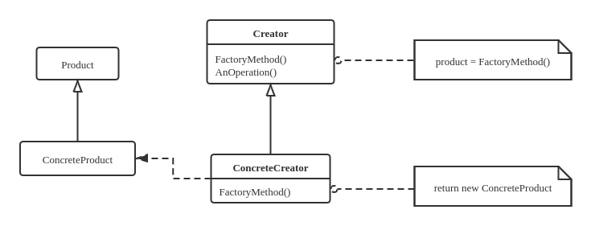
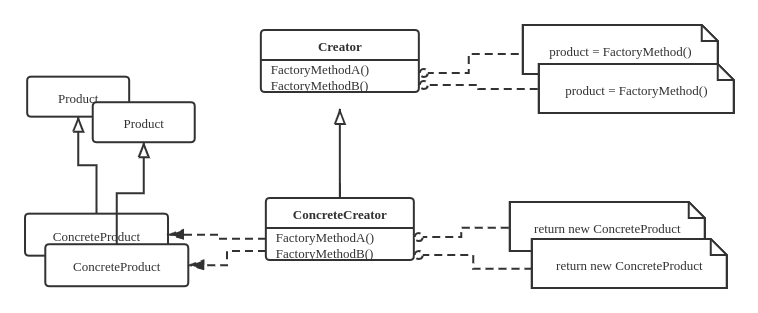

# 增加抽象层级，隔离复杂变化

## 封装多态创建过程 - 简单工厂模式

在面向接口编程的实践中，经常做的操作是将基类指针只上一个子类对象，相比于显式地调用构造函数，可以讲多态对象的选择与构造过程封装起来。

### 封装多态对象的选择与创建

* 先隔离开（借助封装），再徐图之（增加变化）

* 将创建对象中的“选择性”剥离出来
    * 作为控制创建过程的参数
    * 从使用具体类的类型名称来直接控制多态对象的创建，转变成使用变量和符号来间接控制多态对象的创建。
* 封装多台对象的选择过程
    * 设计一个类封装多态对象的创建过程

### 简单工厂模式

下方工厂类的定义，可以根据类体系的扩充不断增加分支语句，以便根据需要返回指定的具体产品，是经常变动的类。
```cpp
class Factory {
   public:
    static ProductBase* Create(ProductID id) {
        if (id == A_ID) return new ProductA;
        if (id == B_ID) return new ProductB;
        // 当产品类体系扩充时，在此增加代码
        return nullptr;
    }
};
```

上述`Factory`的作用只是包装一下静态构造函数`Create`，当然也可以将`Factory`当做一个普通的类去使用
```cpp
class Factory {
   public:
    ProductBase* Create(ProductID id) {
        if (id == A_ID) return new ProductA;
        if (id == B_ID) return new ProductB;
        return nullptr;
    }
};
```

此时接口对象的创建细节被完全剥离

```cpp
int main() {
    ProductID id;
    cin >> id;

    ProductBase* ptr;
    ptr = Factory::Create(id);
    Use(ptr);
}
```

**简单工厂模式**： 将多态对象的创建过程封装起来，使“策略”与算法的选择更直观。

## 增加抽象层 - 工厂方法模式

### 工厂不具备具体产品参数

对于上面的 **简单工厂** 模式，生成哪种对象是由`Factory`类的接口根据传入参数来决定的。此时，生成对象的类名是“看得见”的（Hardcode在源码中）。

但如果编写工厂时并不知道可能的子类集合怎么办？此时可以使用派生增加抽象层来增加使用灵活性。

* 若无法确定多态对象的具体类
    * 在增加一层“抽象层”：从`Factory`派生一个子类，不能确定的问题（使用具体类名创建产品对象）交给他解决！
    * 对这个子类而言，它的“实现者”（程序员、代码上下文环境）是知道具体产品的类名的，因此可以创建相应对！
* 通过派生引入的抽象层增加了使用灵活性
    * 一方面使用基类能将无法确定的事情交由子类去确定；
    * 另一方面也使积累提供的接口不收某些信息的约束。

```cpp
class Factory {
   public:
    virtual ProductBase* Create(ProductID) = 0;
};

class MyFactory : public Factory {
    public:
    ProductBase* Create(ProductID id) {
        if (id == A_ID) return new ProductA;
        if (id == B_ID) return new ProductB;
        // 当产品体系扩充时，在此增加代码
        return nullptr;
    }
};
```

“搁置起来，留给后代解决吧”
——毛泽东

对于`Factory`类的编写者，掌握的信息是`Create`函数的声明形式，但具体对象的类型集合未知，留给工厂子类去解决。

下面的代码中使用了工厂+产品的双重多态
```cpp
int main() {
    ProductBase* ptr;   // 产品基类指针
    Factory* fact_ptr;  // 工厂基类指针
    fact_ptr = new MyFactory;

    ptr = fact_ptr->Create(A_ID);
    Use(ptr);
    ptr = fact_ptr->Create(B_ID);
    Use(ptr);

    fact_ptr->Create(C_ID)->Interface();
}
```

### 工厂方法模式

继承体系的UML图



这种设计被Erich Gamma等人成为 **工厂方法** 模式


## 相互关联对象的创建 - 抽象工厂模式

### 创建接口集成

拿螺丝钉和螺丝刀举例，螺丝钉有一字纹、十字花、六边形等，相应地螺丝刀也有对应的实现。现在假设有螺丝刀和螺丝钉工厂，则二者生产的产品类型应该是一一对应的。

对于这种有“关联”的多态对象，怎样设计工厂能够体现这种“关联”性呢？

既然多种对象间存在关联关系，那就应该将创建它们的接口集成到一起，形成一个创建多种对象的新接口！

### 抽象工厂模式



将关联对象的生成接口集成（合并）到单个创建类中，在实现该类时保证各个对象之间的关联性符合要求。

上述设计思路被Erich Gamma等人称为 **抽象工厂** 模式。


## 总结

* 设计原则
    * **开闭原则**
    * **单一责任原则**

* 设计模式
    * **策略模式**
    * **委托模式**
    * **桥接模式**
    * **适配器模式**
    * **代理模式**
    * **装饰器模式**
    * **责任链模式**
    * **简单工厂模式、工厂方法模式、抽象工厂模式**

* 未涉及的模式
    * **解释器模式**
    * **命令模式**（用于交互式程序、状态保存）
    * **状态模式**（类似于状态机）
