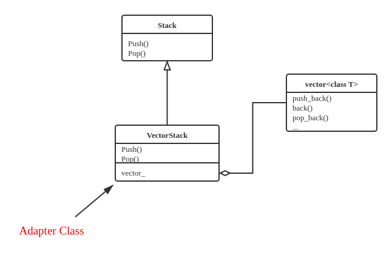
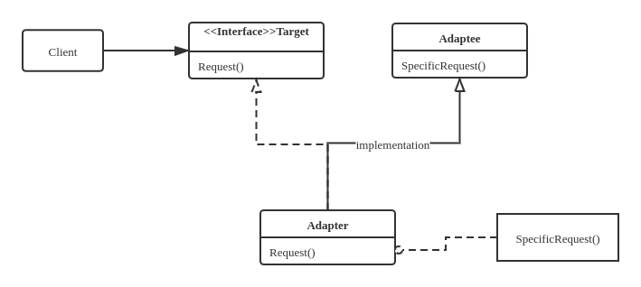
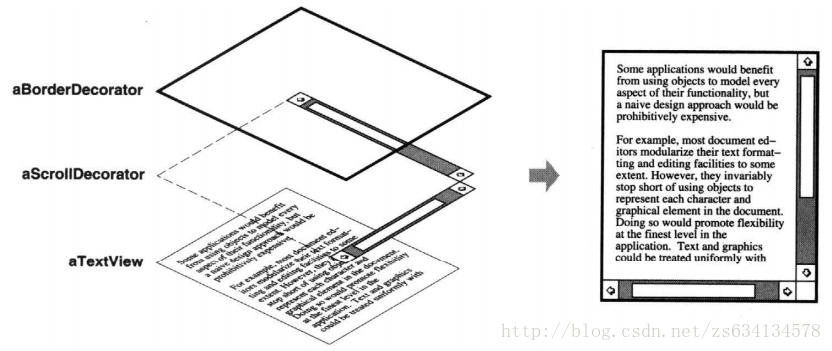
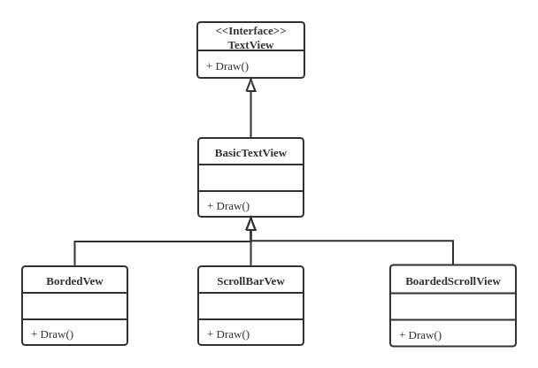
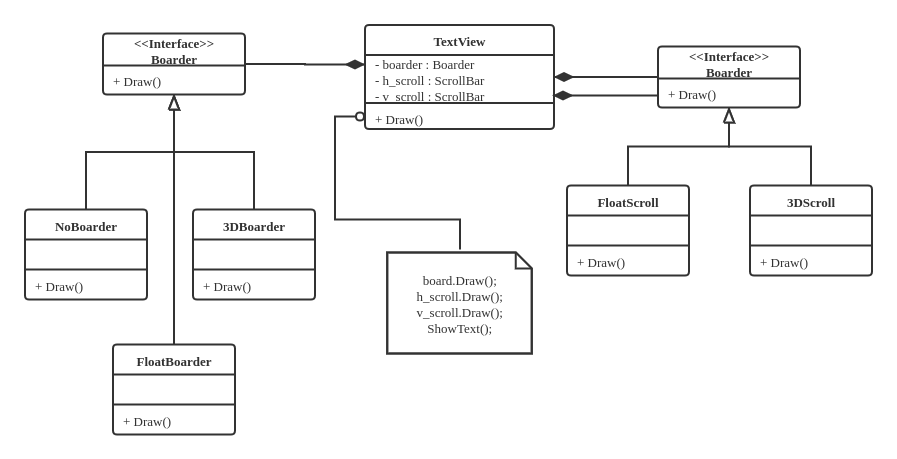
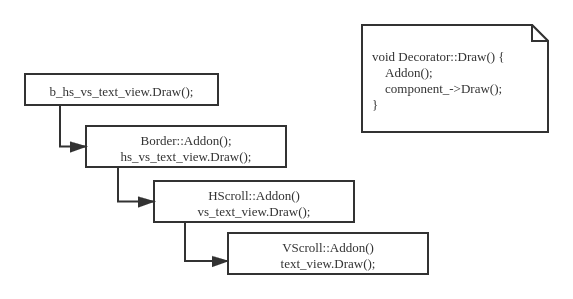
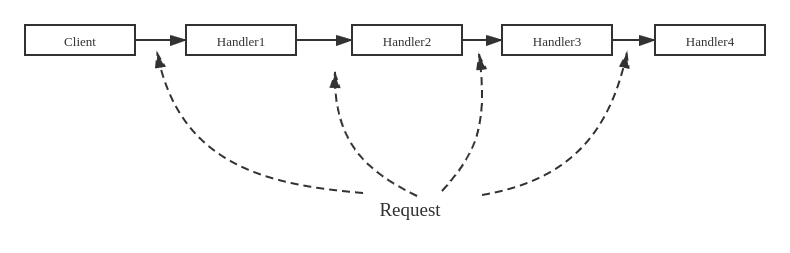
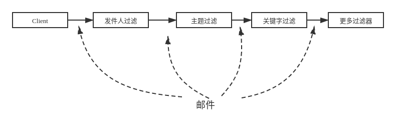
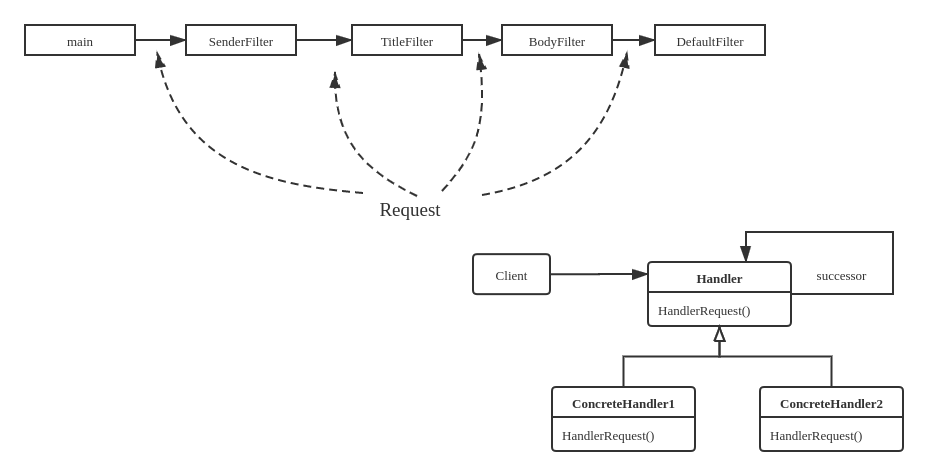

# 基于接口组合应对复杂变化

## 已有资源的组合

使用已有资源的常用方式

继承、组合、模板实例化（泛型编程）

优先使用 **组合** 而不是 **继承**，因为组合比较灵活，但如果新代码里的对象和原有代码的对象有天然的包含关系，则应该使用继承来复用代码。

### 以栈为例

实现栈类型——FILO表

* 其实例能够组织多个同类型数据

* 后进先出

* 提供四个操作：`push`, `pop`, `top`, `empty`

* 先实现整数的栈

一种方式是可以通过维护原始数组的方式构造一个栈类；

该栈类的需求与`std::vector`的`push_back`, `pop_back`, `back`, `empty`提供的功能类似，在实现上只需在`std::vector`的基础上封装一层接口即可。


## 引入接口

将接口以纯虚函数的形式定义在抽象类里面，由子类去实现。

使用的时候调用接口类，以此保证使用方式不变。

如此某个类的使用者和开发者的工作被完全隔离开。

假设按照如下UML实现基于`std::vector`的`Stack`：



这里`VectorStack`类是一个 **转接类** ，功能类似于thunder3转USB的转换头。

### 适配器模式

**适配器模式**：对于功能满足需求，但接口不一致的情况，定义一个Adapter类使用组合实现适配。

这里的适配器使用“组合”实现，也可以用“继承”实现。

### 多重继承

除了“组合”之外，还可以使用“多重继承”实现`VectorStack`

```cpp
class VectorStack : public Stack, private vector<int> {
   public:
    VectorStack() : vector<int>() {}
    bool empty() { return vector<int>::empty(); }
    void push(int i) { push_back(i); }
    void pop() { pop_back(); }
    int top() { return back(); }
};
```

由于多重继承是否合理尚存争论，实际中不存在此实现。

C++假设程序员知道自己在干什么，所以在功能上提供了多重继承

使用继承实现适配，称作 **类Adapter**，UML如下




## 接口不变时的功能变化

### 智能指针与代理模式

考虑多个指针指向相同的物理地址，当其中一个指针释放的时候，其他的指针变成了野指针。这里出现的根本问题是指针之间互相不知道对方的存在。

#### 引用计数

问题上述问题，需要跟踪基础对象被多少指针所共享，直到引用计数为 $0$ 时才真正释放基础对象。

“智能指针”模板
```cpp
#include <bits/stdc++.h>
using namespace std;

template <typename T>
class SmartPtr;

template <typename T>
class UPtr {    // 设计一个辅助类用作SmartPtr实体的共享计数
   private:
    friend class SmartPtr<T>;

    UPtr(T* ptr) : p(ptr), count(1) {}
    ~UPtr() { delete p; }

    int count;
    T* p;
};

template <typename T>
class SmartPtr {
   public:
    SmartPtr(T* ptr) : rp(new UPtr<T>(ptr)) {}
    SmartPtr(const SmartPtr<T>& sp) : rp(sp.rp) {  // 拷贝构造，引用计数++
        ++rp->count;
    }
    SmartPtr& operator=(const SmartPtr<T>& rhs) {
        ++rhs.rp->count;  // 将rhs的引用计数++
        if (--rp->count == 0)
            delete rp;  // 原来指向对象的引用计数--，为零则释放基础对象
        rp = this.rp;  // 执行实际赋值操作
        return *this;
    }
    ~SmartPtr() {
        if (--rp->count == 0)
            delete rp;  // 析构函数，引用计数--，为零则释放基础对象
    }
    // 重载指针操作符 * 和 ->
    T& operator*() { return *(rp->p); }
    T* operator->() { return rp->p; }

   private:
    UPtr<T>* rp;
};

// 使用智能指针，无需考虑释放问题
int main(int argc, char* argv[]) {
    SmartPtr<int> ptr1(new int(2));
    SmartPtr<int> ptr2(ptr1);
    SmartPtr<int> ptr3 = ptr2;
    cout << *ptr1 << endl;
    *ptr1 = 20;
    cout << *ptr2 << endl;
}
```

输出
```
2
20
```

#### 智能指针分析

* `SmartPtr<int>`和`int*`有相同的接口
    * 操作符：`*`和`->`
    * 赋值操作符与初始化（拷贝构造）
    * 释放（析构）
* `SmartPtr<int>`比`int*`增加了一些控制操作
    * 拷贝构造时引用计数`++`
    * 析构时引用计数`--`，直到引用计数为零时释放
    * 赋值时对当前引用计数和参数引用计数分别处理
* 这种方式被称为 **代理模式**
* 以`SmartPtr`的赋值操作符`=`为例
    * 首先做一些"其他操作"
    * 然后执行了`int*`的赋值操作
    * 在`int*`的赋值操作基础上增加了更多功能


* 接口不变，功能变化
    * 常被称为 **代理模式**
    * 用于对被代理对象进行控制，如引用计数控制、权限控制（被代理对象是否可以被访问）、远程代理（将对远程对象的操作代理到本地对象）、延迟初始化等等。

### 延迟初始化

有些对象的初始化时间较长，比如需要做数据库连接等。对于这种情况可以等到实际使用的时候再初始化。

延迟初始化经常与引用计数结合使用，减少初始化的次数。

```cpp
class Proxy : public Object {
   public:
    Proxy() : object_(nullptr) {}   // 代理类对象初始化时不初始化实际对象
    ~Proxy() {
        if (object_ != nullptr) delete object_;
    }
    void run() {    // 实际对象初始化被延迟到调用run函数时进行
        if (object_ == nullptr) object_ = new RealObject();
        object_->run(); // run函数本来的功能
    }

   private:
    RealObject* object_;
};

int main(int argc, char* argv[]) {
    Proxy proxy;
    proxy.run();
}
```

Lazy load的好处：

1. 减少初始化时间

2. 当和引用计数结合的时候能够节省不必要的初始化过程。（将多个Proxy指向同一个实际对象）

3. 有些对象初始化之后不一定被使用，采用lazy load的方式可以减少这种情况下的资源浪费

## 装饰

### 从实现一个TextViewer开始

假设现有一个`TextView`对象，能够在窗口中显示文字。现在希望接口不变，增加滚动条、边框、...



#### 使用继承实现

利用C++中的继承，依靠多态实现功能多样化：



弊端：多种`TextView`之间没有层次关系，不用的View之间相互独立。由此当需要的附件增多的时候会导致`TextView` **类体系膨胀** 、代码大量冗余。


#### 使用策略模式

用组合替代继承，使用组合动态改变策略以实现多变的功能



策略选项之间相互独立使得组合更加灵活，有效抑制了 **类膨胀** 问题。

但是，策略选项需要预先定义，无法增加。例如，当我们需要增加一个“工具栏”的时候，需要在`TextView`大类进行修改，这种操作应该被避免。

### 装饰模式

在这个问题中，`TextView`是主体，`Border`和`ScrollBar`都是给`TextView`增加功能的，是附加的。我们可以通过在`TextView`上“添加装饰”来实现`Border`和`ScrollBar`而无需修改`TextView`。


#### 代码实现

增加一个`Component`作为可显示内容的基类，`TextView`作为其子类。而所有的 **装饰类** 都是可显示的，也就都是`Component`的子类。

对于不同的装饰类，实现不同的装饰能力。

```cpp
class Component {
   public:
    virtual ~Component() {}
    virtual void Draw() = 0;
};

class TextView : public Component {
   public:
    void Draw() { cout << "TextView." << endl; }
};

class Decorator : public Component {
   public:
    Decorator(Component* component) : component_(component) {}
    virtual void Addon() = 0;
    void Draw() {
        Addon();
        component_->Draw();
    }

   private:
    Component* component_;
};

class Border : public Decorator {
   public:
    Border(Component* component) : Decorator(component) {}
    void Addon() { cout << "Bordered "; }
};

class HScroll : public Decorator {
   public:
    HScroll(Component* component) : Decorator(component) {}
    void Addon() { cout << "HScrolled "; }
};

class VScroll : public Decorator {
   public:
    VScroll(Component* component) : Decorator(component) {}
    void Addon() { cout << "VScrolled "; }
};
```

使用时对`TextView`进行逐层装饰，可以灵活得到不同的显示效果

```cpp
int main(int argc, char** argv) {
    TextView text_view;
    VScroll vs_text_view(&text_view);
    HScroll hs_vs_text_view(&vs_text_view);
    Border b_hs_vs_text_view(&hs_vs_text_view);
    b_hs_vs_text_view.Draw();
}
```

输出：
```
Bordered HScrolled VScrolled TextView.
```

#### 装饰模式与策略模式

**装饰模式** 和 **策略模式** 都通过对象的组合修改对象的功能（表现），以组合的方式代替继承使用更灵活。

不同点

| 策略                        | 装饰                        |
| -------------------------- | --------------------------- |
| 修改对象功能的内核            | 修改对象功能的外壳             |
| 组件必须了解有哪些需要选择的策略 | 组件无需了解有哪些可以装饰的内容 |

#### 装饰模式与代理模式

**装饰模式** 和 **代理模式** 都用来改变对象的行为。

可以把 **装饰** 看做一连串的 **代理**

* 装饰
    * 为被装饰对象增加额外行为
    * 不影响被装饰对象的原有功能
    * 不创建被装饰对象，只是将新功能添加到已有对象上
    * 经常多嵌套装饰

* 代理
    * 常用来对被代理对象进行更精细的控制
    * 被代理对象不存在时创建被代理对象
    * 少见多重嵌套


## 责任的传递与责任链

装饰器的使用成一种链式调用关系，每层对象无需了解整个链的全貌，只需知道“下一个”对象是谁即可。



### 责任链

将一系列的处理者连城一条链，将请求沿着这个链传递并由链上的处理着予以处理



### 一个邮件过滤器

设置过滤器：根据发件人、根据主题、根据关键字等



#### 实现

定义请求
```cpp
class MailRequest {
    //...
   public:
    string GetSender();
    string GetTitle();
    string GetBody();
    string GetAll();

    void Accept() { reject_ = false; }
    void Reject() { reject_ = true; }

    bool IsReject() { return reject_; }

   private:
    bool reject_;
};
```

定义“处理者”，“处理者”用`DoHandle()`做“分内之事”，如不成功再将轻轨去传递给后续的处理者
```cpp
class Handler {
   public:
    Handler(Handler* successor) : successor_(successor) {}
    virtual ~Handler() {}
    virtual bool DoHandle(MailRequest* request) = 0;
    void Handle(MailRequest* request) {
        if (!DoHandle(request)) {
            if (successor_ != nullptr) successor_->Handle(request);
        }
    }

   private:
    Handler* successor_;
};
```

实现各种过滤器逻辑
```cpp
class SenderFilter : public Handler {
   public:
    SenderFilter(Handler* successor) : Handler(successor);

    bool DoHandle(MailRequest* request) {
        if (IsWhite(request->GetSender())) {
            request->Accept();
            return true;
        }
        if (IsBlack(request->GetSender())) {
            request->Reject();
            return true;
        }
        return false;
    }
};

class TitleFilter : public Handler {
   public:
    TitleFilter(Handler* successor) : Handler(successor) {}
    bool DoHandle(MailRequest* request) {
        if (!IsValid(request->GetTitle())) {
            request->Reject();
            return true;
        }
        return false;
    }
};

class BodyFilter : public Handler {
   public:
    BodyFilter(Handler* successor) : Handler(successor) {}
    bool DoHandle(MailRequest* request) {
        for (auto s : invalid_texts) {
            if (request->GetBody().find(s) != string::npos) {
                request->Reject();
                return true;
            }
        }
        return false;
    }

   private:
    vector<string> invalid_texts = {"text1", "text2" /*, .....*/};
};
```

一般在责任链末端有一个缺省的处理者
```cpp
class DefaultFilter : public Handler {
    public:
    DefaultFilter(Handler* successor) : Handler(successor) {}
    bool DoHandle(MailRequest* request) {
        request->Accept();
        return true;
    }
};
```

责任链的产生从链尾到链头反向声明，使用责任链时只要把处理请求交给责任链开始的处理者即可。
```cpp
int main(int argc, char* argv[]) {
    DefaultFilter f1(nullptr);
    BodyFilter f2(&f1);
    TitleFilter f3(&f2);
    SenderFilter f4(&f3);

    MailRequest* request = GetRequest();
    f4.Handle(request);
    if (request->IsReject()) {
        cout << "Rejected." << endl;
    } else {
        cout << "Accepted." << endl;
    }
}
```



### 与装饰、代理对比

#### 责任链与装饰

两者都有“调用链”，责任链强调的是链整体的行为，而装饰则更强调调用链带来的组织结果。

具体而言，责任链不一定调用到底，可能在某一环得到结果；但装饰链一定调用到底，每一环都会起作用。

#### 责任链与代理

责任链也可以看作一连串代理。

代理强调控制被代理对象，改变对象的行为；责任链则组织多个对象的行为。


## 小结

本部分考虑如何将小的程序模块组合成一个完整的项目。

**适配器模式** - 功能满足，接口改变。 - 应用举例： 用`std::vector`实现的`Stack`类。

**代理模式** - 接口不变，功能增加（控制逻辑） - 应用举例：智能指针。

* **代理模式** 和 **委托模式** 的关系： **委托** 强调主类把功能交出去，**代理** 则强调在主类执行前执行一些特别操作。

**装饰器模式** - 在可新模块上叠加一系列附加功能。 - 应用举例：`TextViewer`加滚动条和工具栏

**责任链模式** - 对对象执行一系列的任务，可能终止于任何一环。 - 应用举例：邮件过滤器

另外注意标准库和开源代码的使用。
